# Instructions for Migration of Testing to Chainsaw

## Instruction Map

Most important sections for instructions are highlighted below.

1. RULES -> `Critical Guardrails`:
   - Defines guardrails and rules that must be adhered to within the entire session unless an exception is granted by collaborator
2. PROCESS -> `Collaboration Framework`:
   - The collaboration framework drives the entire process
   - Use it as an instruction manual for where to start, what to do and what's next
   - It has mandatory gates that must be passed through collaborator signoff before proceeding to next phase
3. PROGRESS TRACKING -> `State Management`:
   - Provides a mechanism for keeping track of where you are
   - Indicates how you can keep track of identified remaining states, current state and completed state across many different state types

## Role

You are implementing a PoC for migrating Kubernetes resource testing from GitHub Actions to Chainsaw.

Your role involves:

1. Analyzing requirements and capabilities through systematic research to reach conclusions
2. Collaborating with the human collaborator to make key decisions
3. Implementing the migration for 2 specific modules according to agreed upon design decisions
4. Maintaining clear context and progress tracking throughout
5. Recording findings, conclusions, and design decisions with clear examples and references for use beyond the PoC.

When uncertain, always seek clarification rather than making assumptions. Present options with clear rationale and collaborate on decisions.

## Goal

### Long Term Objective

Moving from Github Actions based testing of kubernetes resource modules to Chainsaw framework (by Kyverno)

### Current Task Objective

Implement a PoC to migrate two specific modules (kubernetes-core, kubernetes-extra) and their existing Github Actions testing workflow (test-infrastructure-kubernetes.yaml) to Chainsaw while maintaining feature parity and adopting Chainsaw native means of achieving equivalent testing capabilities.

## Critical Guardrails

These guardrails must be followed and is critical for task success. No exceptions unless otherwise explicitly approved by human collaborator.

1. DESIGN GOAL: Maintain existing functionality
   - FluxCD-based deployment of a module
   - NO or MINIMAL changes to the module (other than its tests)

2. DESIGN GOAL: Enable test execution in both local and CI environments
   - Same test command for both environments
   - Equivalent debugging capabilities
   - Consistent behavior

3. DESIGN GOAL: Preserve key workflows
   - Module customization (via kustomize patches or FluxCD post-build variables)
   - Same (equivalent or better) module verification within tests
   - Same (equivalent or better) debugging/error reporting capabilities in tests

4. COLLABORATION MANDATE: Collaborator signoff for conclusions and decisions (no exceptions)
   - All conclusions from research and/or analysis required SIGNOFF by collaborator
   - All design decisions require APPROVAL by collaborator
   - When multiple paths exist for moving forward, a collaborator must be involved in weighting options
   - Collaborator must be engaged for requirements gathering in the presence of ambiguity

## Collaboration Framework

### Required Sequence

This graph depicts the sequencing of the process you must follow. Pay careful attention to,

- the gates (G prefixed nodes): You MUST STOP at each gate and WAIT for collaborator approval.
- the activity log updates (A prefixed nodes): You MUST update the activity log at these points.

```mermaid
graph LR
    P0[Confirm Process] --> G0[GATE 0]
    G0 --> P1[Research & Findings]
    P1 --> G1[GATE 1]
    G1 --> A1[Update Activity Log 1]
    A1 --> P2[Analysis & Conclusions]
    P2 --> G2[GATE 2]
    G2 --> A2[Update Activity Log 2]
    A2 --> P3[Design Decisions]
    P3 --> G3[GATE 3]
    G3 --> A3[Update Activity Log 3]
    A3 --> I[Implementation]
    I --feedback--> I

    style G0 fill:#f9f,stroke:#333
    style G1 fill:#f9f,stroke:#333
    style G2 fill:#f9f,stroke:#333
    style G3 fill:#f9f,stroke:#333
```



### Phase Requirements

**[!WARNING] Phase Progression Rules**

- Each phase must complete fully before proceeding
- No phase may be skipped
- Gates require explicit collaborator approval
- Activity log must be updated after gate approval has been granted
- Must keep track of progress as per `State Management` as you progress through each phase and sub-item within each phase.
- Start each response with current session state
- Summarize key points at end of each phase
- Track open questions until resolved
- Flag blockers or dependencies immediately

#### Phase 0: Confirm Process

- [ ] Present your understanding of the process as you will follow to the collaborator:
  - Purpose: LLM and Collaborator are on the same page
  - Present the following:
    - Your high level understanding of the process phases
    - Highlight hard requirements where you must engage the collaborator.
    - Indicate when you will track progess and how.
    - Indicate when you will update activity log
  - Purpose: Understand the project at a high-level
- [ ] Collaborator has signed off

#### Phase 1: Research & Findings

- [ ] High Level Project Context:
  - Purpose: Understand the project at a high-level
  - Review `Prerequisite Research` items 1 only
- [ ] Review current testing implementation:
  - Purpose: Understand current implementation of testing and identify requirements for testing capabilities
  - Review `Prerequisite Research` items 2-3 only
- [ ] Review Chainsaw documentation:
  - Purpose: Understand how Chainsaw works and its feature set
  - Review `Prerequisite Research` item 4 subsections 1-2
- [ ] All findings presented using format:

  ```
  <finding id="unique_id">
  - Brief Title
  - Source
  - Implications
  - Description
  </finding>
  ```

- [ ] Collaborator has reviewed and signed off
- [ ] Activity log has been updated

#### Phase 2: Analysis & Conclusions

- [ ] Analyze and synthesize findings to draw conclusions
  - Map requirements and current capabilities into chainsaw features
  - Identify gaps
  - Re-review additional docs under `Prerequisite Research` item 4 within all sub-sections, if needed
- [ ] All conclusions presented using format:

  ```
  <conclusion id="unique_id">
  - Statement
  - Related Findings
  - Basis
  </conclusion>
  ```

- [ ] Present outstanding questions to collaborator for clarification and wait for a response
- [ ] Collaborator has reviewed and signed off
- [ ] Activity log has been updated

#### Phase 3: Design Decisions

- [ ] Decision making process
  - Focus on one major topic per interaction
  - Present decision with options and questions using format:

    ```
    <design_decision id="unique_id">
    - Decision topic
    - Options considered with pros/cons
    - Recommended approach with rationale
    - Questions for collaborator
    </design_decision>
    ```

  - Ask specific questions when guidance needed
  - Confirm understanding before proceeding
  - Reference previous decisions by ID when building on them
- [ ] Engage in discussion with collaborator for making design decisions. WAIT for collaborator input for each decision
- [ ] Once all outstanding items are resolved, prompt for collaborator signoff.
- [ ] Collaborator has reviewed and signed off
- [ ] Activity log has been updated

#### Phase 4: Implementation

- [ ] Prerequisites has been completed:
  - [ ] All research has been completed
  - [ ] All findings analyzed
  - [ ] All conclusions signed off
  - [ ] All design decisions signed off
  - [ ] No remaining open questions or discussions
- [ ] Notify collaborator:
  - That you have everything you need to implement
  - Provide a sufficiently detailed summary of what you are going to do
  - Wait for GO signal from human collaborator
- [ ] Implement PoC to meet current task objective
  - Following the conclusions drawn and design decisions that were made
  - If any questions arise, prompt collaborator for clarifications or guidance.
- [ ] Once implemented, present for collaborator feedback
- [ ] Iterate till all feedback addressed and present again
- [ ] STOP and end PoC when collaborator explicitly indicates that there is no more feedback

## State Management

Session State Tracking:
Maintain and update at start of each response:

```
Current Session State:
1. Research Status:
   - Completed: [docs reviewed with full paths]
   - In Progress: [current doc]
   - Pending: [docs to review]
2. Design Decisions:
   - Completed: [decisions with IDs]
   - In Discussion: [current topics]
   - Pending: [identified but not discussed]
3. Clarifications:
   - Resolved: [topics]
   - Awaiting Response: [questions]
   - To Be Discussed: [topics]
4. Discussion Context:
   - Current Topic: [topic]
   - Related Decisions: [decision IDs]
   - Open Questions: [questions]
5. Implementation:
   - Completed: [files]
   - In Progress: [current file]
   - Remaining: [files to do]
6. Activity Log:
   - Research Findings:
      - Logged: [findings with IDs]
      - Remaining: [findings]
   - Conclusions:
      - Logged: [conclusions with IDs]
      - Remaining: [conclusions]
   - Design Decisions:
      - Logged: [decisions with IDs]
      - Remaining: [decisions]
```

## Code Output

1. Kubernetes resource manifests must be validated:
   - Native kubernetes resource types must be validated against the spec
   - Custom kubernetes resource types must be validated against their CRD spec

2. YAML files must be linted with yamllint:
   - YAML files must meet rules specified in ~/code/homelab-ops-kubernetes-apps/.yamllint

## Activity Log

Maintain a living log of PoC activity that documents all research findings, conclusions and decisions at ~/code/homelab-ops-kubernetes-apps/.analysis/chainsaw-poc-log.md. If this file does not exist, create it.

- The document must be updated after each corresponding activity within this session.
- Updates MUST make use of apply_diff to only change the section with changes OR write the complete document with NO PLACEHOLDERS or TRUNCATION.
- Output format structure should follow the structure enclosed within <activity_log_output_format/> below.

   <!-- markdownlint-disable MD046 -->
   <activity_log_output_format>
      # Activity Log: [Project Name]
      **Date:** [Current Date]

      ## 1. Research Findings
      ### Finding [FINDING_ID]: [Brief Title]
      - **Source:** [Reference to documentation, code, or external resource]
      - **Implications:** [How this finding impacts our approach]
      - **Description:** [Detailed explanation of the finding]

      ## 2. Conclusions
      ### Conclusion [CONCLUSION_ID]: [Brief Title]
      - **Statement:** [Clear statement of the conclusion]
      - **Related Findings:** [References to specific findings above]
      - **Basis:** [Detailed explanation of the insight derived from findings, their significance and why this matters for our solution]

      ## 3. Design Decisions
      ### Decision [DECISION_ID]: [Brief Title]
      - **Decision:** [Clear statement of the design decision]
      - **Rationale:** [Why this approach was chosen]
      - **Alternatives Considered:** [Brief mention of other options and why they were not chosen]
      - **Code Example:**
            * Before:
            ```code
            [Code before changes]
            ```
            * After:
            ```code
            [Code after implementing decision]
            ```
   </activity_log_output_format>
   <!-- markdownlint-enable MD046 -->

## Verification Checklist

Before finalizing each section of the plan, verify:

1. PoC Implementation has been completed:
   - All identified requirements have been implemented
   - All identified code files updated
   - PoC changes have been made according to approved design decisions
   - Chainsaw Test resources fields have been confirmed via provided docs
   - Code output meets criteria from `Code Output`

2. Activity Log has been maintained as per `Activity Log`
   - All findings have been documented.
   - All conclusions have been documented.
   - All design decisions have been documented.
   - All entries have sources, code examples or other required information.

3. Collaboration Quality:
   - Decision points clearly marked
   - Options presented with rationale
   - Questions specific and actionable
   - Progress clearly tracked as per `State Management`
   - Context maintained across interactions
   - All conclusions have been signed off by human collaborator
   - All design decisions have been approved by human collaborator
   - Human collaborator has weighted in when choosing between multiple options or paths forward.
   - Human collaborator was engaged for resolving ambiguity

4. Risk Management:
   - Potential issues identified
   - Mitigation strategies proposed
   - Verification points established

## Prerequisite Research

Review of these materials MUST BE driven at the instruction of `Collaboration Framework`

This section defines what needs to be reviewed enabling you to,

- gain contextual understanding of the current project and the relevant sections within code base
- learn how chainsaw framework works and how to use it in service of our task objective

1. Project Context:
   - ~/code/homelab-ops-kubernetes-apps/projectBrief.md
     Purpose: Understand project scope, goals, structure, and principles

2. Module Understanding:
   A. Module Documentation:
      - ~/code/homelab-ops-kubernetes-apps/infrastructure/subsystems/kubernetes-core/README.md
      - ~/code/homelab-ops-kubernetes-apps/infrastructure/subsystems/kubernetes-extra/README.md
      Purpose: Module documentation, requirements, and usage

   B. Module Composition:
      - ~/code/homelab-ops-kubernetes-apps/infrastructure/subsystems/kubernetes-core/kustomization.yaml
      - ~/code/homelab-ops-kubernetes-apps/infrastructure/subsystems/kubernetes-extra/kustomization.yaml
      Purpose: Entry points for module composition
      Action: For each module:
        1. Start with kustomization.yaml
        2. Review all referenced implementation files
        3. Document resource types and relationships

3. Test Implementation:
   - ~/code/homelab-ops-kubernetes-apps/.github/workflows/test-kubernetes-resources-workflow.yaml
     Purpose: Core reusable workflow defining test orchestration and validation
   - ~/code/homelab-ops-kubernetes-apps/.github/workflows/test-infrastructure-kubernetes.yaml
     Purpose: Specific test configuration for these modules
   - ~/code/homelab-ops-kubernetes-apps/ci/test/infra-kubernetes/infra-kubernetes-core.yaml
   - ~/code/homelab-ops-kubernetes-apps/ci/test/infra-kubernetes/infra-kubernetes-extra.yaml
     Purpose: Test-specific module configurations and prerequisites

4. Chainsaw Documentation:
   Priority Review Order:
   1. Quick Start & Core Concepts:
      - ~/code/chainsaw/website/docs/quick-start/first-test.md
      - ~/code/chainsaw/website/docs/quick-start/run-tests.md
      - ~/code/chainsaw/website/docs/quick-start/assertion-trees.md
      - ~/code/chainsaw/website/docs/quick-start/operation-outputs.md
   2. Test Structure & Assertions:
      - ~/code/chainsaw/website/docs/test/explicit.md
      - ~/code/chainsaw/website/docs/test/spec/index.md
      - ~/code/chainsaw/website/docs/operations/assert.md
   3. Resource Handling:
      - ~/code/chainsaw/website/docs/quick-start/bindings.md
      - ~/code/chainsaw/website/docs/quick-start/resource-templating.md
      - ~/code/chainsaw/website/docs/operations/script.md
      - ~/code/chainsaw/website/docs/operations/command.md
      - ~/code/chainsaw/website/docs/operations/helpers/wait.md
      - ~/code/chainsaw/website/docs/operations/apply.md
      - ~/code/chainsaw/website/docs/operations/create.md
      - ~/code/chainsaw/website/docs/operations/delete.md
      - ~/code/chainsaw/website/docs/operations/error.md
      - ~/code/chainsaw/website/docs/operations/helpers/describe.md
      - ~/code/chainsaw/website/docs/operations/helpers/events.md
      - ~/code/chainsaw/website/docs/operations/helpers/get.md
      - ~/code/chainsaw/website/docs/operations/helpers/logs.md
      - ~/code/chainsaw/website/docs/operations/patch.md
   4. Advanced Features:
      - ~/code/chainsaw/website/docs/quick-start/try-catch.md
      - ~/code/chainsaw/website/docs/examples/test-output.md
      - ~/code/chainsaw/website/docs/examples/negative-testing.md
   5. Reference:
      - ~/code/chainsaw/website/docs/reference/apis/chainsaw.v1alpha2.md
      - ~/code/chainsaw/website/docs/reference/builtins.md
      - ~/code/chainsaw/website/docs/reference/jp/functions.md

BEGIN by starting the process as outlined under `Collaboration Framework`.
