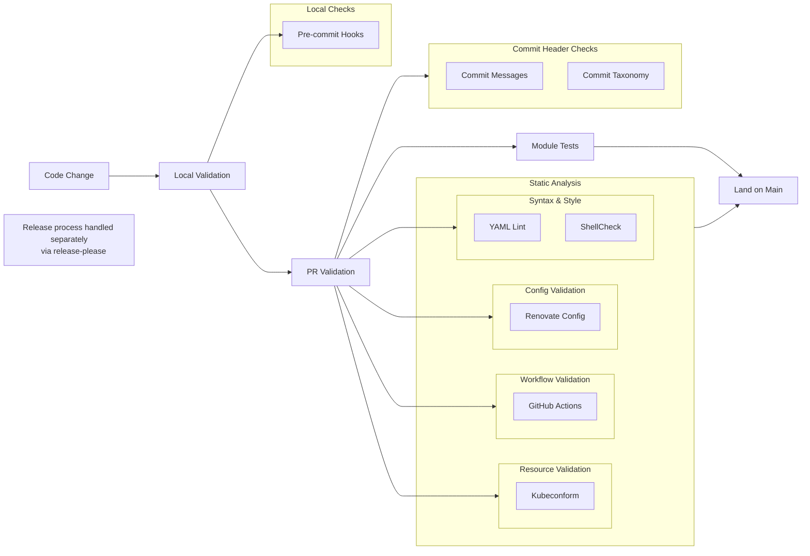
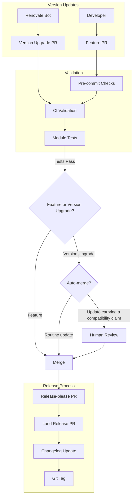

# Development Workflow

How changes flow through this repository — from a code change or an automated
dependency bump, through validation, to an independently versioned release.
The design concepts these workflows operate on (modules, the core/extra pattern,
dependencies) are described in [DESIGN.md](./DESIGN.md); the module test flow
that gates every change is detailed in [TESTING.md](./TESTING.md); the exact
lint/validate commands are in [CLAUDE.md](./CLAUDE.md#commands).

## Quality Controls

The merge gate is branch protection's list of required status checks, not the set of jobs that
happen to run on a pull request: a job outside that list reports its result and can be merged
past. The commit header checks sit in that reporting position by deliberate choice — commitlint
over the branch's commits, and the emission-closure check that asserts every header this repo's
Renovate and release-please configuration *can* produce would pass commitlint. Making either one
required is a separate decision that has not been taken. The closure check lives in
[`ci/scripts/commit-taxonomy/`](./ci/scripts/commit-taxonomy/README.md), which documents what it
models and what it deliberately does not. Treat a red result there as a real
defect regardless: it is precisely what would block if the check were required, and the taxonomy
it protects decays silently when it is ignored.

## Version Management

### Automated Updates

Renovate manages dependency versions across modules. Its configuration — `.github/renovate.json`
plus the rule files in `.github/renovate/` — is the source of truth for the policy described here.

- **Auto-merge is decided per dependency, not per version delta.** A routine update auto-merges
  once the module's tests pass; an update that carries a compatibility claim gets human review.
- **For dependencies versioned by semver, the update type carries that claim.** A major asserts
  the API may have changed, so it is marked breaking and reviewed. A handful of dependencies break
  on *minors* instead, and are configured to be treated the same way.
- **For dependencies versioned by calendar, it does not.** Segments that date a release do not
  grade its risk — a year or month rollover is the calendar turning, not an API change — so those
  dependencies opt out of the semver-shaped treatment wholesale: no breaking marker, auto-merge
  stays on, and a flat release-age soak rather than one graded by segment. Classify by the scheme
  the vendor actually operates, not by the shape of the tag.
- **Some paths and packages are pinned to human review regardless of update type** — the bootstrap
  CRD copies, and individual packages that have earned it (an unusual security-advisory volume; a
  minor release that flipped a behaviour-affecting default).
- **The chainsaw fixtures under `ci/test/` are scanned like any other manifest, deliberately.**
  They pin the same images the modules run, so a fixture left behind would have the suites
  validating against images nobody deploys. Renovate's `:ignoreModulesAndTests` preset would
  suppress exactly those updates and is therefore kept out of the config, directly and via any
  preset that extends it.
- **Renovate compiles its own commit headers** from the same configuration; leave its titles
  alone. What must hold is that every header it can emit is one commitlint accepts — the check
  that asserts this is described under Quality Controls above, and
  [.claude/rules/commits.md](./.claude/rules/commits.md) covers the header rules themselves.

### Release Process

Each module is versioned and released independently.

Which landed changes cut a release is decided by the commit **type**; which module they cut it for
is decided by the **paths** the diff touched. The scope in the header decides neither — it is a
claim about the diff, kept honest so the two agree. Types that describe internal surfaces are
marked hidden in `release-please-config.json` and open no release PR at all; every other type
proposes a patch bump, `docs` included — documentation is surfaced in changelogs deliberately, and
a documentation-only release is the accepted cost of that. A breaking marker (`!`) renders and
bumps whatever the type's hidden flag says. `release-please-config.json` is the source of truth
for which types are visible.

1. Changes land in main branch (via Renovate or manual PRs)
2. Release-please creates release PR with:
   - Version bump
   - Changelog updates
3. When release PR merges:
   - CHANGELOG.md is updated
   - Module gets versioned (git tag)

## Maintenance Practices

1. Module Archival
   - Unused modules moved to `.archive`
   - Preserves historical context
   - Maintains deployment history

2. Repository Organization
   - Helm repositories split by purpose (infra vs apps)
   - Clear module categorization
   - Consistent structure

3. Documentation
   - CHANGELOG.md per module
