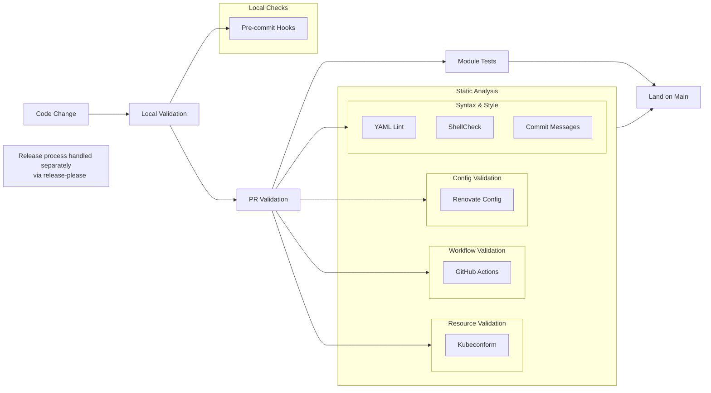
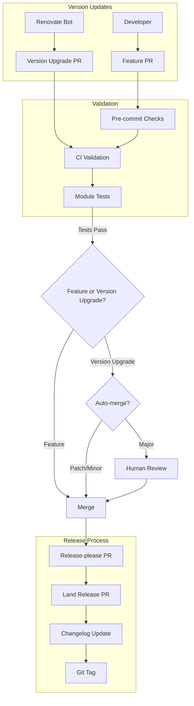

# Development Workflow

How changes flow through this repository — from a code change or an automated
dependency bump, through validation, to an independently versioned release.
The design concepts these workflows operate on (modules, the core/extra pattern,
dependencies) are described in [DESIGN.md](./DESIGN.md); the module test flow
that gates every change is detailed in [TESTING.md](./TESTING.md); the exact
lint/validate commands are in [CLAUDE.md](./CLAUDE.md#commands).

## Quality Controls

## Version Management

### Automated Updates

- Renovate bot manages version updates for applications
- Automated merging rules:
  - Patch versions: Auto-merge if tests pass
  - Minor versions: Auto-merge if tests pass (with exceptions for critical infrastructure)
  - Major versions: Require human approval

### Release Process

Each module is versioned and released independently.

1. Changes land in main branch (via Renovate or manual PRs)
2. Release-please creates release PR with:
   - Version bump
   - Changelog updates
3. When release PR merges:
   - CHANGELOG.md is updated
   - Module gets versioned (git tag)

## Maintenance Practices

1. Module Archival
   - Unused modules moved to `.archive`
   - Preserves historical context
   - Maintains deployment history

2. Repository Organization
   - Helm repositories split by purpose (infra vs apps)
   - Clear module categorization
   - Consistent structure

3. Documentation
   - CHANGELOG.md per module
