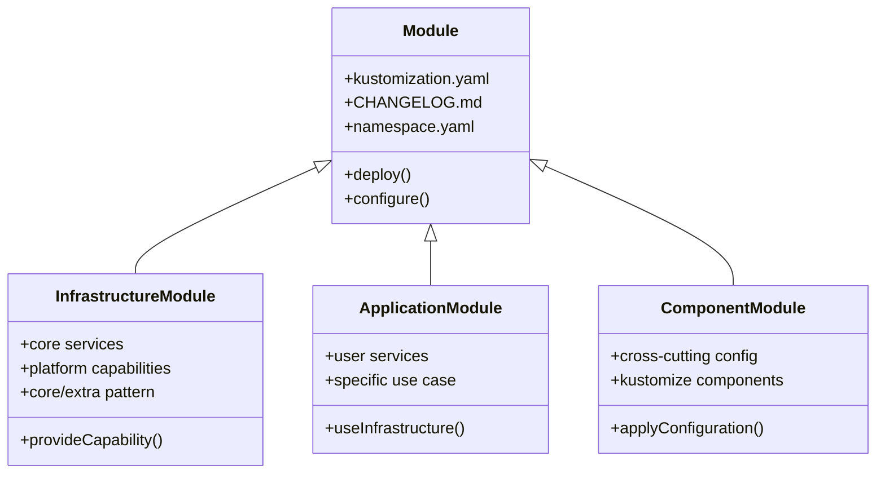

# Kubernetes Platform Modules

This repository contains modules for deploying and managing a complete Kubernetes platform. It provides both foundational infrastructure capabilities and end-user applications, using a modular approach that enables consistent deployment and management through GitOps practices.

## What This Project Provides

This platform enables you to:

- Deploy and manage infrastructure capabilities:
  - Secure service communication with automated TLS certificate management
  - Provide distributed storage with automated backup and replication
  - Configure networking with automated DNS and load balancing
  - Monitor system health with metrics, logs, and alerts
  - Manage databases with automated failover and backups

- Run end-user applications:
  - Secure password management with Bitwarden
  - Remote development environments with Coder
  - Container image registry with Harbor
  - Home automation through Home Assistant
  - Media management with Plex, Jellyfin, and automated content organization

## Project Structure & Concepts

The platform organizes functionality into module types with clear responsibilities:

| Module Type | Purpose | Characteristics | Examples |
|------------|---------|-----------------|----------|
| Infrastructure | Provides foundational platform capabilities | • Supplies core services • Uses core/extra pattern • Focuses on platform features • Other modules depend on it | [Infrastructure Modules](./infrastructure): • Security (certs, secrets) • Storage (block, object) • Networking (DNS, ingress) |
| Application | Delivers end-user functionality | • Provides user services • Focuses on use cases • Uses infrastructure capabilities • Independent deployment | [Application Modules](./apps): • Password management • Development environments • Media streaming |
| Component | Enables cross-cutting features | • Configures shared features • Uses Kustomize components • Applies to other modules • Flexible application | [Component Modules](./components): • Single sign-on • Backup policies • Monitoring templates |

## Finding Your Way

| Category | When you need to... | Look in... | To find... | For example... |
|----------|-------------------|------------|------------|----------------|
| Project Understanding | Understand the project structure | [Project Brief - Organization](./projectBrief.md#module-types-and-organization) | Module types and relationships | • Infrastructure/Apps/Components • Core/Extra pattern • Module boundaries |
|  | Learn about design decisions | [Project Brief - Design](./projectBrief.md#design-principles) | Architecture principles and patterns | • Module independence • Configuration flexibility • Dependency management |
|  | See how changes are managed | [Project Brief - Development](./projectBrief.md#development-workflow) | Quality controls and workflows | • Version management • Automated updates • Release process |
| Module Usage | Find infrastructure capabilities | [Infrastructure Modules](./infrastructure) | Platform services by category | • Security (cert-manager, secrets) • Storage (Longhorn, MinIO) • Networking (MetalLB, Traefik) |
|  | Set up end-user applications | [Application Modules](./apps) | User-facing services | • Password management (Bitwarden) • Development environments (Coder) • Media streaming (Plex) |
|  | Configure cross-cutting features | [Component Modules](./components) | Reusable configurations | • Single sign-on setup • Backup configurations • Monitoring templates |
| Configuration | Configure modules | [Project Brief - Configuration](./projectBrief.md#configuration) | Configuration methods | • Kustomize patches • Post-build variables • Component overlays |
|  | Handle dependencies | [Project Brief - Dependencies](./projectBrief.md#dependencies) | Dependency management | • Hard vs soft dependencies • Core/Extra pattern • Dependency cycles |
|  | Set up integrations | [Project Brief - Integration](./projectBrief.md#integration-patterns) | Integration patterns | • Certificate management • Secret handling • Monitoring setup |
