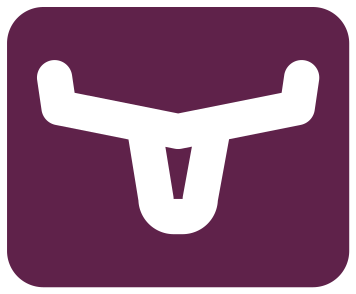
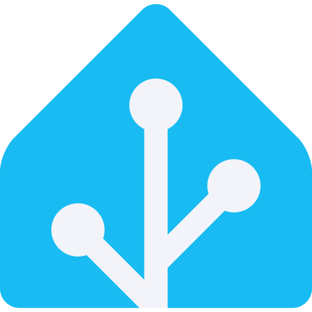

# Kubernetes Platform Modules

This repository contains modules for deploying and managing a complete Kubernetes platform. It provides both foundational infrastructure capabilities and end-user applications, using a modular approach that enables consistent deployment and management through GitOps practices.

## What This Project Provides

This platform enables you to:

- Deploy and manage infrastructure capabilities:
  - Secure service communication with automated TLS certificate management
  - Provide distributed storage with automated backup and replication
  - Configure networking with automated DNS and load balancing
  - Monitor system health with metrics, logs, and alerts
  - Manage databases with automated failover and backups

- Run end-user applications:
  - Secure password management with Bitwarden
  - Remote development environments with Coder
  - Container image registry with Harbor
  - Home automation through Home Assistant
  - Media management with Plex, Jellyfin, and automated content organization
  - Utility services including SMTP relay with Maddy

| Module Type | Module Name | Applications (↗) | Capabilities |
|-------------|-------------|--------------|--------------|
| **Infrastructure (Core)** | [security-core](./infrastructure/subsystems/security-core) |  <a href="https://cert-manager.io/" target="_blank">cert-manager</a>  <a href="https://external-secrets.io/" target="_blank">external-secrets</a>  <a href="https://cert-manager.io/docs/trust/trust-manager/" target="_blank">trust-manager</a> | • Provides automated TLS certificate management • Enables secure secret management with external providers • Facilitates certificate distribution across namespaces |
| | [storage-core](./infrastructure/subsystems/storage-core) |  <a href="https://longhorn.io/" target="_blank">Longhorn</a>  <a href="https://min.io/" target="_blank">MinIO</a>  NFS CSI Driver | • Delivers distributed block storage with replication • Provides S3-compatible object storage • Enables dynamic provisioning from NFS shares |
| | [networking-core](./infrastructure/subsystems/networking-core) |  <a href="https://metallb.io/" target="_blank">MetalLB</a>  <a href="https://github.com/kubernetes-sigs/external-dns" target="_blank">external-dns</a>  <a href="https://traefik.io/" target="_blank">Traefik</a> | • Supplies Layer 2 load balancing for services • Manages DNS records automatically • Controls ingress with TLS and middleware support |
| | [observability-core](./infrastructure/subsystems/observability-core) |  <a href="https://prometheus.io/" target="_blank">Prometheus</a>  <a href="https://grafana.com/oss/loki/" target="_blank">Loki</a>  <a href="https://grafana.com/" target="_blank">Grafana</a> | • Collects metrics with ServiceMonitor support • Aggregates logs with retention policies • Provides unified visualization dashboards |
| | [database-core](./infrastructure/subsystems/database-core) |  <a href="https://cloudnative-pg.io/" target="_blank">CloudNativePG</a> | • Manages PostgreSQL clusters with automation • Enables high availability with failover • Configures backup with retention policies |
| | [kubernetes-core](./infrastructure/subsystems/kubernetes-core) |  <a href="https://coredns.io/" target="_blank">CoreDNS</a> | • Configures cluster-wide service discovery • Provides secure API access • Supports custom DNS zones |
| | [clusterops-core](./infrastructure/subsystems/clusterops-core) |  <a href="https://fluxcd.io/" target="_blank">Flux CD</a>  <a href="https://github.com/rancher/system-upgrade-controller" target="_blank">system-upgrade-controller</a> | • Manages GitOps-based deployments • Automates component upgrades • Provides OOM protection |
| **Infrastructure (Extra)** | [security-extra](./infrastructure/subsystems/security-extra) |  <a href="https://goauthentik.io/" target="_blank">Authentik</a> | • Deploys identity provider for SSO • Implements policy-based access control • Secures service ingress with identity headers |
| | [networking-extra](./infrastructure/subsystems/networking-extra) |  <a href="https://pi-hole.net/" target="_blank">Pi-hole</a>  <a href="https://freeradius.org/" target="_blank">FreeRADIUS</a>  <a href="https://tailscale.com/" target="_blank">Tailscale</a>  <a href="https://ui.com/" target="_blank">UniFi</a> | • Filters DNS and blocks ads • Provides secure VPN access • Manages network devices comprehensively • Maps wireless clients to VLANs based on MAC addresses |
| | [observability-extra](./infrastructure/subsystems/observability-extra) |  <a href="https://github.com/resmoio/kubernetes-event-exporter" target="_blank">Kubernetes Event Exporter</a>  <a href="https://github.com/kubernetes/node-problem-detector" target="_blank">Node Problem Detector</a>  <a href="https://github.com/prometheus/snmp_exporter" target="_blank">SNMP Exporter</a>  <a href="https://www.syslog-ng.com/technical-documents/doc/syslog-ng-open-source-edition/3.37/administration-guide/" target="_blank">Syslog-ng</a>  <a href="https://unpoller.com/" target="_blank">UniFi Poller</a> | • Exports Kubernetes events to Loki • Collects metrics from network devices • Detects node problems with custom definitions |
| | [kubernetes-extra](./infrastructure/subsystems/kubernetes-extra) |  <a href="https://kubernetes-sigs.github.io/node-feature-discovery/" target="_blank">node-feature-discovery</a>  <a href="https://github.com/kubernetes/autoscaler/tree/master/vertical-pod-autoscaler" target="_blank">Vertical Pod Autoscaler</a>  <a href="https://github.com/kubernetes-sigs/descheduler" target="_blank">descheduler</a> | • Discovers and labels node hardware • Optimizes resource allocation • Balances workloads with policies |
| | [clusterops-extra](./infrastructure/subsystems/clusterops-extra) | <a href="https://github.com/FairwindsOps/goldilocks" target="_blank">Goldilocks</a>  <a href="https://github.com/stakater/Reloader" target="_blank">reloader</a>  <a href="https://github.com/weaveworks/tf-controller" target="_blank">Terraform controller</a> | • Visualizes resource optimization • Automates pod restarts on config changes • Manages infrastructure with Terraform integration |
| **Applications** | [ai](./apps/subsystems/ai) |  <a href="https://github.com/ollama/ollama" target="_blank">Ollama</a>  <a href="https://github.com/open-webui/open-webui" target="_blank">OpenWebUI</a> | • Hosts large language models locally • Provides web-based chat interface • Enables model selection and configuration |
| | [bitwarden](./apps/subsystems/bitwarden) |  <a href="https://bitwarden.com/help/password-manager-overview/" target="_blank">Bitwarden</a> | • Provides end-to-end encrypted password vault • Enables credential autofill in browsers • Supports two-factor authentication |
| | [coder](./apps/subsystems/coder) |  <a href="https://coder.com/docs/about" target="_blank">Coder</a> | • Creates cloud-based development environments • Provides server-grade compute resources • Enables consistent environment configuration |
| | [downloaders](./apps/subsystems/downloaders) |  <a href="https://github.com/Sonarr/Sonarr/blob/v5-develop/README.md" target="_blank">Sonarr</a>  <a href="https://github.com/Radarr/Radarr/blob/develop/README.md" target="_blank">Radarr</a>  <a href="https://github.com/Lidarr/Lidarr/blob/develop/README.md" target="_blank">Lidarr</a>  <a href="https://github.com/Prowlarr/Prowlarr/blob/develop/README.md" target="_blank">Prowlarr</a>  <a href="https://sabnzbd.org/wiki/" target="_blank">SABnzbd</a> | • Manages TV shows with quality profiles • Handles movies with automated organization • Provides unified indexer management |
| | [harbor](./apps/subsystems/harbor) |  <a href="https://github.com/goharbor/harbor/blob/main/README.md" target="_blank">Harbor</a> | • Stores and manages container images and charts • Performs vulnerability scanning on images • Enables image signing and content trust |
| | [home-automation](./apps/subsystems/home-automation) |  <a href="https://www.home-assistant.io/" target="_blank">Home Assistant</a> | • Integrates with smart home devices • Provides automation engine for device control • Enables custom monitoring dashboards |
| | [media](./apps/subsystems/media) |  <a href="https://www.plex.tv/" target="_blank">Plex</a>  <a href="https://jellyfin.org/" target="_blank">Jellyfin</a>  <a href="https://freetubeapp.io/" target="_blank">FreeTube</a>  <a href="https://tautulli.com/" target="_blank">Tautulli</a> | • Streams media with transcoding capabilities • Enables privacy-focused YouTube viewing • Monitors Plex statistics and usage |
| | [misc](./apps/subsystems/misc) | <a href="https://github.com/foxcpp/maddy" target="_blank">Maddy</a> | • Houses misc applications • Provides SMTP relay services • |
| **Components** | [sso](./components/sso) | SSO integration patches | • Adds single sign-on to multiple applications • Secures ingress with authentication middleware • Provides consistent login experience |
| | [db-backups](./components/db-backups) | Database backup configuration | • Configures scheduled database backups • Manages backup credentials securely • Applies consistent backup policies |
| | [oidc-credentials](./components/oidc-credentials) | OIDC credential configuration | • Configures OIDC credentials for applications • Enables secure authentication flows • Provides consistent identity integration |

## Project Structure & Concepts

The platform organizes functionality into module types with clear responsibilities:

| Module Type | Purpose | Characteristics | Examples |
|------------|---------|-----------------|----------|
| Infrastructure | Provides foundational platform capabilities | • Supplies core services • Uses core/extra pattern • Focuses on platform features • Other modules depend on it | [Infrastructure Modules](./infrastructure): • Security (certs, secrets) • Storage (block, object) • Networking (DNS, ingress) |
| Application | Delivers end-user functionality | • Provides user services • Focuses on use cases • Uses infrastructure capabilities • Independent deployment | [Application Modules](./apps): • Password management • Development environments • Media streaming |
| Component | Enables cross-cutting features | • Configures shared features • Uses Kustomize components • Applies to other modules • Flexible application | [Component Modules](./components): • Single sign-on • Backup policies • Monitoring templates |

## Finding Your Way

| Category | When you need to... | Look in... | To find... | For example... |
|----------|-------------------|------------|------------|----------------|
| Project Understanding | Understand the project structure | [Project Brief - Organization](./projectBrief.md#module-types-and-organization) | Module types and relationships | • Infrastructure/Apps/Components • Core/Extra pattern • Module boundaries |
|  | Learn about design decisions | [Project Brief - Design](./projectBrief.md#design-principles) | Architecture principles and patterns | • Module independence • Configuration flexibility • Dependency management |
|  | See how changes are managed | [Project Brief - Development](./projectBrief.md#development-workflow) | Quality controls and workflows | • Version management • Automated updates • Release process |
| Module Usage | Find infrastructure capabilities | [Infrastructure Modules](./infrastructure) | Platform services by category | • Security (cert-manager, secrets) • Storage (Longhorn, MinIO) • Networking (MetalLB, Traefik) |
|  | Set up end-user applications | [Application Modules](./apps) | User-facing services | • Password management (Bitwarden) • Development environments (Coder) • Media streaming (Plex) |
|  | Configure cross-cutting features | [Component Modules](./components) | Reusable configurations | • Single sign-on setup • Backup configurations • Monitoring templates |
| Configuration | Configure modules | [Project Brief - Configuration](./projectBrief.md#configuration) | Configuration methods | • Kustomize patches • Post-build variables • Component overlays |
|  | Handle dependencies | [Project Brief - Dependencies](./projectBrief.md#dependencies) | Dependency management | • Hard vs soft dependencies • Core/Extra pattern • Dependency cycles |
|  | Set up integrations | [Project Brief - Integration](./projectBrief.md#integration-patterns) | Integration patterns | • Certificate management • Secret handling • Monitoring setup |
