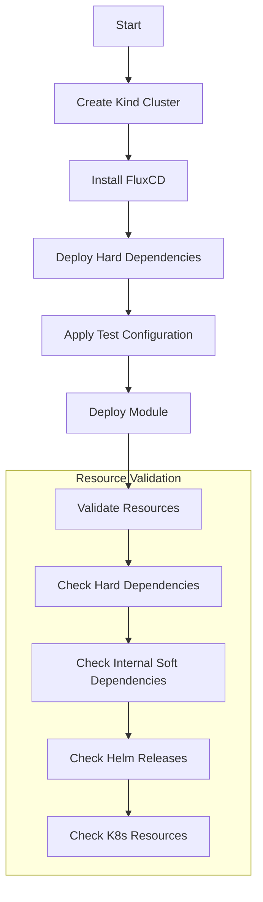

# Testing and Validation

How modules in this repository are tested and validated. For the module and
dependency concepts referenced below (hard vs soft dependencies, the core/extra
pattern, module boundaries), see [DESIGN.md](./DESIGN.md). For the commands to
run these checks locally, see [CLAUDE.md](./CLAUDE.md#commands).

## Module Testing Strategy

Each module is tested as a complete unit in CI, even when only one component changes. This ensures:

- All components within a module work together
- Dependencies are properly satisfied
- Configuration is valid

## Test Process



## Test Components

1. Environment Setup
   - Kind cluster creation
   - FluxCD installation
   - Test configuration and secrets

2. Dependency Deployment
   - Deploy hard dependencies first
   - Configure test mode settings
   - Apply necessary patches

3. Resource Validation

   ```yaml
   # Example validation checks
   - kubectl wait --for=condition=Ready pod -l app=dependency-app
   - kubectl wait --for=condition=Ready helmrelease/app-release
   - kubectl get deploy app-deployment -o jsonpath='{.status.readyReplicas}'
   ```

## Test Data

- Located in `ci/test/<module>/pre-requisites/`
- Contains test configurations and secrets
- No production data or credentials
- Example:

  ```yaml
  apiVersion: v1
  kind: Secret
  metadata:
    name: test-credentials
  type: Opaque
  stringData:
    username: test-user
    password: example
  ```

## Resource Validation

- Uses `kubeconform` to validate all Kubernetes manifests
- Validates against:
  - Native Kubernetes resource specs
  - Custom Resource Definition (CRD) specs
- Runs on all pull requests

## Known Limitations

- **NetworkPolicy enforcement**: the kind-based chainsaw suites cannot validate that a
  `NetworkPolicy` actually filters traffic — kind's default CNI (kindnetd) does not implement
  NetworkPolicy enforcement, so any policy applies as an object but has no effect on the
  cluster's data plane. Chainsaw assertions for these resources are therefore structural only
  (the object exists and is shaped as expected); real enforcement must be verified on a
  cluster whose CNI implements NetworkPolicy (e.g. k3s's bundled controller).
