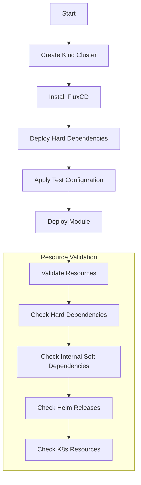

# Testing and Validation

How modules in this repository are tested and validated. For the module and
dependency concepts referenced below (hard vs soft dependencies, the core/extra
pattern, module boundaries), see [DESIGN.md](./DESIGN.md). For the commands to
run these checks locally, see [CLAUDE.md](./CLAUDE.md#commands).

## Module Testing Strategy

Each module is tested as a complete unit in CI, even when only one component changes. This ensures:

- All components within a module work together
- Dependencies are properly satisfied
- Configuration is valid

## Test Process



## Test Components

1. Environment Setup
   - Kind cluster creation
   - FluxCD installation
   - Test configuration and secrets

2. Dependency Deployment
   - Deploy hard dependencies first
   - Configure test mode settings
   - Apply necessary patches

3. Resource Validation
   - `validate-*.yaml` steps, one per component, each asserting that component's
     `HelmRelease` and the workloads underneath it
   - shared readiness assertions from `ci/test/chainsaw/assertions/`, reused rather than
     restated per suite — a fix to one of them reaches every suite at once

## Test Data

- Located in `ci/test/<module>/pre-requisites/`, or `ci/test/chainsaw/pre-requisites/<name>/`
  for a fixture more than one suite needs
- Contains test configurations and secrets
- No production data or credentials
- Example:

  ```yaml
  apiVersion: v1
  kind: Secret
  metadata:
    name: test-credentials
  type: Opaque
  stringData:
    username: test-user
    password: example
  ```

## Sequential Test Fixtures

- Some modules apply fixtures under `ci/test/<module>/test-resources/` sequentially, in
  place, during the chainsaw run - e.g. `infra-database`'s CNPG cluster moves through
  bare -> backups enabled -> restored as three separate files sharing one Flux
  `Kustomization` name, mirroring how the same object mutates over separate commits in
  production (see clusters-repo PR #735 for a real restore).
- A static point-in-time tree scan (e.g. `flux-local`, used by the `diff-changes`
  workflow) cannot represent "same identity, different specs over time" as anything but
  a duplicate-name collision, so `test-resources/` is excluded from what that workflow
  scans. It is chainsaw-only scaffolding, not part of the module's own manifest -
  `pre-requisites/` and the module's own Flux `Kustomization` files are still diffed
  normally.
- **Re-asserting a condition after mutating an object in place is vacuous on its own.** The
  object still carries the previous spec's `Ready=True` when the step begins, so the assert
  returns instantly and its budget can never be consumed. Gate the step on something the new
  spec necessarily creates - `validate-test-postgres-db-backup.yaml` waits for the
  sidecar-injected Pod for exactly this reason - or on
  `observedGeneration == metadata.generation` where the CRD maintains it.

## Assertions Compare Status to Intent, Not Status to Status

A workload's status only ever describes **the spec the controller last acted on**, so an
assertion built entirely out of status fields can be fully satisfied by a spec nobody asked
for. Three properties of the assertion engine, all measured on the chainsaw version CI pins
(v0.2.15), make that easy to write by accident:

- **Absent compares equal to absent.** `(a == b): true` passes when both fields are missing,
  so `(replicas == readyReplicas)` is satisfied by an empty status.
- **Whether a field renders at zero is a serialisation detail, not a design.**
  `DaemonSetStatus.numberReady` carries no `omitempty` and renders `0`; `numberAvailable`
  carries one and disappears. Every field of `DeploymentStatus` is omitempty. So whether a
  status-vs-status check happens to catch an empty status is an accident of Go struct tags,
  and it differs between kinds.
- **A condition that was True stays True** until the controller revisits it.

The shared workload assertions therefore carry two things no status-only check can provide:

- `(status.observedGeneration == metadata.generation)` - the controller has seen *this*
  spec. It closes the fresh-object window and the stale-status-after-mutation case in one
  line, and costs nothing on a green run. Only add it where the field is genuinely
  maintained: apps/v1 `Deployment`, `StatefulSet` and `DaemonSet` all maintain it; verify
  before relying on it for a CRD, because a controller that never sets it makes the
  assertion permanently red.
- **a comparison against `spec`.** Without `(status.readyReplicas == spec.replicas)` a
  StatefulSet that cannot create pod-1 at all reports `{replicas:1, readyReplicas:1,
  currentReplicas:1}` and passes at 1 of N, and a Deployment scaled to zero passes with no
  pods running at all.

Two gaps are deliberately left to scripts and separate assertions, because the quantity they
need is not in the object being asserted:

- **DaemonSet node coverage.** `desiredNumberScheduled` counts the nodes the DaemonSet
  *currently targets*, so it shrinks along with the regression - a dropped toleration passes
  at 2 == 2 with a node uncovered. `ci/test/chainsaw/scripts/daemonset-node-coverage.sh`
  compares it to the node count; apply it on multi-node suites whose DaemonSet is meant to
  run everywhere.
- **Service to pod wiring.** `service-clusterip-ready.yaml` cannot go red for any live
  ClusterIP Service - it is an existence check. Where a Service actually resolving is part
  of what the suite claims to prove, add `service-endpoints-ready.yaml`.

The rule underneath all of it: **an assertion that cannot go red is worse than no
assertion**, because it consumes a budget and reads as coverage. Before believing a new
assertion works, construct the state it is meant to catch and watch it fail.

## What an Assertion Actually Means

The section above turns on how chainsaw's assertion-tree matcher reads an assertion, and those
rules are not obvious. Four of them are load-bearing here, and `ci/test/assertion-semantics/`
holds each one under test so a chainsaw bump cannot move one in silence:

| behaviour | consequence for an assertion you write |
| --- | --- |
| maps match by **subset** | naming a field asserts it; unnamed fields are ignored |
| absent fields compare **equal** inside an expression | `(a == b): true` passes when *neither* exists, so an expression over status a controller has not populated yet passes vacuously — the root of the vacuity family above |
| scalars use **strict equality**, never globbing | `*` is a literal asterisk. Kyverno *policies* glob-match; chainsaw assertions do not, so do not carry that instinct across |
| arrays require **equal length** and match **index-wise** | a **literal** list-shaped assertion already notices an added element and needs no `(length(x)): n` guard — but reordering produces a false red. Beside **expression selectors** (`(items[?name == 'x'] \| [0]...)`) a `length()` guard is load-bearing, not redundant: a filter that picks one named element says nothing about the rest of the array (see `validate-alloy.yaml`) |

These are pinned by `CHAINSAW_VERSION`, which lives in `ppat/github-workflows` and is bumped
there by Renovate. That bump reaches this repository only as a Renovate PR moving the `uses:`
sha in `.github/workflows/test-*.yaml`, so `ci/test/assertion-semantics/` runs on exactly that
PR — a release that changed matching semantics would otherwise land underneath all sixteen
suites in silence, and every assertion in the repo would quietly start meaning something else.

The suite pairs each negative check with a positive control on the same object, so an `error`
that passed for the wrong reason (wrong name, wrong field path) cannot read as a green result.
It needs any cluster and no Flux, and it costs one job: **27–33s of chainsaw time inside a
90–114s job** (five CI runs). Both numbers get quoted for this suite and they are not in
conflict — see *Say which duration you mean* below; the difference is almost entirely
`kind create` and the Flux install the shared workflow performs whether a suite needs it or not.

## Timeout Budgets and Validation Order

Assertions in a suite run **sequentially**; the workloads underneath them do not. Flux applies
the whole module in one shot, so every pod begins pulling and starting **in parallel** the
moment the module is applied — but a validate step's timeout only starts counting when
chainsaw *reaches that step*. A component validated late has therefore already absorbed most
of its startup before its own clock starts; one validated first gets none of that head start.

The conventions below follow from that one fact, and they only work together.

### A budget is only meaningful relative to what runs before it

This is the idea underneath everything else here, and it is the one most often missed. A step
that returns in 0.1s is not necessarily cheap — it may be cheap *because the step ahead of it
already waited out the whole rollout*. Move it earlier, or delete the step in front of it, and
it becomes the one that waits.

Two consequences:

- **Whatever runs first absorbs the module's initial convergence**, whichever component it
  happens to assert. So the first validate step is structurally the most exposed in any suite,
  and should be budgeted for that absorption rather than for its own component's typical time.
  A suite's first step inheriting the shared default is almost always wrong.
- **Reordering displaces pressure; it does not remove it.** After any reorder, check what the
  change exposed — the newly-first step, and anything that used to sit behind a long wait.

### Move a wait to where the dependency actually is

The largest wins available are not budgets or ordering at all: they are waits placed earlier
than the thing that needs them. A prerequisite waited for at the top of a suite blocks *every*
workload behind it from even starting to pull.

The criterion for moving one safely: **a prerequisite may be waited for late if, and only if,
it provides no CRD and no admission webhook that the module's own manifests need at apply
time.** A component supplying only a runtime endpoint — object storage, say — can be waited on
immediately before the first step that uses it. A component supplying a CRD cannot.

This composes with ordering, but the two are closer to substitutes than complements: moving a
wait creates slack for everyone, and ordering only decides who pays for whatever is left.

### Order validate steps by readiness, not by source order

Sort ascending by how long each component actually takes to become ready. **Declared
dependencies are the primary sort key and measured speed only the secondary** — a step that
passes because it ran before something it depends on is a worse defect than the flake it was
meant to fix.

Three things this ordering must not do:

- **Promote a step that asserts an end-to-end outcome.** Steps that assert a whole
  `HelmRelease` is Ready, or that a record written by one component is retrievable from
  another, are cheap and instant but belong last. Sorting by cost puts them first.
- **Assert a workload before its `HelmRelease`.** Helm creates nothing until a release
  completes, so a workload assertion on a still-installing release fails with
  `actual resource not found` — a release in progress, reported as if the module were missing
  an object. Where the release does not set `install.disableWait`, helm-controller waits for
  the workloads anyway, so asserting the `HelmRelease` first both subsumes those assertions
  and gives the failure a self-explanatory message. Since the step asserts both, its total
  duration is unchanged either way; only the message and the budget's placement move.
  Note the exception: where a chart runs a **post-install hook Job** — an API-readiness check,
  a migration — the release goes Ready long after its workloads do, rather than the usual few
  seconds. Keep the workload assertions in that case; the release condition is no longer a
  near-proxy for them.
- **Be expected to do the work alone.** Ordering is free, but it is only worth the elapsed
  time of the steps it moves past. Where one component dominates a suite it is nearly
  worthless on its own and must be paired with a budget that fits.

### Size budgets from measurement, in both directions

A budget that has never been approached is as much a defect as one that expires: it states
nothing about what the step should cost, so it cannot detect that step regressing, and it
delays the signal on the failure mode where it *is* consumed. Right-sizing runs both ways —
raising the under-budgeted and cutting the unreachable.

- **Raising a budget is free on runs that pass.** A satisfied assertion returns the instant its
  condition holds, so a larger number costs nothing unless the run was going to be red anyway.
  This is what makes speed and flakiness far less opposed than they look: the trade-off only
  bites if the timeout number is the only lever you reach for.
- **Prefer a measured maximum with a wide multiplier over a round number.** A tight budget
  costs a full re-run; a generous one costs extra minutes only on runs that are already broken.
  Expect a genuinely slow runner to exceed a maximum drawn from green runs by more than you
  would guess: the sample of runs that finished is, by construction, the sample that fit.
  Historically the multiplier had to come from that cost asymmetry alone, because every timeout
  failure is censored at its own budget — an assert dying at 60.0s of 60s says nothing about
  what it needed. **`UNCENSORED` lines in a failed run's log now report what it needed**, so
  prefer that number over the multiplier whenever the failure produced one.
- **Readiness is not creation, not image size, and not assert duration.** All three are
  tempting proxies and each has been measurably wrong here. `AGE` in a dump is *creation*;
  image bytes predict pull time but not dependency waits; and assert duration is circular,
  because a step measures 0s precisely when the step ahead of it absorbed the wait. Use the
  `READY` lines below instead — and for pull time specifically, the `PULL` lines, which carry
  kubelet's own measurement rather than a proxy for it.
- **Record the measurement next to the number**, in the suite. What it was, what was observed,
  and why the new value. A budget without that is indistinguishable from a guess, and the next
  maintainer will "tidy" it back to the default.

### The anti-pattern this exists to prevent

**Raising a timeout to turn a red run green, without first establishing what the step needs.**
It is indistinguishable from a fix while it is being made and it silently raises the bar for
every future regression. Before changing a budget, confirm the component was *late* rather
than *broken* — a broken component leaves obligatory evidence behind (`CrashLoopBackOff`,
non-zero restarts, `Helm install failed`, an Error event), and the absence of that evidence is
what distinguishes the two. If a component never started at all, no budget can fix it.

## What Every Run Emits, and How to Read It

Every suite emits the same grep-able lines whether it passes or fails — passing runs from
`ci/test/chainsaw/steps/report-readiness.yaml` (the last step), failing runs from the shared
`catch` in `ci/test/chainsaw/.chainsaw.yaml`. Both call the same scripts under
`ci/test/chainsaw/scripts/`, so the two outcomes cannot drift into different formats again.

It is the evidence base every convention above runs on — budgets, validation order, and the test
for whether a component was late or broken all read these same lines — which is why it belongs to
none of them in particular.

There is one exception, and it is the case with the most to explain: **a job killed by
`timeout-minutes` emits none of this.** Chainsaw buffers a script's stdout until the script
exits, so a run that dies at the ceiling loses the whole block rather than truncating it. Two
jobs have died there (`test-apps-ai`, 915s of a 900s ceiling), which is why the watch bound in
the shared `catch` is set well inside the cliff rather than near it.

| prefix | what it answers |
| --- | --- |
| `READY T0+<s> <ts> <status> <kind>/<ns>/<name>` | when each pod, `Kustomization` and `HelmRelease` became Ready, one ascending timeline. This is the input to validate-step ordering. |
| `RESTART <n> <pod> [<container>]` | which containers crashed and recovered *inside* an assertion's budget — invisible everywhere else. |
| `PULL <pull_s> <incl_wait_s> <pod> <image>` | kubelet's own pull duration. The second number includes time queued behind containerd's concurrent-download limit; the gap is the multi-node pull-parallelism argument. |
| `CONTENTION <start\|end> nproc= loadavg= calib_ms= net_mbps= fsync_us= uptime_s= elapsed_s=` | how loaded the runner was, at the two boundaries only. Lets a historical run be conditioned on contention after the fact instead of re-running both arms serially. Four axes because CPU is the one measurably *not* implicated; `net_mbps` is, and `fsync_us` is the untested candidate for the prerequisite phase's bimodality. `uptime_s` is the runner's own uptime at that boundary; `elapsed_s` on the `end` line is the whole chainsaw phase. |
| `UNCENSORED +<s>\|~<s>\|never\|gone <Ready\|NotReady\|Deleted> <kind>/<ns>/<name>` | **failing runs only.** How much longer each not-Ready object actually needed after the suite went red. `never` on a CNPG `Cluster` is #3678. `~` in place of `+` marks a figure taken from when the watch noticed, for an object carrying no Ready `lastTransitionTime`. |
| `UNCENSORED-SUMMARY watched= ready= notready= gone= max_extra_s= bound_s=` | one line to grep a fleet of failures for. A trailing `skipped=no-wall-clock-left` means the watch never ran because the job had no headroom left. |

The same scripts emit four secondary lines that a parser has to expect even though nobody greps
for them by hand: `UNCENSORED-SNAPSHOT at= not_ready=` (the census taken at failure time, before
the dumps), `UNCENSORED-CLAMP requested= remaining_wall_s=` when the watch is shortened against
the job's remaining wall clock, `UNCENSORED-PENDING t+<s> <keys>` progress lines while it waits,
and `PULL-CACHED <n> image(s) already present on machine`. A kubelet message the `PULL` parser
cannot read is emitted as `PULL ? ? <pod> :: <message>` and sorted to the top rather than
dropped. `ci/test/chainsaw/scripts/report-cnpg.sh` adds `--- CNPG: ... ---` blocks on a failure
with a CNPG `Cluster` not Ready; those are diagnostics to read, not a grammar to parse.

Two readings that are not what they look like: `T0` is the earliest transition in that run's own
list, not the suite start, so offsets compare between runs of a suite and not against job
duration; and `calib_ms` is a relative index tied to a fixed iteration count, not a benchmark —
changing that count silently rebases the whole series.

### Say which duration you mean

Three measures nest — **prerequisite ⊂ chainsaw ⊂ job** — and they differ by enough to reverse a
comparison, so a number quoted without saying which one it is cannot be checked.

| measure | what it covers | where it comes from |
| --- | --- | --- |
| prerequisite | the `Reconcile pre-requisites` step alone | chainsaw step timings |
| chainsaw | the whole chainsaw test, prerequisites included | chainsaw step timings, and `elapsed_s` on the `CONTENTION end` line |
| job | chainsaw *plus* checkout, mise, `kind create`, `flux install`, teardown | the **jobs** API — `updated_at` on the *runs* API is corrupt in this repository and must not be used for durations |

`job − chainsaw` is fixed overhead that no change inside a suite can touch, which makes it a free
sanity check on any measurement: an intervention that appears to move it is measuring something
it did not intend to.

## Kind Cluster Topology

Each suite chooses a `kind_config` — one node, or three. This looks like a capacity decision and
is not: **extra kind nodes add no CPU.** They are containers on a single runner sharing the same
cores. What they do add is **image-pull parallelism**, because each node runs its own containerd
with its own concurrent-download limit.

So the question for a new suite is not "how much work does it do" but **"is this suite's cost many
distinct images, or the same image on every node?"** Many distinct images favour more nodes,
because the pulls proceed in parallel. Per-node duplication — DaemonSets above all — favours one
node, because the extra copies are bytes already fetched.

The trap is treating "no duplicated bytes to recover" as making single-node safe by default. It
does not: with nothing to recover, the only remaining effect is the parallelism that is being
given up. `apps-downloaders` measured **10% slower** on a single node for exactly that reason,
reversing a decision that had already been taken.

The rule underneath: **a node count must be justified by something a test can observe.**
`infra-storage` was held at three nodes on the belief that longhorn requires three to function.
It does not — asked for two replicas on one node, longhorn places what it can and runs the
volume degraded, and because a missing replica has no pod-layer signature at all (see Known
Limitations) the suite passed green on either topology. Nothing in it ever checked, which is
exactly why the belief survived unchallenged. Record the measurement in the suite's workflow
beside the `kind_config`, the same way a budget records its own.

## Scheduled Baseline Runs

**The slots are 02:23, 08:23, 14:23 and 20:23 UTC, every day, on `main`.** Anyone running a
serial CI experiment should read that as a hazard and steer around it: a stray fleet dispatch
landing mid-experiment has already invalidated a measurement here. The times are fixed and
published for exactly that reason.

`scheduled-baseline.yaml` measures the fleet's single-run failure rate by designed sampling —
unchanging content, a published cadence, and *n* that grows without anyone doing anything. It
exists because a red that happens to appear on a PR which changed nothing a suite runs is one
sample under one set of load conditions, and rates read off those have contradicted each other.
It is also the only source of data on time of day, which is where contention varies and which
no PR-triggered run can see.

Each slot runs a quarter of the fleet, rotating so that every suite visits every slot over four
days; `infra-observability` and `apps-downloaders` ride every slot because they are the
historically flaky pair and the ones in-flight work is expected to move. Per suite that is
about 30 samples a month, or about 120 for those two. Each suite's `test_path` and `kind_config`
are read out of its own `test-*.yaml` at plan time rather than restated, so a suite that changes
its kind topology cannot go on producing samples under the old one.

Read the series with:

```bash
ci/scripts/baseline-census.sh          # per-suite rate, 95% interval, and the same by hour
ci/scripts/baseline-census.sh --raw    # one TSV row per sampled job
```

### Enumerate the conclusions your census can return

Any rate computed off the GitHub API is only as good as the filter that selected the runs, and
two filters here have silently excluded the exact category they were asked to count:

- **`gh run list` returns only the *latest* attempt of a run**, so a failure that was later
  re-run green is invisible to a `--status=failure` census — which is precisely the sample a
  flake census exists to find.
- **A `timeout-minutes` kill is reported as `cancelled`, not `failure`.** A failure-filtered
  census of job-ceiling kills therefore returned zero and was recorded as settled fact, when
  jobs had in fact been dying at exactly the ceiling all along — reversing a correct earlier
  belief on the strength of a query that could never have found them.

Both queries were confident and both were structurally blind, so confidence is no defence.
**Before trusting a census, enumerate the conclusions the query can return and confirm the
category you are counting is among them** — then, where it is cheap, verify one known-positive
example actually appears in the output.

## Resource Validation

- Uses `kubeconform` to validate all Kubernetes manifests
- Validates against:
  - Native Kubernetes resource specs
  - Custom Resource Definition (CRD) specs
- Runs on all pull requests

## Known Limitations

- **NetworkPolicy enforcement**: the kind-based chainsaw suites cannot validate that a
  `NetworkPolicy` actually filters traffic — kind's default CNI (kindnetd) does not implement
  NetworkPolicy enforcement, so any policy applies as an object but has no effect on the
  cluster's data plane. Chainsaw assertions for these resources are therefore structural only
  (the object exists and is shaped as expected); real enforcement must be verified on a
  cluster whose CNI implements NetworkPolicy (e.g. k3s's bundled controller).
- **Longhorn attach and mount**: `iscsiadm` is present in the kind node image but `iscsid` is
  **inactive**, so `AttachVolume` fails with `DeadlineExceeded` and any consumer pod sits in
  `ContainerCreating` indefinitely. This is why `infra-storage` asserts `PVC → Bound` and stops
  there — a limit of the environment, not an oversight, and worth stating because the missing
  assertion otherwise reads as a gap somebody should close. `Bound` proves only that the
  provisioner answered; it implies nothing about attach, mount, or a readable filesystem, so CI
  cannot catch an attach-path regression on a longhorn upgrade. Tracked as
  [#3718](https://github.com/ppat/homelab-ops-kubernetes-apps/issues/3718).
- **Replica placement across nodes**: not asserted, and deliberately so. A kind cluster's
  topology resembles no real cluster's, so a green "the replicas landed on distinct nodes" would
  mean nothing about production. The storage suite exists to prove *our installation is
  configured correctly and can fulfil its role* across longhorn upgrades and changes to our own
  values — not to re-test longhorn's own scheduler. Note also that longhorn replicas are
  processes inside `instance-manager`, not pods, so a replica that fails to place leaves no
  pod-layer signature for a pod-oriented suite to find.
