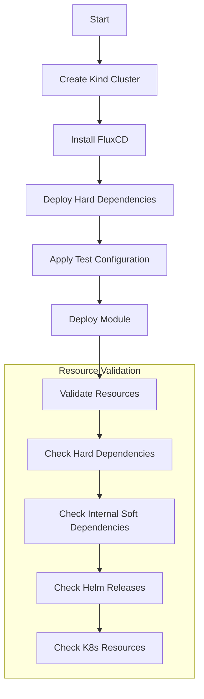

# Testing and Validation

How modules in this repository are tested and validated. For the module and
dependency concepts referenced below (hard vs soft dependencies, the core/extra
pattern, module boundaries), see [DESIGN.md](./DESIGN.md). For the commands to
run these checks locally, see [CLAUDE.md](./CLAUDE.md#commands).

## Module Testing Strategy

Each module is tested as a complete unit in CI, even when only one component changes. This ensures:

- All components within a module work together
- Dependencies are properly satisfied
- Configuration is valid

## Test Process



## Test Components

1. Environment Setup
   - Kind cluster creation
   - FluxCD installation
   - Test configuration and secrets

2. Dependency Deployment
   - Deploy hard dependencies first
   - Configure test mode settings
   - Apply necessary patches

3. Resource Validation

   ```yaml
   # Example validation checks
   - kubectl wait --for=condition=Ready pod -l app=dependency-app
   - kubectl wait --for=condition=Ready helmrelease/app-release
   - kubectl get deploy app-deployment -o jsonpath='{.status.readyReplicas}'
   ```

## Test Data

- Located in `ci/test/<module>/pre-requisites/`
- Contains test configurations and secrets
- No production data or credentials
- Example:

  ```yaml
  apiVersion: v1
  kind: Secret
  metadata:
    name: test-credentials
  type: Opaque
  stringData:
    username: test-user
    password: example
  ```

## Sequential Test Fixtures

- Some modules apply fixtures under `ci/test/<module>/test-resources/` sequentially, in
  place, during the chainsaw run - e.g. `infra-database`'s CNPG cluster moves through
  bare -> backups enabled -> restored as three separate files sharing one Flux
  `Kustomization` name, mirroring how the same object mutates over separate commits in
  production (see clusters-repo PR #735 for a real restore).
- A static point-in-time tree scan (e.g. `flux-local`, used by the `diff-changes`
  workflow) cannot represent "same identity, different specs over time" as anything but
  a duplicate-name collision, so `test-resources/` is excluded from what that workflow
  scans. It is chainsaw-only scaffolding, not part of the module's own manifest -
  `pre-requisites/` and the module's own Flux `Kustomization` files are still diffed
  normally.

## Timeout Budgets and Validation Order

Assertions in a suite run **sequentially**; the workloads underneath them do not. Flux applies
the whole module in one shot, so every pod begins pulling and starting **in parallel** the
moment the module is applied — but a validate step's timeout only starts counting when
chainsaw *reaches that step*. A component validated late has therefore already absorbed most
of its startup before its own clock starts; one validated first gets none of that head start.

The conventions below follow from that one fact, and they only work together.

### A budget is only meaningful relative to what runs before it

This is the idea underneath everything else here, and it is the one most often missed. A step
that returns in 0.1s is not necessarily cheap — it may be cheap *because the step ahead of it
already waited out the whole rollout*. Move it earlier, or delete the step in front of it, and
it becomes the one that waits.

Two consequences:

- **Whatever runs first absorbs the module's initial convergence**, whichever component it
  happens to assert. So the first validate step is structurally the most exposed in any suite,
  and should be budgeted for that absorption rather than for its own component's typical time.
  A suite's first step inheriting the shared default is almost always wrong.
- **Reordering displaces pressure; it does not remove it.** After any reorder, check what the
  change exposed — the newly-first step, and anything that used to sit behind a long wait.

### Move a wait to where the dependency actually is

The largest wins available are not budgets or ordering at all: they are waits placed earlier
than the thing that needs them. A prerequisite waited for at the top of a suite blocks *every*
workload behind it from even starting to pull.

The criterion for moving one safely: **a prerequisite may be waited for late if, and only if,
it provides no CRD and no admission webhook that the module's own manifests need at apply
time.** A component supplying only a runtime endpoint — object storage, say — can be waited on
immediately before the first step that uses it. A component supplying a CRD cannot.

This composes with ordering, but the two are closer to substitutes than complements: moving a
wait creates slack for everyone, and ordering only decides who pays for whatever is left.

### Order validate steps by readiness, not by source order

Sort ascending by how long each component actually takes to become ready. **Declared
dependencies are the primary sort key and measured speed only the secondary** — a step that
passes because it ran before something it depends on is a worse defect than the flake it was
meant to fix.

Three things this ordering must not do:

- **Promote a step that asserts an end-to-end outcome.** Steps that assert a whole
  `HelmRelease` is Ready, or that a record written by one component is retrievable from
  another, are cheap and instant but belong last. Sorting by cost puts them first.
- **Assert a workload before its `HelmRelease`.** Helm creates nothing until a release
  completes, so a workload assertion on a still-installing release fails with
  `actual resource not found` — a release in progress, reported as if the module were missing
  an object. Where the release does not set `install.disableWait`, helm-controller waits for
  the workloads anyway, so asserting the `HelmRelease` first both subsumes those assertions
  and gives the failure a self-explanatory message. Since the step asserts both, its total
  duration is unchanged either way; only the message and the budget's placement move.
  Note the exception: where a chart runs a **post-install hook Job** — an API-readiness check,
  a migration — the release goes Ready long after its workloads do, rather than the usual few
  seconds. Keep the workload assertions in that case; the release condition is no longer a
  near-proxy for them.
- **Be expected to do the work alone.** Ordering is free, but it is only worth the elapsed
  time of the steps it moves past. Where one component dominates a suite it is nearly
  worthless on its own and must be paired with a budget that fits.

### Size budgets from measurement, in both directions

A budget that has never been approached is as much a defect as one that expires: it states
nothing about what the step should cost, so it cannot detect that step regressing, and it
delays the signal on the failure mode where it *is* consumed. Right-sizing runs both ways —
raising the under-budgeted and cutting the unreachable.

- **Raising a budget is free on runs that pass.** A satisfied assertion returns the instant its
  condition holds, so a larger number costs nothing unless the run was going to be red anyway.
  This is what makes speed and flakiness far less opposed than they look: the trade-off only
  bites if the timeout number is the only lever you reach for.
- **Prefer a measured maximum with a wide multiplier over a round number.** Every timeout
  failure is censored at its own budget — an assert that dies at 60.0s of 60s tells you
  nothing about how long it needed — so the tail cannot be measured and the multiplier has to
  come from the cost asymmetry instead. A tight budget costs a full re-run; a generous one
  costs extra minutes only on runs that are already broken. Expect a genuinely slow runner to
  exceed a maximum drawn from green runs by more than you would guess: the sample of runs that
  finished is, by construction, the sample that fit.
- **Readiness is not creation, not image size, and not assert duration.** All three are
  tempting proxies and each has been measurably wrong here. `AGE` in a dump is *creation*;
  image bytes predict pull time but not dependency waits; and assert duration is circular,
  because a step measures 0s precisely when the step ahead of it absorbed the wait. Use the
  pod `Ready` transition times the suites report at the end of every passing run.
- **Record the measurement next to the number**, in the suite. What it was, what was observed,
  and why the new value. A budget without that is indistinguishable from a guess, and the next
  maintainer will "tidy" it back to the default.

### The anti-pattern this exists to prevent

**Raising a timeout to turn a red run green, without first establishing what the step needs.**
It is indistinguishable from a fix while it is being made and it silently raises the bar for
every future regression. Before changing a budget, confirm the component was *late* rather
than *broken* — a broken component leaves obligatory evidence behind (`CrashLoopBackOff`,
non-zero restarts, `Helm install failed`, an Error event), and the absence of that evidence is
what distinguishes the two. If a component never started at all, no budget can fix it.

## Resource Validation

- Uses `kubeconform` to validate all Kubernetes manifests
- Validates against:
  - Native Kubernetes resource specs
  - Custom Resource Definition (CRD) specs
- Runs on all pull requests

## Known Limitations

- **NetworkPolicy enforcement**: the kind-based chainsaw suites cannot validate that a
  `NetworkPolicy` actually filters traffic — kind's default CNI (kindnetd) does not implement
  NetworkPolicy enforcement, so any policy applies as an object but has no effect on the
  cluster's data plane. Chainsaw assertions for these resources are therefore structural only
  (the object exists and is shaped as expected); real enforcement must be verified on a
  cluster whose CNI implements NetworkPolicy (e.g. k3s's bundled controller).
