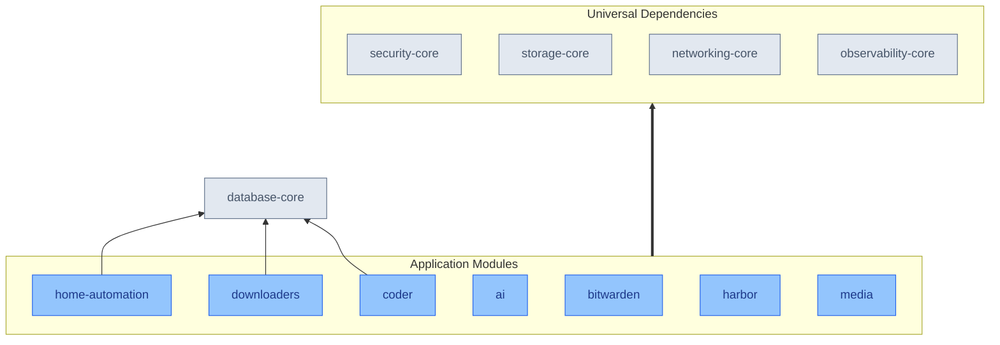

# Application Modules

This directory contains application modules that provide end-user functionality on top of the cluster's infrastructure capabilities. Each module delivers specific user-facing services while leveraging the platform's core services for security, storage, and operations.

## Functional Areas & Capabilities

| Category | Functional Areas | Module Capabilities |
|----------|-----------------|-------------------|
| AI | Language Models Chat Interfaces Model Management | [ai](./subsystems/ai): • Hosts large language models locally through <a href="https://github.com/ollama/ollama" target="_blank">Ollama</a> • Provides web-based chat interface via <a href="https://github.com/open-webui/open-webui" target="_blank">OpenWebUI</a> • Enables model selection and configuration • Supports conversation history management |
| Security & Credentials | Password Management Secrets Storage Identity Management | [bitwarden](./subsystems/bitwarden): • Provides <a href="https://bitwarden.com/help/password-manager-overview/" target="_blank">end-to-end encrypted password vault</a> with zero-knowledge architecture • Enables credential autofill in browsers and mobile apps with browser extensions • Supports two-factor authentication and secure password generation • Integrates with enterprise SSO and directory systems |
| Development Tools | Remote Development Cloud Workspaces IDE Support | [coder](./subsystems/coder): • Creates <a href="https://coder.com/docs/about" target="_blank">cloud-based development environments</a> with any IDE (VS Code, JetBrains, Web) • Provides server-grade compute resources for faster development • Enables consistent environments through infrastructure tools (Terraform, Docker) • Supports secure remote access through HTTPS/SSH |
| Container Registry | Image Management Security Scanning Access Control | [harbor](./subsystems/harbor): • Stores and manages <a href="https://github.com/goharbor/harbor/blob/main/README.md" target="_blank">container images and Helm charts</a> with role-based access • Performs vulnerability scanning on container images with policy enforcement • Enables image signing and content trust through Notary • Provides automated garbage collection and image cleanup |
| Home Automation | Device Control Automation Monitoring | [home-automation](./subsystems/home-automation): • Integrates with smart home devices through <a href="https://www.home-assistant.io/" target="_blank">Home Assistant</a> • Provides automation engine for device control based on triggers and conditions • Enables custom dashboards for monitoring and control • Supports local processing without cloud dependencies |
| Media Management | Media Servers Content Organization Download Management | [media](./subsystems/media): • Streams media through <a href="https://www.plex.tv/" target="_blank">Plex</a> (transcoding, user management) and Jellyfin • Enables privacy-focused YouTube viewing through <a href="https://freetubeapp.io/" target="_blank">FreeTube</a> • Monitors Plex statistics and usage through <a href="https://tautulli.com/" target="_blank">Tautulli</a>  [downloaders](./subsystems/downloaders): • Manages TV shows through <a href="https://github.com/Sonarr/Sonarr/blob/v5-develop/README.md" target="_blank">Sonarr</a> with quality profiles and metadata • Handles movies through <a href="https://github.com/Radarr/Radarr/blob/develop/README.md" target="_blank">Radarr</a> with automated organization • Manages music through <a href="https://github.com/Lidarr/Lidarr/blob/develop/README.md" target="_blank">Lidarr</a> with artist monitoring • Provides unified indexer management through <a href="https://github.com/Prowlarr/Prowlarr/blob/develop/README.md" target="_blank">Prowlarr</a> • Processes downloads via <a href="https://sabnzbd.org/wiki/" target="_blank">SABnzbd</a> with repair and extraction |

## Module Relationships

The following diagram shows how application modules depend on infrastructure capabilities:

## Configuration

For detailed information about configuration methods used across all modules, including Kustomize patches, FluxCD post-build variables, and component overlays, refer to the [Configuration Methods](../projectBrief.md#configuration-methods) section in the project brief.
