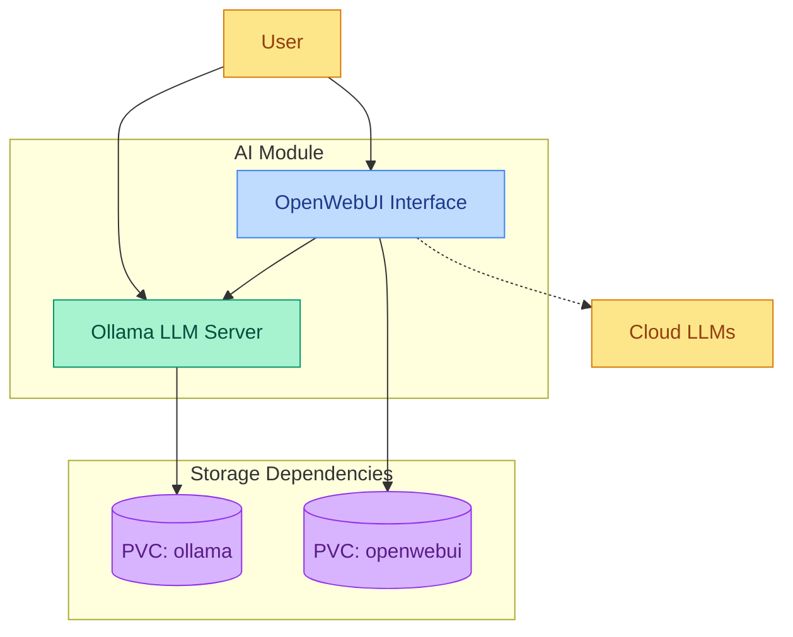

# AI Subsystem

Self-hosted AI platform providing local large language model capabilities and a web interface for interacting with AI models.

## Quick Links

- [Ollama Documentation](https://github.com/ollama/ollama)
- [Ollama GitHub Repository](https://github.com/ollama/ollama)
- [OpenWebUI Documentation](https://docs.openwebui.com/)
- [OpenWebUI GitHub Repository](https://github.com/open-webui/open-webui)

## Overview

The AI subsystem consists of two main capability groups:

1. AI Model Serving
   - Local large language model hosting
   - Model management and versioning
   - API-based model interaction
   - Efficient resource utilization

2. User Interface
   - Web-based chat interface
   - Model selection and configuration
   - Conversation history management
   - Optional external LLM integration

## Component Architecture

The following diagram illustrates how the AI subsystem components work together, showing the relationship between the LLM server, web interface, and how users interact with the system.

*Line styles: Solid (→) = Direct interaction, Dotted (-.→) = Optional connection*

### Component Details

| Component | Type | Primary Role | Key Features | Integration Points |
|-----------|------|--------------|--------------|-------------------|
| Ollama | Core | LLM Server | • Run large language models locally • Efficient model management • API-based interaction • Model downloading and serving | • Direct user access via API • OpenWebUI integration • Persistent storage for models |
| OpenWebUI | Core | Web Interface | • User-friendly chat interface • Conversation management • Model selection and configuration • Optional cloud LLM integration | • Ollama API integration • Direct user access via web browser • Persistent storage for settings |

## Prerequisites

1. Persistent Storage

   | PVC Name | Purpose | Access Mode |
   |----------|---------|-------------|
   | ollama | Model storage and configuration | RWX |
   | openwebui | User settings and conversation history | RWX |

2. Required Variables

   | Variable | Purpose | Used By |
   |----------|---------|---------|
   | domain_name | External access URL (ollama.${domain_name}, openwebui.${domain_name}) | Ollama, OpenWebUI |
