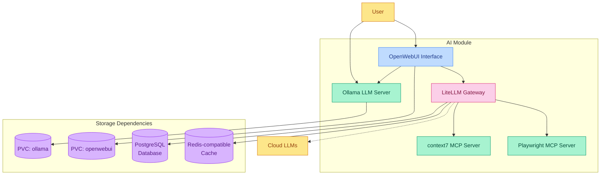

# AI Subsystem

Self-hosted AI platform providing local large language model capabilities and a web interface for interacting with AI models.

## Quick Links

 

## Overview

The AI subsystem consists of three main capability groups:

1. AI Model Serving
   - Local large language model hosting
   - Model management and versioning
   - API-based model interaction
   - Efficient resource utilization

2. User Interface
   - Web-based chat interface
   - Model selection and configuration
   - Conversation history management
   - Optional external LLM integration

3. AI Gateway & Tooling
   - Unified routing across multiple LLM providers, with automatic failover
   - Virtual key, team, and budget management for gateway consumers
   - Request caching and cost tracking
   - Self-hosted MCP servers exposing documentation-lookup and browser-automation tools to any client behind the gateway

## Component Architecture

The following diagram illustrates how the AI subsystem components work together, showing the relationship between the LLM server, web interface, and how users interact with the system.

```mermaid
flowchart TB
    %% Color scheme with good contrast for light/dark themes
    classDef core fill:#a7f3d0,stroke:#059669,color:#064e3b
    classDef ui fill:#bfdbfe,stroke:#3b82f6,color:#1e3a8a
    classDef gateway fill:#fbcfe8,stroke:#db2777,color:#831843
    classDef storage fill:#d8b4fe,stroke:#9333ea,color:#581c87
    classDef external fill:#fde68a,stroke:#d97706,color:#92400e
    classDef legend fill:none,stroke:none,color:#6b7280

    %% External Access
    user[User]:::external
    cloud[Cloud LLMs]:::external

    %% Core Components - Module Provided
    subgraph module[AI Module]
        ollama[Ollama LLM Server]:::core
        openwebui[OpenWebUI Interface]:::ui
        litellm[LiteLLM Gateway]:::gateway
        context7[context7 MCP Server]:::core
        playwright[Playwright MCP Server]:::core
    end

    %% Storage Components - Dependencies
    subgraph storage[Storage Dependencies]
        ollama_pvc[(PVC: ollama)]:::storage
        openwebui_pvc[(PVC: openwebui)]:::storage
        litellm_db[("PostgreSQL<br/>Database")]:::storage
        litellm_cache[("Redis-compatible<br/>Cache")]:::storage
    end

    %% Relationships
    user --> ollama
    user --> openwebui

    openwebui --> ollama
    openwebui --> litellm
    litellm -.-> cloud

    litellm --> context7
    litellm --> playwright

    ollama --> ollama_pvc
    openwebui --> openwebui_pvc
    litellm --> litellm_db
    litellm --> litellm_cache
```

<!-- markdownlint-disable-next-line MD036 -->
*Line styles: Solid (→) = Direct interaction, Dotted (-.→) = Optional connection*

### Component Details

| Component | Type | Primary Role | Key Features | Integration Points |
| ----------- | ------ | -------------- | -------------- | ------------------- |
| Ollama | Core | LLM Server | • Run large language models locally • Efficient model management • API-based interaction • Model downloading and serving | • Direct user access via API • OpenWebUI integration • Persistent storage for models |
| OpenWebUI | Core | Web Interface | • User-friendly chat interface • Conversation management • Model selection and configuration • Optional cloud LLM integration | • Ollama API integration • LiteLLM gateway integration for cloud model access • Direct user access via web browser • Persistent storage for settings |
| LiteLLM | Gateway | AI Gateway | • Unified routing across multiple LLM providers with automatic failover • Virtual key, team, and budget management • Request caching and cost tracking • Hosts MCP servers for client tool access | • OpenWebUI and other gateway consumer integration • PostgreSQL for persistent configuration and spend data • Redis-compatible cache for response caching • context7-mcp and playwright-mcp integration |
| context7-mcp | Core | Documentation MCP Server | • Self-hosted library/API documentation lookup • MCP protocol interface for AI clients • Stateless, lightweight process | • Hosted behind the LiteLLM gateway • Provides documentation context to AI assistants |
| playwright-mcp | Core | Browser Automation MCP Server | • Self-hosted browser automation and web interaction • MCP protocol interface for AI clients • Headless browser execution | • Hosted behind the LiteLLM gateway • Provides browsing/automation tools to AI assistants |

## Prerequisites

This module also depends on a PostgreSQL and Redis-compatible cache, provisioned via the cluster's database operators, for the LiteLLM gateway's configuration, spend tracking, and response caching.

1. Persistent Storage

   | PVC Name | Purpose | Access Mode |
   | -------- | ------- | ----------- |
   | ollama | Model storage and configuration | RWX |
   | openwebui | User settings and conversation history | RWX |

2. Required Secrets

   | Secret Name | Purpose | Required Keys |
   | ----------- | ------- | -------------- |
   | litellm-openwebui-key | OpenWebUI's virtual key for authenticating to the LiteLLM gateway — sourced from the `apikey_litellm_openwebui` secret-store key, which is populated by a separate Terraform-managed workspace, not manually | apikey |

   The following secret-store keys are also required by the LiteLLM gateway and its self-hosted MCP servers:

   | Secret Store Key | Purpose |
   | ------------------- | --------- |
   | litellm_master_key | LiteLLM proxy master/admin API key |
   | litellm_salt_key | Encryption salt for virtual keys persisted in LiteLLM's database |
   | apikey_openrouter_litellm | OpenRouter API key used by LiteLLM to route requests to OpenRouter-hosted models |
   | litellm_redis_password | Password for LiteLLM's Redis-compatible cache |
   | apikey_context7_mcp | context7 API key required by the self-hosted context7-mcp server |

3. Required Variables

   | Variable | Purpose | Used By |
   | ---------- | --------- | --------- |
   | domain_name | External access URL (ollama.${domain_name}, openwebui.${domain_name}) | Ollama, OpenWebUI |
   | db_name | PostgreSQL cluster name prefix | LiteLLM |
   | db_suffix_current | PostgreSQL cluster name suffix (blue/green rotation) | LiteLLM |
   | db_bootstrap_database | Initial database name created on bootstrap | LiteLLM |
   | db_bootstrap_owner | Initial database owner role created on bootstrap | LiteLLM |
   | db_replicas | PostgreSQL instance count | LiteLLM |
   | db_storage_size | PostgreSQL volume size | LiteLLM |
   | db_storage_class | PostgreSQL volume storage class | LiteLLM |

4. Optional Configuration

   | ConfigMap Name | Namespace | Key | Purpose |
   | --------------- | --------- | ---- | ------- |
   | litellm-model-config | ai | model-config.yaml | Model catalog and routing tuning (`proxy_config.model_list`, `router_settings.fallbacks`/`routing_strategy`/`allowed_fails`/`cooldown_time`) for the LiteLLM gateway. Not provided by this module — merged in via the HelmRelease's `spec.valuesFrom` (optional). Without it, LiteLLM falls back to the chart's own built-in placeholder models. |
