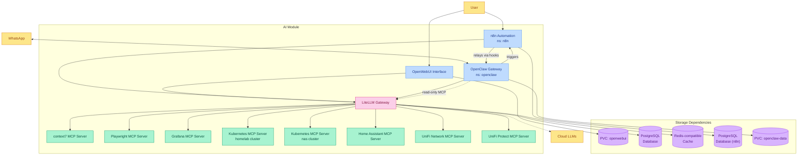

# AI Subsystem

Self-hosted AI platform providing a web interface for interacting with AI models routed through a self-hosted LLM gateway, plus self-hosted MCP tooling.

## Quick Links

   

## Overview

The AI subsystem consists of five main capability groups:

1. User Interface
   - Web-based chat interface
   - Model selection and configuration
   - Conversation history management
   - Optional external LLM integration

2. AI Gateway
   - Unified routing across multiple LLM providers, with automatic failover
   - Virtual key, team, and budget management for gateway consumers
   - Request caching and cost tracking

3. MCP Tooling
   - Self-hosted MCP servers exposing documentation lookup, browser automation, observability, Kubernetes, network, and home automation tools to any client behind the gateway

4. Workflow Automation
   - Self-hosted n8n instance (own namespace, own Postgres) for glue workflows between the LLM gateway, MCP servers, Alertmanager, the *arr stack, and email
   - Owner-login authenticated; not part of the shared SSO/forward-auth layer yet

5. Conversational Gateway
   - OpenClaw provides a WhatsApp-reachable conversational front door (own namespace), able to trigger n8n workflows and relay results back
   - Locked down hard: read-only MCP access, no exec/browser/elevated tools, pairing-only DMs — see [Prerequisites](#prerequisites) for the full list of what's disabled day-one

## Component Architecture

The following diagram illustrates how the AI subsystem components work together, showing the relationship between the web interface, the LLM gateway, and how users interact with the system.

```mermaid
flowchart TB
    %% Color scheme with good contrast for light/dark themes
    classDef core fill:#a7f3d0,stroke:#059669,color:#064e3b
    classDef ui fill:#bfdbfe,stroke:#3b82f6,color:#1e3a8a
    classDef gateway fill:#fbcfe8,stroke:#db2777,color:#831843
    classDef storage fill:#d8b4fe,stroke:#9333ea,color:#581c87
    classDef external fill:#fde68a,stroke:#d97706,color:#92400e
    classDef legend fill:none,stroke:none,color:#6b7280

    %% External Access
    user[User]:::external
    whatsapp[WhatsApp]:::external
    cloud[Cloud LLMs]:::external

    %% Core Components - Module Provided
    subgraph module[AI Module]
        openwebui[OpenWebUI Interface]:::ui
        litellm[LiteLLM Gateway]:::gateway
        context7[context7 MCP Server]:::core
        playwright[Playwright MCP Server]:::core
        grafana[Grafana MCP Server]:::core
        kubehomelab[Kubernetes MCP Server<br/>homelab cluster]:::core
        kubenas[Kubernetes MCP Server<br/>nas cluster]:::core
        homeassistant[Home Assistant MCP Server]:::core
        unifinetwork[UniFi Network MCP Server]:::core
        unifiprotect[UniFi Protect MCP Server]:::core
        n8n[n8n Automation<br/>ns: n8n]:::ui
        openclaw[OpenClaw Gateway<br/>ns: openclaw]:::ui
    end

    %% Storage Components - Dependencies
    subgraph storage[Storage Dependencies]
        openwebui_pvc[(PVC: openwebui)]:::storage
        litellm_db[("PostgreSQL<br/>Database")]:::storage
        litellm_cache[("Redis-compatible<br/>Cache")]:::storage
        n8n_db[("PostgreSQL<br/>Database (n8n)")]:::storage
        openclaw_pvc[(PVC: openclaw-data)]:::storage
    end

    %% Relationships
    user --> openwebui
    user --> n8n
    whatsapp <--> openclaw

    openwebui --> litellm
    n8n --> litellm
    openclaw --> litellm
    litellm -.-> cloud

    litellm --> context7
    litellm --> playwright
    litellm --> grafana
    litellm --> kubehomelab
    litellm --> kubenas
    litellm --> homeassistant
    litellm --> unifinetwork
    litellm --> unifiprotect
    openclaw -.->|read-only MCP| litellm

    openclaw -->|triggers| n8n
    n8n -->|relays via hooks| openclaw

    openwebui --> openwebui_pvc
    litellm --> litellm_db
    litellm --> litellm_cache
    n8n --> n8n_db
    openclaw --> openclaw_pvc
```

<!-- markdownlint-disable-next-line MD036 -->
*Line styles: Solid (→) = Direct interaction, Dotted (-.→) = Optional connection*

### Component Details

| Component | Type | Primary Role | Key Features | Integration Points |
| ----------- | ------ | -------------- | -------------- | ------------------- |
| OpenWebUI | Core | Web Interface | • User-friendly chat interface • Conversation management • Model selection and configuration • Cloud LLM integration via the LiteLLM gateway | • LiteLLM gateway integration for cloud model access • Direct user access via web browser • Persistent storage for settings |
| LiteLLM | Gateway | AI Gateway | • Unified routing across multiple LLM providers with automatic failover • Virtual key, team, and budget management • Request caching and cost tracking • Hosts MCP servers for client tool access | • OpenWebUI and other gateway consumer integration • PostgreSQL for persistent configuration and spend data • Redis-compatible cache for response caching • mcp-context7, mcp-grafana, mcp-home-assistant, mcp-kubernetes-homelab, mcp-kubernetes-nas, mcp-playwright, mcp-unifi-network, and mcp-unifi-protect integration |
| mcp-context7 | Core | Documentation MCP Server | • Self-hosted library/API documentation lookup • MCP protocol interface for AI clients • Stateless, lightweight process | • Hosted behind the LiteLLM gateway • Provides documentation context to AI assistants |
| mcp-grafana | Core | Observability MCP Server | • Self-hosted Grafana MCP server covering search, dashboards, datasources, Prometheus, Loki, alerting, navigation, and panel queries, plus write access • Admin toolset excluded • Service-account token self-provisioned and rotated via an ESO `Grafana` generator authenticating with Grafana admin basic auth, so it survives a Grafana DB wipe with no manual re-pasting • MCP protocol interface for AI clients | • Hosted behind the LiteLLM gateway • Connects to the in-cluster Grafana instance, both for its API calls and to mint its own service-account token • Provides observability context and query tools to AI assistants |
| mcp-home-assistant | Core | Home Automation MCP Server | • Self-hosted Home Assistant MCP server • Read-write access for device control and automation • MCP protocol interface for AI clients | • Hosted behind the LiteLLM gateway • Connects to the in-cluster Home Assistant instance • Provides home automation control and inspection tools to AI assistants |
| mcp-kubernetes-homelab | Core | Kubernetes Cluster MCP Server (homelab) | • Self-hosted, read-only Kubernetes cluster MCP server for the homelab cluster • Explicit read-only allow-list, plus a `denied_resources` entry blocking Secrets as defence-in-depth • MCP protocol interface for AI clients | • Hosted behind the LiteLLM gateway • In-cluster access via a dedicated ServiceAccount, bound (outside this module) to a purpose-built read-only ClusterRole the consuming cluster provides • Provides cluster state context to AI assistants |
| mcp-kubernetes-nas | Core | Kubernetes Cluster MCP Server (nas) | • Self-hosted, read-only Kubernetes cluster MCP server for the separate `nas` cluster • Reaches that cluster via a mounted kubeconfig (`cluster_provider_strategy = "kubeconfig"`) rather than in-cluster credentials • Same read-only allow-list and Secrets-denial posture as the homelab server • MCP protocol interface for AI clients | • Hosted behind the LiteLLM gateway on the homelab cluster (kept behind the gateway even though its target cluster is remote) • Kubeconfig sourced from the `kubeconfig_nas_mcp` secret-store key • Provides nas cluster state context to AI assistants |
| mcp-playwright | Core | Browser Automation MCP Server | • Self-hosted browser automation and web interaction • MCP protocol interface for AI clients • Headless browser execution | • Hosted behind the LiteLLM gateway • Provides browsing/automation tools to AI assistants |
| mcp-unifi-network | Core | UniFi Network MCP Server | • Self-hosted, read-only UniFi Network MCP server • MCP protocol interface for AI clients | • Hosted behind the LiteLLM gateway • Connects to the UniFi Network controller • Provides network state context to AI assistants |
| mcp-unifi-protect | Core | UniFi Protect MCP Server | • Self-hosted, read-only UniFi Protect MCP server • MCP protocol interface for AI clients | • Hosted behind the LiteLLM gateway • Connects to the UniFi Protect controller • Provides camera/security system context to AI assistants |
| n8n | Core | Workflow Automation | • Self-hosted n8n (main mode, own namespace/Postgres) • Owner-login authenticated, LAN/tailnet-only ingress • Alertmanager/*arr/Harbor/Coder webhook receivers • Transactional and workflow email via Maddy SMTP | • Calls the LiteLLM gateway for model access and MCP tools • Triggers OpenClaw's `/hooks/agent` to relay results to WhatsApp • Own CloudNativePG PostgreSQL cluster for workflow/credential storage |
| OpenClaw | Core | Conversational Gateway | • WhatsApp-reachable conversational front door (own namespace) • Hardened: read-only MCP, no exec/browser/elevated tools, pairing-only DMs • Inbound hooks for n8n/Alertmanager relays, daily cron digest | • Calls the LiteLLM gateway for model access (cheap model set) • Read-only MCP via LiteLLM `/mcp` and direct Home Assistant MCP (read-only toolFilter) • Triggers n8n workflows and relays their output back to WhatsApp |

## Prerequisites

This module also depends on a PostgreSQL and Redis-compatible cache, provisioned via the cluster's database operators, for the LiteLLM gateway's configuration, spend tracking, and response caching. n8n has its own dedicated PostgreSQL cluster (own namespace, own postBuild variables — see below).

n8n and OpenClaw each run in their own isolated namespace (`n8n`, `openclaw`) rather than the shared `ai` namespace. Neither ingress is behind SSO forward-auth yet (deferred — requires coordinated Terraform-repo changes); n8n relies on its own owner login, OpenClaw on its gateway auth token. Both are LAN/tailnet-only, same as the rest of this module.

OpenClaw's runtime config (`openclaw.json`, delivered as the `openclaw-config` ConfigMap in the `openclaw` namespace), its `openclaw-config-secrets` Secret, and its `openclaw-data` PVC are all cluster-provided — like `litellm-model-config`, this module mounts them but does not ship them. The image's entrypoint wrapper seeds `openclaw.json` into a writable path (`chmod 600`) at startup, so the module carries no `openclaw.json` of its own.

1. Persistent Storage

   | PVC Name | Purpose | Access Mode |
   | -------- | ------- | ----------- |
   | openwebui | User settings and conversation history | RWX |
   | n8n-data | n8n configuration, workflow static data | RWO |
   | openclaw-data | OpenClaw config, workspace, memory SQLite, and WhatsApp Baileys session | RWO |

   All three PVCs are provisioned externally (by the cluster), not defined by this module.

2. Required Secrets

   | Secret Name | Purpose | Required Keys |
   | ----------- | ------- | -------------- |
   | litellm-openwebui-key | OpenWebUI's virtual key for authenticating to the LiteLLM gateway — sourced from the `apikey_litellm_openwebui` secret-store key, which is populated by a separate Terraform-managed workspace, not manually | apikey |
   | n8n-secrets | n8n's encryption key, pre-provisioned owner login (email + password hash), pre-seeded LiteLLM/SMTP credential-overwrite blob, its LiteLLM virtual key, and SMTP relay credentials + sender | N8N_ENCRYPTION_KEY, N8N_INSTANCE_OWNER_EMAIL, N8N_INSTANCE_OWNER_PASSWORD_HASH, N8N_CREDENTIALS_OVERWRITE_DATA, LITELLM_API_KEY, N8N_SMTP_USER, N8N_SMTP_PASS, N8N_SMTP_SENDER |
   | openclaw-secrets | OpenClaw's universal secrets — gateway auth token and LiteLLM virtual key | OPENCLAW_GATEWAY_TOKEN, LITELLM_KEY |
   | openclaw-config-secrets | Feature-coupled OpenClaw secrets — inbound hooks bearer token and owner WhatsApp number (used by `channels.whatsapp.allowFrom`). Provided by the cluster, co-located with the cluster-owned `openclaw.json`; not shipped by this module | OPENCLAW_HOOKS_TOKEN, OWNER_WHATSAPP_NUMBER |

   The following secret-store keys are also required by the LiteLLM gateway and its self-hosted MCP servers:

   | Secret Store Key | Purpose |
   | ------------------- | --------- |
   | litellm_master_key | LiteLLM proxy master/admin API key |
   | litellm_salt_key | Encryption salt for virtual keys persisted in LiteLLM's database |
   | apikey_openrouter_litellm | OpenRouter API key used by LiteLLM to route requests to OpenRouter-hosted models |
   | litellm_redis_password | Password for LiteLLM's Redis-compatible cache |
   | apikey_context7_mcp | context7 API key required by the self-hosted mcp-context7 server |
   | cluster_homelab_grafana_admin_password | Grafana admin-user password (the same one observability-core provisions for `grafana-admin-credentials`), used by mcp-grafana's ESO `Grafana` generator to authenticate via admin basic auth and self-provision its own Editor-role service-account token |
   | unifi_network_username_mcp | Username for a native UniFi Read-Only/Viewer account, used by the self-hosted mcp-unifi-network server |
   | unifi_network_password_mcp | Password for the UniFi Network account used by the self-hosted mcp-unifi-network server |
   | unifi_protect_username_mcp | Username for a UniFi Protect View-Only account, used by the self-hosted mcp-unifi-protect server |
   | unifi_protect_password_mcp | Password for the UniFi Protect account used by the self-hosted mcp-unifi-protect server |
   | homeassistant_token_mcp | Long-lived Home Assistant access token (from an admin user) used by the self-hosted mcp-home-assistant server |
   | kubeconfig_nas_mcp | Kubeconfig for the remote `nas` cluster, mounted into the self-hosted mcp-kubernetes-nas server so it can reach that cluster's API |
   | n8n_encryption_key | n8n's data-at-rest encryption key (credentials, etc.) — must not change after first boot |
   | n8n_owner_password_hash | bcrypt hash of the n8n owner account password, used to pre-provision the owner login and skip the setup wizard |
   | n8n_credentials_overwrite | JSON blob n8n loads via `N8N_CREDENTIALS_OVERWRITE_DATA` to pre-seed the LiteLLM (OpenAI-compatible) and Maddy SMTP credentials matched by name against example workflows supplied at the cluster level and imported at rollout (not shipped in this module) |
   | apikey_litellm_n8n | n8n's virtual key for authenticating to the LiteLLM gateway |
   | n8n_smtp_user | Username n8n authenticates with against the Maddy SMTP relay |
   | n8n_smtp_password | Password n8n authenticates with against the Maddy SMTP relay |
   | n8n_owner_email | Email address of the pre-provisioned n8n owner account (sourced into `N8N_INSTANCE_OWNER_EMAIL`) |
   | n8n_smtp_sender | From/sender address n8n sets on outbound mail — must be an address the SMTP account is authorized to send as (sourced into `N8N_SMTP_SENDER`) |
   | openclaw_gateway_token | Bearer token required to reach OpenClaw's control UI/gateway |
   | apikey_litellm_openclaw | OpenClaw's virtual key for authenticating to the LiteLLM gateway |
   | openclaw_hooks_token | Bearer token n8n/Alertmanager present when calling OpenClaw's inbound `/hooks/agent` endpoint |
   | openclaw_owner_whatsapp_number | Owner's E.164 WhatsApp number, the only sender OpenClaw's `pairing` DM policy admits without a pairing code |

3. Required Variables

   | Variable | Purpose | Used By |
   | ---------- | --------- | --------- |
   | domain_name | External access URL (openwebui.${domain_name}) and UniFi controller host (unifi.nodes.${domain_name}) | OpenWebUI, mcp-unifi-network, mcp-unifi-protect |
   | grafana_admin_username | Grafana admin username mcp-grafana's ESO generator authenticates with to self-provision its service-account token. Optional, defaults to `admin` | mcp-grafana |
   | db_name | PostgreSQL cluster name prefix | LiteLLM |
   | db_suffix_current | PostgreSQL cluster name suffix (blue/green rotation) | LiteLLM |
   | db_bootstrap_database | Initial database name created on bootstrap | LiteLLM |
   | db_bootstrap_owner | Initial database owner role created on bootstrap | LiteLLM |
   | db_replicas | PostgreSQL instance count | LiteLLM |
   | db_storage_size | PostgreSQL volume size | LiteLLM |
   | db_storage_class | PostgreSQL volume storage class | LiteLLM |
   | n8n_db_name | n8n's PostgreSQL cluster name prefix (own var — kept separate from `db_name` so the two clusters in this shared module never collide) | n8n |
   | n8n_db_suffix_current | n8n's PostgreSQL cluster name suffix (blue/green rotation) | n8n |
   | n8n_db_bootstrap_database | Initial database name created on bootstrap (default `n8n`) | n8n |
   | n8n_db_bootstrap_owner | Initial database owner role created on bootstrap (default `n8n`) | n8n |
   | n8n_db_replicas | n8n PostgreSQL instance count | n8n |
   | n8n_db_storage_size | n8n PostgreSQL volume size | n8n |
   | n8n_db_storage_class | n8n PostgreSQL volume storage class | n8n |
   | n8n_owner_first_name | First name of the pre-provisioned n8n owner account (default `Admin`) | n8n |
   | n8n_owner_last_name | Last name of the pre-provisioned n8n owner account (default `User`) | n8n |

4. Optional Configuration

   | ConfigMap Name | Namespace | Key | Purpose |
   | --------------- | --------- | ---- | ------- |
   | litellm-model-config | ai | model-config.yaml | Model catalog and routing tuning (`proxy_config.model_list`, `router_settings.fallbacks`/`routing_strategy`/`allowed_fails`/`cooldown_time`) for the LiteLLM gateway. Not provided by this module — merged in via the HelmRelease's `spec.valuesFrom` (optional). Without it, LiteLLM falls back to the chart's own built-in placeholder models. |

5. RBAC

   | Resource | Access | Purpose |
   | -------- | ------ | ------- |
   | ClusterRole: `mcp-kubernetes-readonly` — homelab cluster (**not shipped by this module**; a prerequisite the consuming cluster must provide, e.g. `clusters/<cluster>/cluster/rbac/mcp-kubernetes-readonly.yaml` in the clusters repo) | Purpose-built, explicit read-only allow-list, cluster-wide, excluding Secrets | Bound (in the consuming cluster's own manifests) to the `mcp-kubernetes-homelab` ServiceAccount this module ships |
   | ClusterRole: `mcp-kubernetes-readonly` — nas cluster (**not shipped by this module**; must exist on the remote `nas` cluster itself) | Purpose-built, explicit read-only allow-list, cluster-wide, excluding Secrets | Bound to the identity presented by mcp-kubernetes-nas's mounted kubeconfig |

## Notes

- **mcp-kubernetes-homelab / mcp-kubernetes-nas access posture**: both run against an explicit read-only allow-list ClusterRole (`mcp-kubernetes-readonly`), not the built-in `view` role, and that ClusterRole is cluster policy, not module behaviour — this module ships only the `mcp-kubernetes-homelab` ServiceAccount that role gets bound to on the homelab cluster. mcp-kubernetes-nas has no ServiceAccount of its own (`automountServiceAccountToken: false`); it authenticates entirely via its mounted kubeconfig, so the same ClusterRole must be bound to that kubeconfig's identity on the remote `nas` cluster. Secrets are excluded twice over on both servers: by the ClusterRole itself, and again by a `denied_resources` entry in each server's `config.toml` as defence-in-depth. external-secrets kinds (e.g. `ExternalSecret`, `ClusterSecretStore`) are readable under this allow-list — their specs reference secret-store keys by name and never contain secret values.
- **MCP tool access control and boundary**: access control for MCP tools is enforced by **LiteLLM virtual-key scoping**, configured out-of-band in the LiteLLM UI (eventually Terraform) and therefore not visible in this repo. Registering a new MCP server does not, by itself, grant existing keys access to it — each virtual key that should reach the new server must be deliberately updated to include it. The LiteLLM gateway is the intended access boundary for the MCP Services — this is why n8n reaches MCP servers through LiteLLM rather than allowlisting them directly (see `N8N_SSRF_ALLOWED_HOSTNAMES` in `n8n/deployment.yaml`).
- **`app.kubernetes.io/component: mcp-server` pod label**: every MCP server Deployment's pod template (not its immutable `spec.selector`) carries this label, giving every MCP server a single stable selector an ingress NetworkPolicy can target regardless of `app.kubernetes.io/name`. It exists so a server added later by copying an existing module directory is covered by that policy by default rather than silently unprotected.
