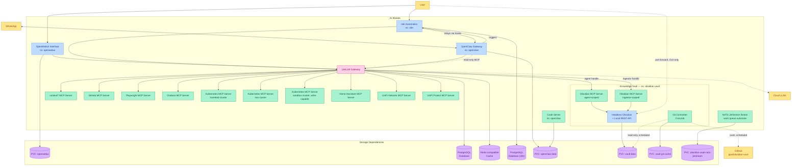

# AI Subsystem

Self-hosted AI platform providing a web interface for interacting with AI models routed through a self-hosted LLM gateway, self-hosted MCP tooling, and a shared knowledge vault that both the operator and every AI client can read and contribute to.

## Quick Links

     

## Overview

The AI subsystem consists of seven main capability groups:

1. User Interface
   - Web-based chat interface
   - Model selection and configuration
   - Conversation history management
   - Optional external LLM integration

2. AI Gateway
   - Unified routing across multiple LLM providers, with automatic failover
   - Virtual key, team, and budget management for gateway consumers
   - Request caching and cost tracking

3. MCP Tooling
   - Self-hosted MCP servers exposing documentation lookup, browser automation, observability, Kubernetes, network, home automation, and GitHub tools to any client behind the gateway

4. Workflow Automation
   - Self-hosted n8n instance (own namespace, own Postgres) for glue workflows between the LLM gateway, MCP servers, Alertmanager, the *arr stack, and email
   - Owner-login authenticated; not part of the shared SSO/forward-auth layer yet

5. Conversational Gateway
   - OpenClaw provides a WhatsApp-reachable conversational front door (own namespace), able to trigger n8n workflows and relay results back
   - Locked down hard: read-only MCP access, no exec/browser/elevated tools, pairing-only DMs — see [Prerequisites](#prerequisites) for the full list of what's disabled day-one

6. Knowledge Vault
   - A git-backed markdown vault (own namespace, `obsidian-vault`) that AI clients write to and the operator reads, backed by a headless in-cluster Obsidian instance
   - Headless Obsidian is the only process that mounts vault content read-write and the only one that ever mutates a markdown file
   - Two separately-scoped MCP server instances of the same image are the only network door to it — one confined to the agent capture zones, one carrying the wider scope promotion requires
   - Isolated by a default-deny-ingress namespace where only the gateway may reach the MCP servers and only the MCP servers may reach Obsidian
   - No ingress at all: the Obsidian GUI is reachable solely by `kubectl port-forward` — see [Notes](#notes)

7. Work Queue Substrate
   - A NATS JetStream broker giving the vault's write path a durable, ordered, acknowledged transport, reachable off-cluster over TLS for producers that do not run in this cluster
   - One account per message shape — patch-carrying, pointer-carrying, and content-carrying with a destination the processor fixes — each restricted by subject permission to the one stream it may publish to. Authority is carried by the credential presented on connect, never by network position, and a new holder of an existing shape takes that shape's credential rather than earning an account of its own
   - Ships no streams: each stream is created with the processor that consumes it, so none ever stands reachable with nothing entitled to drain it

## Component Architecture

The following diagram illustrates how the AI subsystem components work together, showing the relationship between the web interface, the LLM gateway, and how users interact with the system.

```mermaid
flowchart TB
    %% Color scheme with good contrast for light/dark themes
    classDef core fill:#a7f3d0,stroke:#059669,color:#064e3b
    classDef ui fill:#bfdbfe,stroke:#3b82f6,color:#1e3a8a
    classDef gateway fill:#fbcfe8,stroke:#db2777,color:#831843
    classDef storage fill:#d8b4fe,stroke:#9333ea,color:#581c87
    classDef external fill:#fde68a,stroke:#d97706,color:#92400e
    classDef legend fill:none,stroke:none,color:#6b7280

    %% External Access
    user[User]:::external
    whatsapp[WhatsApp]:::external
    cloud[Cloud LLMs]:::external
    githubremote[GitHub<br/>ppat/obsidian-vault]:::external

    %% Core Components - Module Provided
    subgraph module[AI Module]
        openwebui[OpenWebUI Interface<br/>ns: openwebui]:::ui
        litellm[LiteLLM Gateway]:::gateway
        context7[context7 MCP Server]:::core
        github[GitHub MCP Server]:::core
        playwright[Playwright MCP Server]:::core
        grafana[Grafana MCP Server]:::core
        kubehomelab[Kubernetes MCP Server<br/>homelab cluster]:::core
        kubenas[Kubernetes MCP Server<br/>nas cluster]:::core
        kubesandbox[Kubernetes MCP Server<br/>sandbox cluster, write-capable]:::core
        homeassistant[Home Assistant MCP Server]:::core
        unifinetwork[UniFi Network MCP Server]:::core
        unifiprotect[UniFi Protect MCP Server]:::core
        n8n[n8n Automation<br/>ns: n8n]:::ui
        obsidian_vault_nats[NATS JetStream Broker<br/>work queue substrate]:::core
        openclaw[OpenClaw Gateway<br/>ns: openclaw]:::ui
        codeserver[Code Server<br/>ns: openclaw]:::core
        subgraph vault[Knowledge Vault — ns: obsidian-vault]
            mcpagent[Obsidian MCP Server<br/>agent-scoped]:::core
            mcpingestor[Obsidian MCP Server<br/>ingestor-scoped]:::core
            obsidian[Headless Obsidian<br/>+ Local REST API]:::ui
            gitcommitter[Git Committer<br/>CronJob]:::core
        end
    end

    %% Storage Components - Dependencies
    subgraph storage[Storage Dependencies]
        openwebui_pvc[(PVC: openwebui)]:::storage
        litellm_db[("PostgreSQL<br/>Database")]:::storage
        litellm_cache[("Redis-compatible<br/>Cache")]:::storage
        n8n_db[("PostgreSQL<br/>Database (n8n)")]:::storage
        openclaw_pvc[(PVC: openclaw-data)]:::storage
        vault_pvc[(PVC: vault-data)]:::storage
        vault_git_pvc[(PVC: vault-git-cache)]:::storage
        obsidian_vault_nats_pvc[(PVC: obsidian-vault-nats-jetstream)]:::storage
    end

    %% Relationships
    user --> openwebui
    user --> n8n
    whatsapp <--> openclaw

    openwebui --> litellm
    n8n --> litellm
    openclaw --> litellm
    litellm -.-> cloud

    litellm --> context7
    litellm --> github
    litellm --> playwright
    litellm --> grafana
    litellm --> kubehomelab
    litellm --> kubenas
    litellm --> kubesandbox
    litellm --> homeassistant
    litellm --> unifinetwork
    litellm --> unifiprotect
    litellm -->|agent handle| mcpagent
    litellm -->|ingestor handle| mcpingestor
    mcpagent --> obsidian
    mcpingestor --> obsidian
    openclaw -.->|read-only MCP| litellm

    openclaw -->|triggers| n8n
    n8n -->|relays via hooks| openclaw

    openwebui --> openwebui_pvc
    litellm --> litellm_db
    litellm --> litellm_cache
    n8n --> n8n_db
    openclaw --> openclaw_pvc
    codeserver --> openclaw_pvc
    obsidian --> vault_pvc
    user -.->|port-forward, GUI only| obsidian

    gitcommitter -.->|read-only, scheduled| vault_pvc
    gitcommitter --> vault_git_pvc
    gitcommitter -.->|push, scheduled| githubremote

    obsidian_vault_nats --> obsidian_vault_nats_pvc
```

<!-- markdownlint-disable-next-line MD036 -->
*Line styles: Solid (→) = Direct interaction, Dotted (-.→) = Optional connection*

### Component Details

| Component | Type | Primary Role | Key Features | Integration Points |
| ----------- | ------ | -------------- | -------------- | ------------------- |
| OpenWebUI | Core | Web Interface | • User-friendly chat interface (own namespace, `openwebui`) • Conversation management • Model selection and configuration • Cloud LLM integration via the LiteLLM gateway • Chart-deployed Redis alongside it as the websocket session manager | • LiteLLM gateway integration for cloud model access • Direct user access via web browser • Persistent storage for settings |
| LiteLLM | Gateway | AI Gateway | • Unified routing across multiple LLM providers with automatic failover • Virtual key, team, and budget management • Request caching and cost tracking • Hosts MCP servers for client tool access | • OpenWebUI and other gateway consumer integration • PostgreSQL for persistent configuration and spend data • Redis-compatible cache for response caching • mcp-context7, mcp-github, mcp-grafana, mcp-home-assistant, mcp-kubernetes-homelab, mcp-kubernetes-nas, mcp-kubernetes-sandbox, mcp-obsidian-agent, mcp-obsidian-ingestor, mcp-playwright, mcp-unifi-network, and mcp-unifi-protect integration |
| mcp-context7 | Core | Documentation MCP Server | • Self-hosted library/API documentation lookup • MCP protocol interface for AI clients • Stateless, lightweight process | • Hosted behind the LiteLLM gateway • Provides documentation context to AI assistants |
| mcp-github | Core | GitHub MCP Server | • Self-hosted `github/github-mcp-server`, read-broad with a narrow, explicit `--tools` allowlist for writes • Writes limited to issue create/update, issue and PR comments, sub-issue linking, PR review-thread replies, and gist creation • Holds no GitHub credential of its own — LiteLLM injects the PAT as a bearer token on every call • MCP protocol interface for AI clients | • Hosted behind the LiteLLM gateway, which supplies the bearer-token PAT • Provides GitHub issue/PR/repository/search/security-alert context and limited write tools to AI assistants |
| mcp-grafana | Core | Observability MCP Server | • Self-hosted Grafana MCP server covering search, dashboards, datasources, Prometheus, Loki, alerting, navigation, and panel queries, plus write access • Admin toolset excluded • Service-account token self-provisioned and rotated via an ESO `Grafana` generator authenticating with Grafana admin basic auth, so it survives a Grafana DB wipe with no manual re-pasting • MCP protocol interface for AI clients | • Hosted behind the LiteLLM gateway • Connects to the in-cluster Grafana instance, both for its API calls and to mint its own service-account token • Provides observability context and query tools to AI assistants |
| mcp-home-assistant | Core | Home Automation MCP Server | • Self-hosted Home Assistant MCP server • Read-write access for device control and automation • MCP protocol interface for AI clients | • Hosted behind the LiteLLM gateway • Connects to the in-cluster Home Assistant instance • Provides home automation control and inspection tools to AI assistants |
| mcp-kubernetes-homelab | Core | Kubernetes Cluster MCP Server (homelab) | • Self-hosted, read-only Kubernetes cluster MCP server for the homelab cluster • Explicit read-only allow-list, plus a `denied_resources` entry blocking Secrets as defence-in-depth • MCP protocol interface for AI clients | • Hosted behind the LiteLLM gateway • In-cluster access via a dedicated ServiceAccount, bound (outside this module) to a purpose-built read-only ClusterRole the consuming cluster provides • Provides cluster state context to AI assistants |
| mcp-kubernetes-nas | Core | Kubernetes Cluster MCP Server (nas) | • Self-hosted, read-only Kubernetes cluster MCP server for the separate `nas` cluster • Reaches that cluster via a mounted kubeconfig (`cluster_provider_strategy = "kubeconfig"`) rather than in-cluster credentials • Same read-only allow-list and Secrets-denial posture as the homelab server • MCP protocol interface for AI clients | • Hosted behind the LiteLLM gateway on the homelab cluster (kept behind the gateway even though its target cluster is remote) • Kubeconfig sourced from the `kubeconfig_nas_mcp` secret-store key • Provides nas cluster state context to AI assistants |
| mcp-kubernetes-sandbox | Core | Kubernetes Cluster MCP Server (sandbox, write-capable) | • Self-hosted, **write-capable** (`read_only = false`) Kubernetes cluster MCP server for the disposable, resettable sandbox Talos cluster • Reaches that cluster via a mounted kubeconfig (`cluster_provider_strategy = "kubeconfig"`), same mechanism as mcp-kubernetes-nas • Still denies Secrets via a `denied_resources` entry despite `read_only = false` — write capability is not a reason to widen reads • A pod-scoped egress `NetworkPolicy` restricts this server's own outbound traffic to cluster DNS and the sandbox cluster's API only, unlike every other MCP server in this module • MCP protocol interface for AI clients | • Hosted behind the LiteLLM gateway on the homelab cluster (kept behind the gateway even though its target cluster is a separate KubeVirt-hosted sandbox) • Kubeconfig sourced from the `sandbox_talos_vm_agent_admin_kubeconfig` secret-store key • Provides write access to the sandbox cluster for AI-agent testing, structurally kept off the production cluster it runs alongside |
| mcp-obsidian-agent | Core | Knowledge Vault MCP Server (agent scope) | • Self-hosted `cyanheads/obsidian-mcp-server` in the `obsidian-vault` namespace, fronting the headless Obsidian REST API • Writes confined to the agent capture zones (`00-inbox/`, `40-journal/`, `_ops/agent/`) plus the root `log.md`; reads span the whole vault • Path matching is prefix-based with implicit recursion and applies across every tool, note deletion included • Command-palette tools disabled at the server, not merely withheld at the gateway • Authenticates callers with a JWT, unlike the `auth_type: none` posture of every other MCP server here | • Hosted behind the LiteLLM gateway as the `obsidian_agent_mcp` server; only the LiteLLM pod may reach it • Calls the in-cluster `obsidian` Service over HTTPS with the Local REST API bearer token • The write door for OpenClaw, n8n, Claude Code, and the drift-reconciliation channel |
| mcp-obsidian-ingestor | Core | Knowledge Vault MCP Server (ingestor scope) | • Second instance of the same image, carrying the wider write scope promotion, lint, and bulk ingest require • Curated areas, the raw layer, the archive, and the `_ops` records are writable here and nowhere else • The schema file, the hand-curated index, templates, and `.obsidian/` stay outside every write scope • A separate instance rather than a second gateway handle onto the agent instance — a shared instance would leak this scope to the narrower handle | • Hosted behind the LiteLLM gateway as the `obsidian_ingestor_mcp` server; only the LiteLLM pod may reach it • Calls the same in-cluster `obsidian` Service • Reserved for the vault worker and batch processor, never agent-facing keys |
| mcp-playwright | Core | Browser Automation MCP Server | • Self-hosted browser automation and web interaction • MCP protocol interface for AI clients • Headless browser execution | • Hosted behind the LiteLLM gateway • Provides browsing/automation tools to AI assistants |
| mcp-unifi-network | Core | UniFi Network MCP Server | • Self-hosted, read-only UniFi Network MCP server • MCP protocol interface for AI clients | • Hosted behind the LiteLLM gateway • Connects to the UniFi Network controller • Provides network state context to AI assistants |
| mcp-unifi-protect | Core | UniFi Protect MCP Server | • Self-hosted, read-only UniFi Protect MCP server • MCP protocol interface for AI clients | • Hosted behind the LiteLLM gateway • Connects to the UniFi Protect controller • Provides camera/security system context to AI assistants |
| n8n | Core | Workflow Automation | • Self-hosted n8n (main mode, own namespace/Postgres) • Owner-login authenticated, LAN/tailnet-only ingress • Alertmanager/*arr/Harbor/Coder webhook receivers • Transactional and workflow email via Maddy SMTP | • Calls the LiteLLM gateway for model access and MCP tools • Triggers OpenClaw's `/hooks/agent` to relay results to WhatsApp • Own CloudNativePG PostgreSQL cluster for workflow/credential storage |
| obsidian-vault-nats | Core | Work Queue Substrate | • Single-replica NATS JetStream broker (`ai` namespace), file storage on its own PVC, chosen over RabbitMQ on operational weight — this repo runs no StatefulSet anywhere • **Ships zero streams by design**: each stream is created with the processor that consumes it, so no stream ever stands reachable with no consumer and no credential control behind it • One account per **message shape** — patch-carrying (batch), pointer-carrying (promotion), content-carrying with a processor-fixed destination (drift) — each importing exactly one subject as a private service export, each user restricted to publishing on its own stream's subjects and to a reply inbox of its own • No producer is granted the JetStream API subject space — an acknowledged publish never touches it, and granting it would let a producer widen or purge its own stream • Passwords are bcrypt hashes in the environment; only hashes ever reach the broker, and the config that carries the grants stays a reviewable ConfigMap • TLS on the client port, mandatory: static-account auth sends the password on CONNECT and the LoadBalancer puts that CONNECT on the network | • Reachable off-cluster at `obsidian-vault-nats.${domain_name}` over a MetalLB LoadBalancer — an `Ingress` is HTTP-only and cannot carry the NATS protocol • In-cluster clients use the same hostname, because the certificate is issued for it alone • Scraped through a `prometheus-nats-exporter` sidecar; NATS's own monitoring port serves JSON and 404s on `/metrics` • Mounts the externally-provisioned `obsidian-vault-nats-jetstream` PVC |
| Obsidian | Core | Knowledge Vault Engine | • Headless Obsidian with the Local REST API plugin baked in and auto-trusted (own namespace, `obsidian-vault`) • The only workload mounting vault content read-write, and the only process that ever mutates a markdown file • Non-root, read-only root filesystem, `Recreate` rollout so two instances never hold the vault at once • ClusterIP only, no ingress; readiness is the REST API answering, which proves the vault is open, trusted, and the plugin loaded • GUI reachable on demand by `kubectl port-forward` against the same running process | • Reached only by the two Obsidian MCP servers, enforced by NetworkPolicy • Mounts the externally-provisioned `vault-data` PVC, holding only the vault's markdown content — Obsidian's own app state (vault registration, plugin-trust flag) lives on an ephemeral emptyDir, not this claim • Bearer token for its REST API is pinned from the secret store so the MCP servers can be wired declaratively |
| git-committer | Core | Vault Git Committer | • Scheduled `CronJob`, not a long-lived Deployment — takes a commit and exits, so it holds a mount on `vault-data` only while a commit is actually being taken rather than adding a third permanent attachment • Mounts `vault-data` read-only and writes only to its own git-dir PVC, never vault content • Pushes the derived history to a GitHub remote over SSH, with host-key verification pinned rather than disabled • `concurrencyPolicy: Forbid`, so an in-flight `git push` is never killed mid-run by the next scheduled tick | • Reads the `vault-data` PVC read-only; Obsidian is the only other mounter, and its mount is read-write — the two MCP servers never touch this PVC, they reach Obsidian over its REST API • Own `vault-git-cache` PVC for git's own metadata, kept off the vault volume entirely • SSH deploy key (`git-committer-secrets`) authorized as a write key on the GitHub remote |
| OpenClaw | Core | Conversational Gateway | • WhatsApp-reachable conversational front door (own namespace) • Hardened: read-only MCP, no exec/browser/elevated tools, pairing-only DMs • Inbound hooks for n8n/Alertmanager relays, daily cron digest | • Calls the LiteLLM gateway for model access (cheap model set) • Read-only MCP via LiteLLM `/mcp` and direct Home Assistant MCP (read-only toolFilter) • Triggers n8n workflows and relays their output back to WhatsApp |
| Code Server | Core | OpenClaw Config/State Editor | • Real-time editing of OpenClaw's config and state • Non-root, read-only root filesystem • Own dedicated Ingress, separate from OpenClaw's gateway Ingress | • Direct mount of `/etc/openclaw` (OpenClaw's config dir) and `~/.openclaw` (OpenClaw's state, on the `openclaw-data` PVC) • Secure internal-only access |

## Prerequisites

This module also depends on a PostgreSQL and Redis-compatible cache, provisioned via the cluster's database operators, for the LiteLLM gateway's configuration, spend tracking, and response caching. n8n has its own dedicated PostgreSQL cluster (own namespace, own postBuild variables — see below).

OpenWebUI, n8n, OpenClaw, and the knowledge vault each run in their own isolated namespace (`openwebui`, `n8n`, `openclaw`, `obsidian-vault`) rather than the shared `ai` namespace, which holds the LiteLLM gateway, its datastores, and the MCP servers behind it. Neither ingress is behind SSO forward-auth yet (deferred — requires coordinated Terraform-repo changes); n8n relies on its own owner login, OpenClaw on its gateway auth token. Both are LAN/tailnet-only, same as the rest of this module.

OpenClaw's runtime config (`openclaw.json`, delivered as the `openclaw-config` ConfigMap in the `openclaw` namespace), its `openclaw-config-secrets` Secret, and its `openclaw-data` PVC are all cluster-provided — like `litellm-model-config`, this module mounts them but does not ship them. The image's entrypoint wrapper seeds `openclaw.json` into a writable path (`chmod 600`) at startup, so the module carries no `openclaw.json` of its own.

1. Persistent Storage

   | PVC Name | Purpose | Access Mode |
   | -------- | ------- | ----------- |
   | vault-data | Authoritative knowledge-vault content — the markdown files themselves, not Obsidian's own app state | RWX |
   | vault-git-cache | The git committer's own repository metadata (its `--git-dir`) — never vault content, and never mounted by any other workload | RWO |
   | openwebui | OpenWebUI's user settings, conversation history, uploaded documents and vector store | RWO |
   | n8n-data | n8n configuration, workflow static data | RWO |
   | openclaw-data | OpenClaw config, workspace, memory SQLite, WhatsApp Baileys session, and Code Server's own settings | RWO |
   | obsidian-vault-nats-jetstream | JetStream's message store — the durable half of the work queue; an unacknowledged message not on this volume was never enqueued | RWO |

   All six PVCs are provisioned externally (by the cluster), not defined by this module. `vault-data` is RWX because it has two read-only consumers beyond Obsidian itself: the git committer delivered by this phase, and a still-pending maintenance worker from a later phase, both of which must mount it without being co-scheduled onto the Obsidian pod's node. `vault-git-cache` is RWO — `concurrencyPolicy: Forbid` on the git committer's CronJob means at most one pod ever holds it at a time, and nothing else in this module mounts it. `obsidian-vault-nats-jetstream` is RWO for the same class of reason: the broker is one replica on `strategy: Recreate`, so two servers never hold one message store.

2. Required Secrets

   | Secret Name | Purpose | Required Keys |
   | ----------- | ------- | -------------- |
   | litellm-openwebui-key | OpenWebUI's virtual key for authenticating to the LiteLLM gateway — sourced from the `apikey_litellm_openwebui` secret-store key, which is populated by a separate Terraform-managed workspace, not manually | apikey |
   | n8n-secrets | n8n's encryption key, pre-provisioned owner login (email + password hash), pre-seeded LiteLLM/SMTP credential-overwrite blob, its LiteLLM virtual key, and SMTP relay credentials + sender | N8N_ENCRYPTION_KEY, N8N_INSTANCE_OWNER_EMAIL, N8N_INSTANCE_OWNER_PASSWORD_HASH, N8N_CREDENTIALS_OVERWRITE_DATA, LITELLM_API_KEY, N8N_SMTP_USER, N8N_SMTP_PASS, N8N_SMTP_SENDER |
   | openclaw-secrets | OpenClaw's universal secrets — gateway auth token and LiteLLM virtual key | OPENCLAW_GATEWAY_TOKEN, LITELLM_KEY |
   | openclaw-config-secrets | Feature-coupled OpenClaw secrets — inbound hooks bearer token and owner WhatsApp number (used by `channels.whatsapp.allowFrom`). Provided by the cluster, co-located with the cluster-owned `openclaw.json`; not shipped by this module | OPENCLAW_HOOKS_TOKEN, OWNER_WHATSAPP_NUMBER |
   | obsidian-secrets | Pins the Local REST API plugin's bearer token, so it is a known value rather than one generated inside the running container | OBSIDIAN_API_KEY |
   | mcp-obsidian-agent-secrets | The same REST API bearer token the agent-scoped MCP server spends on callers' behalf, plus the signing secret it verifies inbound JWTs against | OBSIDIAN_API_KEY, MCP_AUTH_SECRET_KEY |
   | mcp-obsidian-ingestor-secrets | The same, for the ingestor-scoped MCP server; its signing secret is deliberately distinct from the agent instance's | OBSIDIAN_API_KEY, MCP_AUTH_SECRET_KEY |
   | obsidian-vault-nats-server-credentials | The NATS broker's five account passwords, as bcrypt hashes and nothing else. The broker verifies against a hash and stores no plaintext, so this Secret is not credential material; the plaintext each hash was derived from is a separate secret-store key held by the one producer that presents it | obsidian_vault_nats_sysadmin_password_hash, obsidian_vault_nats_queue_admin_password_hash, obsidian_vault_nats_batch_producer_password_hash, obsidian_vault_nats_promotion_producer_password_hash, obsidian_vault_nats_drift_producer_password_hash |
   | obsidian-vault-nats-tls-cert | The broker's client-port certificate. Issued by cert-manager from `Certificate/obsidian-vault-nats-tls`, not sourced from the secret store; the `Certificate` carries `kustomize.toolkit.fluxcd.io/prune: disabled` so a module reshuffle does not force a re-issue against Let's Encrypt's rate limits | tls.crt, tls.key |
   | git-committer-secrets | The git committer's SSH private key. Its public half must be registered as a deploy key **with write access** on the GitHub remote — out of band, not by this module. Host keys are not a secret and are not here: the committer fetches GitHub's from `api.github.com/meta` at the start of every run | ssh-privatekey |

   The following secret-store keys are also required by the LiteLLM gateway and its self-hosted MCP servers:

   | Secret Store Key | Purpose |
   | ------------------- | --------- |
   | litellm_master_key | LiteLLM proxy master/admin API key |
   | litellm_salt_key | Encryption salt for virtual keys persisted in LiteLLM's database |
   | apikey_openrouter_litellm | OpenRouter API key used by LiteLLM to route requests to OpenRouter-hosted models |
   | litellm_redis_password | Password for LiteLLM's Redis-compatible cache |
   | apikey_context7_mcp | context7 API key required by the self-hosted mcp-context7 server |
   | github_pat_mcp | Fine-grained GitHub PAT that LiteLLM injects as a bearer token when calling mcp-github; the server itself holds no credential |
   | cluster_homelab_grafana_admin_password | Grafana admin-user password (the same one observability-core provisions for `grafana-admin-credentials`), used by mcp-grafana's ESO `Grafana` generator to authenticate via admin basic auth and self-provision its own Editor-role service-account token |
   | unifi_network_username_mcp | Username for a native UniFi Read-Only/Viewer account, used by the self-hosted mcp-unifi-network server |
   | unifi_network_password_mcp | Password for the UniFi Network account used by the self-hosted mcp-unifi-network server |
   | unifi_protect_username_mcp | Username for a UniFi Protect View-Only account, used by the self-hosted mcp-unifi-protect server |
   | unifi_protect_password_mcp | Password for the UniFi Protect account used by the self-hosted mcp-unifi-protect server |
   | homeassistant_token_mcp | Long-lived Home Assistant access token (from an admin user) used by the self-hosted mcp-home-assistant server |
   | kubeconfig_nas_mcp | Kubeconfig for the remote `nas` cluster, mounted into the self-hosted mcp-kubernetes-nas server so it can reach that cluster's API |
   | sandbox_talos_vm_agent_admin_kubeconfig | Kubeconfig for the sandbox Talos cluster, mounted into the self-hosted mcp-kubernetes-sandbox server so it can reach (and write to) that cluster's API. Written by the credential relay, ppat/homelab-ops-kubernetes-experiments#230, which owns this key's name and shape |
   | n8n_encryption_key | n8n's data-at-rest encryption key (credentials, etc.) — must not change after first boot |
   | n8n_owner_password_hash | bcrypt hash of the n8n owner account password, used to pre-provision the owner login and skip the setup wizard |
   | n8n_credentials_overwrite | JSON blob n8n loads via `N8N_CREDENTIALS_OVERWRITE_DATA` to pre-seed the LiteLLM (OpenAI-compatible) and Maddy SMTP credentials matched by name against example workflows supplied at the cluster level and imported at rollout (not shipped in this module) |
   | apikey_litellm_n8n | n8n's virtual key for authenticating to the LiteLLM gateway |
   | n8n_smtp_user | Username n8n authenticates with against the Maddy SMTP relay |
   | n8n_smtp_password | Password n8n authenticates with against the Maddy SMTP relay |
   | n8n_owner_email | Email address of the pre-provisioned n8n owner account (sourced into `N8N_INSTANCE_OWNER_EMAIL`) |
   | n8n_smtp_sender | From/sender address n8n sets on outbound mail — must be an address the SMTP account is authorized to send as (sourced into `N8N_SMTP_SENDER`) |
   | openclaw_gateway_token | Bearer token required to reach OpenClaw's control UI/gateway |
   | apikey_litellm_openclaw | OpenClaw's virtual key for authenticating to the LiteLLM gateway |
   | openclaw_hooks_token | Bearer token n8n/Alertmanager present when calling OpenClaw's inbound `/hooks/agent` endpoint |
   | openclaw_owner_whatsapp_number | Owner's E.164 WhatsApp number, the only sender OpenClaw's `pairing` DM policy admits without a pairing code |
   | obsidian_rest_api_key | Bearer token for the Local REST API plugin inside headless Obsidian. Pinned into the Obsidian pod and held by both Obsidian MCP servers; a caller holding it can write anywhere in the vault, since the REST layer has no path-scoped permissions of its own |
   | obsidian_agent_mcp_auth_secret | Shared secret (minimum 32 characters) the agent-scoped MCP server verifies inbound JWTs against |
   | obsidian_ingestor_mcp_auth_secret | The same for the ingestor-scoped MCP server. Deliberately a different value, so an agent token cannot be replayed against the wider-scoped instance |
   | obsidian_agent_mcp_jwt | Pre-minted JWT signed with `obsidian_agent_mcp_auth_secret`, which LiteLLM presents as a bearer token when calling the agent-scoped server |
   | obsidian_ingestor_mcp_jwt | Pre-minted JWT signed with `obsidian_ingestor_mcp_auth_secret`, for the ingestor-scoped server |
   | obsidian_git_committer_ssh_private_key | The git committer's SSH private key. Its public half is a write-enabled deploy key on the GitHub remote, so it is scoped to that one repository by construction |
   | obsidian_vault_nats_sysadmin_password_hash | bcrypt hash of the NATS `SYS` account password. Operator-only; never issued to a producer |
   | obsidian_vault_nats_queue_admin_password_hash | bcrypt hash of the `BRAIN_QUEUE` account password. This is the identity that creates and manages streams, and it is deliberately never a producer's credential — a producer holding it could widen or purge the stream it publishes to |
   | obsidian_vault_nats_batch_producer_password_hash | bcrypt hash of the batch producer's password. Its plaintext is a separate key, delivered to the one producer that holds it |
   | obsidian_vault_nats_promotion_producer_password_hash | bcrypt hash of the promotion producer's password. Configured before any producer connects, deliberately: the authority test that matters is a legitimately held credential refused at a subject outside its grant, which needs a second real credential to exist |
   | obsidian_vault_nats_drift_producer_password_hash | bcrypt hash of the drift producer's password, held off-cluster by `local-replicator`. Same reasoning as promotion above |

3. Required Variables

   | Variable | Purpose | Used By |
   | ---------- | --------- | --------- |
   | domain_name | External access URL (openwebui.${domain_name}, obsidian-vault-nats.${domain_name}) | OpenWebUI, obsidian-vault-nats |
   | cert_issuer | ClusterIssuer the NATS broker's client-port certificate is requested from. This module's first cert-manager dependency | obsidian-vault-nats |
   | dns_zone | UniFi controller host (unifi.nodes.${dns_zone}) | mcp-unifi-network, mcp-unifi-protect |
   | git_committer_remote_origin_url | SSH URL of the GitHub remote the committer pushes derived history to | git-committer |
   | grafana_admin_username | Grafana admin username mcp-grafana's ESO generator authenticates with to self-provision its service-account token. Optional, defaults to `admin` | mcp-grafana |
   | db_name | PostgreSQL cluster name prefix | LiteLLM |
   | db_suffix_current | PostgreSQL cluster name suffix (blue/green rotation) | LiteLLM |
   | db_bootstrap_database | Initial database name created on bootstrap | LiteLLM |
   | db_bootstrap_owner | Initial database owner role created on bootstrap | LiteLLM |
   | db_replicas | PostgreSQL instance count | LiteLLM |
   | db_storage_size | PostgreSQL volume size | LiteLLM |
   | db_storage_class | PostgreSQL volume storage class | LiteLLM |
   | n8n_db_name | n8n's PostgreSQL cluster name prefix (own var — kept separate from `db_name` so the two clusters in this shared module never collide) | n8n |
   | n8n_db_suffix_current | n8n's PostgreSQL cluster name suffix (blue/green rotation) | n8n |
   | n8n_db_bootstrap_database | Initial database name created on bootstrap (default `n8n`) | n8n |
   | n8n_db_bootstrap_owner | Initial database owner role created on bootstrap (default `n8n`) | n8n |
   | n8n_db_replicas | n8n PostgreSQL instance count | n8n |
   | n8n_db_storage_size | n8n PostgreSQL volume size | n8n |
   | n8n_db_storage_class | n8n PostgreSQL volume storage class | n8n |
   | n8n_owner_first_name | First name of the pre-provisioned n8n owner account (default `Admin`) | n8n |
   | n8n_owner_last_name | Last name of the pre-provisioned n8n owner account (default `User`) | n8n |

4. Optional Configuration

   | ConfigMap Name | Namespace | Key | Purpose |
   | --------------- | --------- | ---- | ------- |
   | litellm-model-config | ai | model-config.yaml | Model catalog and routing tuning (`proxy_config.model_list`, `router_settings.fallbacks`/`routing_strategy`/`allowed_fails`/`cooldown_time`) for the LiteLLM gateway. Not provided by this module — merged in via the HelmRelease's `spec.valuesFrom` (optional). Without it, LiteLLM falls back to the chart's own built-in placeholder models. |

5. RBAC

   | Resource | Access | Purpose |
   | -------- | ------ | ------- |
   | ClusterRole: `mcp-kubernetes-readonly` — homelab cluster (**not shipped by this module**; a prerequisite the consuming cluster must provide, e.g. `clusters/<cluster>/cluster/rbac/mcp-kubernetes-readonly.yaml` in the clusters repo) | Purpose-built, explicit read-only allow-list, cluster-wide, excluding Secrets | Bound (in the consuming cluster's own manifests) to the `mcp-kubernetes-homelab` ServiceAccount this module ships |
   | ClusterRole: `mcp-kubernetes-readonly` — nas cluster (**not shipped by this module**; must exist on the remote `nas` cluster itself) | Purpose-built, explicit read-only allow-list, cluster-wide, excluding Secrets | Bound to the identity presented by mcp-kubernetes-nas's mounted kubeconfig |
   | ServiceAccount `agent-admin` — sandbox Talos cluster (**not shipped by this module or the clusters repo**; minted inside the sandbox cluster's own guest etcd) | Bound to `cluster-admin` on the sandbox cluster — no scoped ClusterRole, unlike the two rows above | Identity presented by mcp-kubernetes-sandbox's mounted kubeconfig. RBAC grants this identity everything, including Secrets; the read/write boundary that keeps Secrets unreadable despite `read_only = false` is enforced by mcp-kubernetes-sandbox's own `config.toml` `denied_resources` entry, not by RBAC |

## Notes

- **mcp-github credential and write boundary**: mcp-github is the only MCP component in this module with no `secrets.yaml`/ExternalSecret of its own — in `http` mode, `github-mcp-server` has no server-side-token option, so auth is strictly bearer pass-through and the PAT lives only in `litellm-secrets`, injected by LiteLLM as `Authorization: Bearer` on every call; the mcp-github pod holds no GitHub credential. Correspondingly, `github_mcp` is the only `mcp_servers` entry in the LiteLLM config with a non-`none` `auth_type`. The write boundary is enforced by the `--tools` allowlist on the mcp-github Deployment, not by LiteLLM config: the server is read-broad, with writes limited to issue create/update, issue and PR comments, sub-issue linking, PR review-thread replies, and gist creation. This allowlist is deliberately not mirrored into LiteLLM's `allowed_tools`, to avoid two sources of truth for the same boundary.
- **mcp-kubernetes-homelab / mcp-kubernetes-nas access posture**: both run against an explicit read-only allow-list ClusterRole (`mcp-kubernetes-readonly`), not the built-in `view` role, and that ClusterRole is cluster policy, not module behaviour — this module ships only the `mcp-kubernetes-homelab` ServiceAccount that role gets bound to on the homelab cluster. mcp-kubernetes-nas has no ServiceAccount of its own (`automountServiceAccountToken: false`); it authenticates entirely via its mounted kubeconfig, so the same ClusterRole must be bound to that kubeconfig's identity on the remote `nas` cluster. Secrets are excluded twice over on both servers: by the ClusterRole itself, and again by a `denied_resources` entry in each server's `config.toml` as defence-in-depth. external-secrets kinds (e.g. `ExternalSecret`, `ClusterSecretStore`) are readable under this allow-list — their specs reference secret-store keys by name and never contain secret values.
- **mcp-kubernetes-sandbox is the one write-capable server in this module**: every other Kubernetes (and every other) MCP server here runs read-only or narrowly write-limited; this one runs `read_only = false` against a cluster-admin credential, by design — the sandbox Talos cluster is disposable and resettable precisely so an agent can be given real write access to something. What constrains that capability, and what doesn't: it can reach only the sandbox cluster's API, both because its kubeconfig points nowhere else and because a pod-scoped egress `NetworkPolicy` (unique to this server in this module) restricts its own outbound traffic to cluster DNS and the sandbox cluster's API — the production API server one namespace-hop away is not reachable even if the kubeconfig were ever wrong. It still cannot read Secrets, even through its write-capable tools, because `denied_resources` is enforced by the server itself rather than by RBAC (see the RBAC table above — RBAC on the sandbox side grants everything). What is *not* constrained by anything in this repo is who may call it at all: same as every other server here, that rests on LiteLLM virtual-key mappings configured out-of-band in LiteLLM's own Postgres/UI (see "MCP tool access control and boundary" below) — an over-scoped key is not something code review can catch for any server in this module, and a write-capable one sharpens the consequence of that gap rather than introducing a new one.
- **This server also exposes `pods_exec`, by design, not by omission**: `denied_resources` blocks Secrets but does not block pod exec, unlike a hypothetical tighter allow-list. Withholding exec while granting cluster-admin would be security theatre — anything exec achieves is already reachable by creating a pod, which the same credential permits, so a tool-level exec denial would add no real boundary. The control that bounds exec's (and every other write tool's) blast radius is not this server's tool list — it's the sandbox cluster's own isolation (a separate cluster, on a separate VM, in a namespace whose egress denies the host API, continuously asserted by that namespace's own falsifiability probe) plus this module's pod-scoped egress `NetworkPolicy` above. **What would make this reasoning wrong later**: if this server's kubeconfig were ever repointed at a non-disposable cluster, or if the egress `NetworkPolicy` were removed — either one collapses the boundary this bullet depends on, independent of anything in this server's own configuration.
- **MCP tool access control and boundary**: access control for MCP tools is enforced by **LiteLLM virtual-key scoping**, configured out-of-band in the LiteLLM UI (eventually Terraform) and therefore not visible in this repo. Registering a new MCP server does not, by itself, grant existing keys access to it — each virtual key that should reach the new server must be deliberately updated to include it. At the network level, the `mcp-servers-ingress` NetworkPolicy (`network-policy.yaml`) restricts ingress to the MCP Services to the LiteLLM pod (plus Prometheus in `monitoring`, for future scraping) by selecting on the `app.kubernetes.io/component: mcp-server` label — this is what makes the LiteLLM gateway an enforced access boundary for the MCP Services rather than just a convention, and is also why n8n reaches MCP servers through LiteLLM rather than allowlisting them directly (see `N8N_SSRF_ALLOWED_HOSTNAMES` in `n8n/deployment.yaml`). Enforcement depends on the cluster's CNI implementing NetworkPolicy — k3s does, via its bundled network policy controller, unless the cluster runs with `--disable-network-policy`.
- **`app.kubernetes.io/component: mcp-server` pod label**: every MCP server Deployment's pod template (not its immutable `spec.selector`) carries this label, giving every MCP server a single stable selector the `mcp-servers-ingress` NetworkPolicy targets regardless of `app.kubernetes.io/name`. It exists so a server added later by copying an existing module directory is covered by that policy by default rather than silently unprotected. The two Obsidian MCP servers carry the same label in the `obsidian-vault` namespace, where it selects both the policy admitting LiteLLM inbound and the policy admitting them onward to Obsidian.

- **The NATS broker is in `ai`, not `obsidian-vault`, and carries no `mcp-server` label.** It could have gone next to the vault workloads on the reading that it is part of the vault's write path, and that would have been wrong twice over. `obsidian-vault` is default-deny ingress and its `obsidian-ingress` policy is the sole control on the REST API's undisableable second endpoint; a broker sited there would need a new ingress exception for every producer that must reach it — and one of them is off-cluster, which no NetworkPolicy can express. That widens the one fence in this module that must not widen, to buy nothing: the broker mounts no vault and never touches one. In `ai` there is no default-deny, so the broker is reachable in-cluster without a policy, which is the intended posture rather than an oversight. Authority here is carried by the credential presented on CONNECT: a NetworkPolicy selects on pod and namespace, has no notion of *stream*, and sees every client arriving through the LoadBalancer identically. It correspondingly must **not** carry `app.kubernetes.io/component: mcp-server` — that label is `mcp-servers-ingress`'s selector and admits only LiteLLM and Prometheus, which would deny every producer the broker exists for.

- **The broker ships zero streams, and that is the unit of work, not an omission.** A stream is an attribute of the processor that consumes it and ships with it. What the design refuses is a stream reachable with no consumer and no credential control behind it — a durable place for messages to accumulate that nothing is entitled to drain and nothing scopes who may fill. Accounts and credentials without streams are not that state: they grant nothing and hold nothing. The ordering also matters in the other direction — all three producer credentials are configured now, before any of them connects, because the acceptance test that distinguishes real subject permissions from a NetworkPolicy is a *legitimately held* credential refused at a foreign subject, and that needs a second real credential to exist.

- **The two permission layers are not redundant; they fail differently and only one fails audibly.** Each message shape gets its own account importing exactly one private service export, *and* its user carries an explicit `publish` allow-list. Drop the second and isolation still holds — but the refusal becomes a silent drop: the client sees a no-responders error, nothing reaches its error callback, and the server logs nothing, which is indistinguishable from a missing stream or a crashed JetStream. With the per-user allow-list the server logs `Publish Violation` naming account, user, connection id and subject. That is what makes the refusal observable and attributable, so the permission layer is load-bearing for verification rather than defence in depth. Neither layer grants any producer access to the JetStream API subject space: an acknowledged publish never touches it, and granting it would hand every producer stream creation, update, deletion and purge across the account — including widening its own stream's subject list to everything.

- **`obsidian-vault/` nests one level deeper than the rest of this module**: every other component sits directly under the module root (`litellm/`, `mcp-*/`, `n8n/`, `openclaw/`), while the three vault services (`obsidian/`, `mcp-obsidian-agent/`, `mcp-obsidian-ingestor/`) sit under `obsidian-vault/`. That is deliberate — everything under it shares one namespace and one network posture, and the module already carries a dozen top-level entries. The extra level is what makes the namespace boundary visible in the directory tree; flattening it back would hide it.

- **Single-writer invariant**: exactly one process ever writes the vault's files — headless Obsidian. Every writer in the system (OpenClaw over WhatsApp, scheduled n8n jobs, Claude Code, later a batch processor, a maintenance worker, and a drift-reconciliation channel) is a client of that one door, never a second filesystem writer. Two things in the manifests enforce it structurally rather than by convention: the Obsidian Deployment uses `Recreate` (a rolling update would run two Obsidian processes against the same volume mid-rollout), and it is the only workload that mounts `vault-data` read-write. This phase adds the first of two planned read-only mounts of that claim — the git committer — with a still-pending maintenance worker to follow in a later phase.

- **git-committer is a CronJob, not a Deployment** — deliberately, not by default. A long-lived committer would leave two questions open that a Deployment can't answer for itself: what rollout strategy it should use, and whether it needs the descheduler `prefer-no-eviction` annotation the Obsidian Deployment carries. Both questions presuppose a pod that outlives a single unit of work; a CronJob has neither a rollout nor anything to evict between runs, so it doesn't answer those questions, it removes them. It also *narrows* the multi-attach exposure noted above rather than adding to it: `clusters#799` observed `AttachVolume.Attach` succeed for a second Obsidian pod two seconds after that pod was already marked for deletion during a pod-template flap, meaning the single-writer invariant currently holds by timing more than by enforcement. A long-lived committer would be a third permanent attachment on `vault-data` and a second pod template capable of flapping; a CronJob holds a mount on that PVC only while a commit is actually being taken. See `ppat/homelab-ops-kubernetes-apps#3443` and `ppat/obsidian-tools#3`.

- **git-committer's `concurrencyPolicy` diverges from this repo's only other CronJob.** `apps/subsystems/downloaders/recyclarr/cronjob.yaml` uses `Replace`, which is correct for an idempotent Recyclarr sync but wrong here: `Replace` kills the currently-running Job outright to start the next tick's, and the running Job could be mid `git push`. git-committer uses `Forbid` instead, which skips a tick that would overlap a still-running one rather than killing it.

- **Network isolation in `obsidian-vault` is the sole control, not defence in depth**: the `obsidian-vault` namespace runs default-deny ingress, which the `ai` namespace deliberately does not. The reason is specific to what sits behind it. The Local REST API in front of Obsidian offers no path-scoped permissions of its own — any caller reaching it can write anywhere in the vault — and it additionally exposes a second, unscoped MCP endpoint at `/mcp/` that upstream provides no way to disable: no such setting exists, it registers unconditionally whenever the REST server is enabled, and the upstream request to split it into a separate plugin was closed the same day with no change. The `obsidian-ingress` NetworkPolicy is therefore the *only* thing standing in front of that endpoint. Its failure is an open door onto the whole vault, not a hardening regression — which is also why it carries no Prometheus exception, unlike `mcp-obsidian-ingress` and the `ai` namespace's policy. As elsewhere, enforcement depends on the cluster's CNI implementing NetworkPolicy, and `kind` does not — so CI can only assert the policies' shape, never that they bite.

- **Two MCP instances, not two gateway handles**: a LiteLLM virtual key decides *who* may call; an MCP server instance's `OBSIDIAN_WRITE_PATHS` decides *where* a write may land. These are separate axes, and the module runs two instances of the same image rather than pointing two gateway handles at one. An instance does not know which handle called it, so two handles onto a shared instance would each see that instance's entire write scope — whoever held the narrow handle would get the wide one's reach for free. Separate instances make the wider scope physically unreachable through the narrower handle, independent of gateway configuration. The two also hold separate JWT signing secrets, so a leaked agent token cannot be replayed against the ingestor.

- **Obsidian MCP auth diverges from the rest of this module**: every other MCP server here is registered with `auth_type: none` and relies on the ingress NetworkPolicy alone. Both Obsidian servers run `MCP_AUTH_MODE=jwt` and are registered with `auth_type: bearer_token` (the same non-`none` shape `github_mcp` uses, for a different reason). The difference is what sits behind them: the listener binds `0.0.0.0`, and an unauthenticated caller reaching it would have the vault's REST API bearer token spent on its behalf. Per-tool scope checks are switched off on both servers, which upstream documents as the supported posture when the caller cannot inject per-request claims — LiteLLM sends one static token per server, so a scope claim in it could not distinguish one client from another anyway. That distinction is made by per-client virtual-key tool filtering at the gateway; authorisation at the server is `OBSIDIAN_WRITE_PATHS`, which no token can widen. Signature, audience, issuer and expiry validation are unaffected.

- **Per-client vault access scope**: as with every other MCP server here, virtual keys are managed out-of-band at runtime and appear in no repository, so no code review can catch an over-scoped key. This table is therefore the durable record of the intended scoping, and folder-level path scoping at the server is the backstop that makes an out-of-band key tolerable — a key broader than intended still cannot write outside the paths its instance permits. Destructive and command-execution tools (note deletion, command-palette execution) are absent from every agent-facing key entirely, not merely scoped away from curated folders; the command-palette pair is additionally disabled at both servers.

  | Client | Handle | Tools |
  | ------ | ------ | ----- |
  | n8n | agent | Read/search, narrow frontmatter status updates, and appends to `log.md` only |
  | OpenClaw | agent | Read/search, create-in-inbox, append, patch, frontmatter, tags |
  | Claude Code | agent | As OpenClaw, plus section and structural edits |
  | Open WebUI | agent | Read/search only — human-facing chat, and the human is not a writer |
  | Vault worker | ingestor | Read/search, patch, frontmatter, append, move/promote |
  | Batch processor | ingestor | The same as the vault worker |

  Write paths follow the instance, not the key: the agent handle can only ever land a write in `00-inbox/`, `40-journal/`, `_ops/agent/`, or `log.md`; the ingestor handle additionally reaches `05-raw/`, `10-areas/`, `20-projects/`, `90-archive/`, and the rest of `_ops/`. Matching is prefix-based with implicit recursion rather than glob, so `00-inbox/` covers everything beneath it, and a bare filename such as `log.md` is a valid degenerate prefix matching only itself. Batch runs disable the agent handle and leave the ingestor handle live.

- **The Obsidian GUI is deliberately reachable, and deliberately ungated**: configuring Obsidian itself — property types, default location for new notes, attachment folder, daily-note format, template folder — requires its GUI, and the only alternative is hand-crafting undocumented application config. So the GUI stays available: a VNC server ships in the image but is never started, and is attached on demand to the display the already-running Obsidian process owns, reached by `kubectl port-forward`. There is no ingress and no second GUI-bearing deployment, because two Obsidian processes against one volume would break the single-writer invariant. A human writing at that GUI carries none of the MCP path's controls — no validation, no provenance stamping, and no record that a write happened until a later maintenance pass notices it. Tolerable for occasional configuration and repair, corrosive as a habit.

- **The broker's `subscribe` grants are a client-library requirement, not authority, and the two traps around them both read as tightening.** A JetStream publish is a request: the client opens one reply inbox per connection and the acknowledgement comes back on it, so a credential permitted to subscribe nowhere cannot receive its own acknowledgement — the publish then fails with a *subscription* violation and a client-side timeout, never a publish violation, which reads as "broker unreachable" to whoever debugs it. Each credential therefore carries `subscribe: { allow: [ "_INBOX_<ROLE>.*.*" ] }`, granting a reply inbox of its own and no read of any stream. `<ROLE>` must match the `inbox_prefix` the producer's client is configured with — the two live in different repositories, and drift between them fails closed and loudly. `.*.*` rather than `.>` because a reply inbox is exactly `<prefix>.<connection-id>.*`; a tail wildcard would additionally let a holder open a catch-all across every connection sharing its prefix. The floor is per-credential, not per-connection: the middle token is generated by the client at connect time and no static config can pin it. The traps, both measured: **omitting** the subscribe block leaves subscribe entirely unrestricted (a credential with no block was observed subscribing to `batch.>` and receiving another producer's patch bytes live, and to `>`, `$JS.API.>` and `$SYS.>`), and `subscribe: { allow: [ ] }` reads as "subscribe to nothing" while meaning no restriction at all. The spelling for no subscribe is `deny: [ ">" ]`. A shared prefix such as a bare `_INBOX.>` is not equivalent: two holders in one account then read each other's acknowledgements, and the only thing preventing that is there happening to be one user per account — a property of circumstance rather than of the grant, and one that a later second user would remove with nothing failing.

- **NATS's monitoring port is not a Prometheus endpoint, which is why a sidecar exists.** `/varz`, `/jsz` and `/connz` serve JSON and `/metrics` answers 404, so a `ServiceMonitor` pointed straight at the broker would produce a permanently failing scrape and no series at all. A `prometheus-nats-exporter` sidecar run with `-jsz all` translates it, and that flag is what emits the per-stream and per-consumer series the queue's acceptance criterion names — depth, acknowledgement, redelivery and backlog, labelled by `stream_name` and `consumer_name`. With zero streams the endpoint answers 200 and carries only server-level `gnatsd_varz_*` series; the per-stream ones appear when a stream does. Two further consequences worth knowing before changing anything here: the probe is `httpGet /healthz` on that monitoring port rather than a `tcpSocket` on the client port (which is what `home-automation/nanomq` does), because this client port requires TLS and a bare TCP connect-and-close logs `TLS handshake error: EOF` on every probe forever; and the monitoring port is bound to the pod IP rather than loopback purely so the kubelet can reach it, which puts server telemetry — but no credential and nothing writable — on the cluster network.

- **The broker's config ConfigMap must keep `kustomize.toolkit.fluxcd.io/substitute: disabled`.** Flux's post-build substitution expands bare `$NAME` as well as `${NAME}`, and the NATS config passes its five bcrypt hashes in as bare `$NAME` environment references that only `nats-server` may resolve. Without the annotation every one of them substitutes to an empty string and the broker comes up with five blank passwords — a total loss of authentication with no error anywhere. The chainsaw suite asserts the annotation for that reason. The same ConfigMap is generated with `disableNameSuffixHash: true`, which is also not cosmetic: Flux prune is disabled cluster-wide, so a content-hashed name would strand an orphan on every edit, and a label-selected assertion is satisfied by *any* matching ConfigMap — a stranded correct orphan would then mask a widened current one. Rolling the pod on a config change is handled by the `configmap.reloader.stakater.com/reload` annotation instead.

- **Obsidian image is pinned by digest, not exercised by CI**: the Obsidian Deployment points at a published, digest-pinned `docker.io/ppatlabs/obsidian` reference rather than a bare tag, because the upstream image is rebuilt and its tags reused — a bare tag would silently change what runs, and this container is the single writer to the authoritative vault. CI does not exercise this container beyond applying and server-side-validating it: the boot chain (Xvfb, Electron, a DevTools attach that disables Restricted Mode) is untested against `kind`'s resource envelope, and how it should be validated there is an open question, tracked in #3440.
