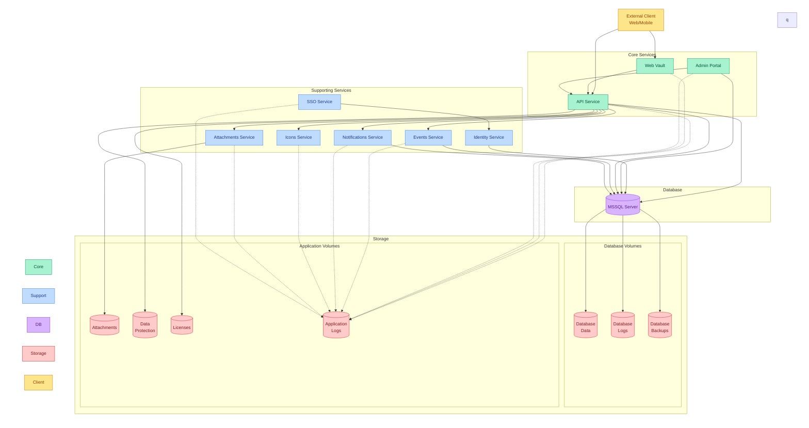

# Bitwarden Subsystem

Self-hosted password management solution providing secure credential storage and sharing capabilities.

## Quick Links

- [Official Documentation](https://bitwarden.com/help/install-on-premise/)
- [GitHub Repository](https://github.com/bitwarden/server)

## Overview

The bitwarden subsystem consists of three main capability groups:

1. Core Services
   - Password vault management
   - Identity and access control
   - Administrative functions
   - Secure attachment handling

2. Data Management
   - Encrypted storage
   - Database persistence
   - Backup management
   - License management

3. Access Control
   - SSO integration
   - API access
   - Web interface
   - Event logging

### Component Architecture

The following diagram illustrates how Bitwarden's components work together, showing the relationships between services and their storage dependencies.

*Note: While component relationships are based on official documentation, some communication flows between services are inferred and may need verification*

### Component Details

| Component | Type | Primary Role | Key Features | Integration Points |
|-----------|------|--------------|--------------|-------------------|
| API Service | Core | Request Handler | • Client request processing • Data operation management • Encryption handling • Storage coordination | • Direct MSSQL database access • Integration with all supporting services • Data protection key management • License validation |
| Web Vault | Core | User Interface | • Password management interface • Secure vault access • Organization management • User settings | • Authentication via Identity service • API service communication • Application logging |
| Admin Portal | Core | Administration | • System configuration • User management • Organization control • License management | • Identity service authentication • MSSQL database access • Application logging |
| Identity Service | Supporting | Authentication | • User authentication • SSO management • Token handling • Session management | • MSSQL database integration • SSO service coordination • Authentication for all services |
| Events | Supporting | Audit System | • Activity logging • Audit trail maintenance • Event tracking • History management | • MSSQL database integration • API service coordination • Application logging |
| Notifications | Supporting | Update System | • Real-time notifications • Status updates • Alert management • User notifications | • MSSQL database integration • API service coordination • Application logging |
| Icons | Supporting | Resource Cache | • Favicon management • Icon caching • Resource optimization • Cache maintenance | • API service coordination • Application logging • External icon fetching |
| Attachments | Supporting | File Management | • Secure file storage • Attachment handling • File encryption • Storage management | • Dedicated volume access • API service coordination • Application logging |
| SSO | Supporting | Authentication | • External SSO integration • Identity provider connection • Protocol support • Session handling | • Identity service integration • Application logging • External provider coordination |

## Prerequisites

1. Persistent Storage

   | PVC Name | Purpose | Access Mode |
   |----------|---------|-------------|
   | bitwarden-attachments | File attachments | RWX |
   | bitwarden-dataprotection | Encryption keys | RWX |
   | bitwarden-db-backups | Database backups | RWX |
   | bitwarden-db-data | MSSQL data files | RWX |
   | bitwarden-db-logs | Database logs | RWX |
   | bitwarden-licenses | License files | RWX |
   | bitwarden-logs | Application logs | RWX |

2. Required Secrets

   | Secret Name | Purpose | Required Keys |
   |-------------|---------|---------------|
   | coder-db-app | Database connection | uri |
   | coder-oidc-auth-settings | OIDC configuration | clientId, clientSecret |

3. Required Variables

   | Variable | Purpose | Used By |
   |----------|---------|---------|
   | domain_name | External access URL (bitwarden.${domain_name}) | All services |
   | cloud_communication | External services (disabled by default) | Core services |
