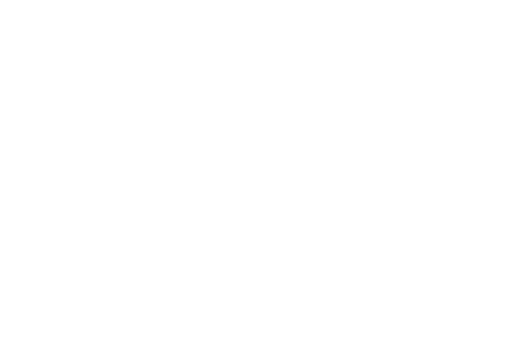

# Coder Subsystem

Self-hosted development environment platform enabling secure, reproducible, and Kubernetes-native workspaces for development.

## Quick Links

## Overview

The coder subsystem consists of three main capability groups:

1. Workspace Management
   - Development environment provisioning
   - Resource allocation
   - Access control
   - Workspace templates

2. Platform Infrastructure
   - State persistence
   - Authentication
   - Metrics collection
   - Network access

3. Security Controls
   - RBAC management
   - TLS encryption
   - Workspace isolation
   - Resource limits

### Component Details

| Component | Type | Primary Role | Key Features | Integration Points |
|-----------|------|--------------|--------------|-------------------|
| Coder Server | Core | Platform Control | • Workspace provisioning • Template management • Access control • Resource orchestration | • PostgreSQL state storage • OIDC authentication • Prometheus metrics • Kubernetes API |
| PostgreSQL | Infrastructure | State Storage | • Platform state persistence • User data management • Workspace metadata • High availability support | • Coder server integration • Automated failover • Metrics collection |
| OIDC Provider | Security | Authentication | • Identity management • Session control • Token handling • User authorization | • Coder server integration • External provider support • Session management |
| Workspace Agent | Runtime | Environment Control | • Development environment • Resource management • Connection handling • Tool integration | • Coder server communication • Kubernetes resources • Template execution |

## Prerequisites

1. Persistent Storage

   | PVC Name | Purpose | Access Mode |
   |----------|---------|-------------|
   | coder-db-data | PostgreSQL data | RWO |
   | workspace-data | Per-workspace storage | RWX |

2. Required Secrets

   | Secret Name | Purpose | Required Keys |
   |-------------|---------|---------------|
   | coder-db-app | Database connection | uri |
   | coder-sso-credentials | OIDC configuration | clientId, clientSecret |

3. Required Variables

   | Variable | Purpose | Used By |
   |----------|---------|---------|
   | domain_name | External access URL | Coder server |
   | db_storage_size | Database storage | PostgreSQL |
   | db_storage_class | Storage class | PostgreSQL |

4. RBAC Requirements

   | Resource | Access | Purpose |
   |----------|---------|---------|
   | configmaps | create, delete, get, list, update, watch | Workspace management |
   | deployments | create, delete, get, list, update | Workspace provisioning |
