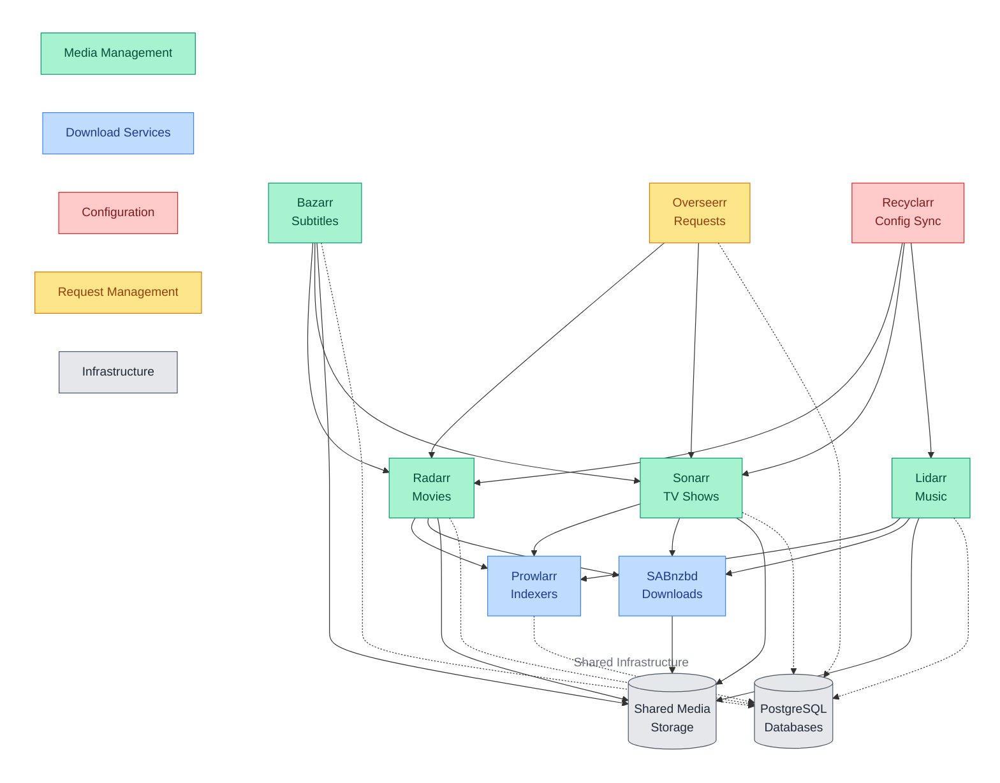

# Downloaders Subsystem

Integrated media management solution enabling automated downloading and organization of movies, TV shows, music, and subtitles.

## Quick Links

- [Radarr Documentation](https://github.com/Radarr/Radarr)
- [Sonarr Documentation](https://github.com/Sonarr/Sonarr)
- [Lidarr Documentation](https://github.com/lidarr/Lidarr)
- [Prowlarr Documentation](https://github.com/Prowlarr/Prowlarr)
- [SABnzbd Documentation](https://github.com/sabnzbd/sabnzbd)
- [Recyclarr Documentation](https://github.com/recyclarr/recyclarr)

## Overview

The downloaders subsystem consists of three main capability groups:

1. Media Management
   - Automated organization of movies, TV shows, and music
   - Subtitle management and synchronization
   - User request handling and tracking
   - Library maintenance and cleanup

2. Download Management
   - Centralized indexer configuration
   - Usenet download handling
   - Automated quality profiles
   - Download state tracking

3. Configuration Management
   - Automated service configuration
   - Quality profile synchronization
   - Release profile management
   - Custom format definitions

### Component Architecture

The following diagram illustrates how the various components of the downloaders subsystem work together to provide comprehensive media management capabilities. It shows the flow of requests, metadata, and content between services, as well as their interaction with shared infrastructure.

*Line styles: Solid (→) = Application communication (API calls, downloads), Dotted with arrow (-.→) = Database connections*

### Component Details

| Component | Type | Primary Role | Key Features | Integration Points |
|-----------|------|--------------|--------------|-------------------|
| Radarr | Media Manager | Movie Management | • Comprehensive movie library organization • Advanced quality profile management • Intelligent release filtering • State persistence in PostgreSQL | • Searches content through Prowlarr's indexer network • Automatically sends download tasks to SABnzbd • Receives configuration updates from Recyclarr |
| Sonarr | Media Manager | TV Series Management | • Complete TV series tracking • Automated season/episode management • Smart media file renaming • State persistence in PostgreSQL | • Searches content through Prowlarr's indexer network • Automatically sends download tasks to SABnzbd • Receives configuration updates from Recyclarr |
| Lidarr | Media Manager | Music Management | • Comprehensive music library organization • Detailed artist/album tracking • Advanced quality profiles • State persistence in PostgreSQL | • Searches content through Prowlarr's indexer network • Automatically sends download tasks to SABnzbd • Receives configuration updates from Recyclarr |
| Bazarr | Media Manager | Subtitle Management | • Automated subtitle downloading • Multi-language management • Intelligent subtitle synchronization • State persistence in PostgreSQL | • Actively monitors Radarr/Sonarr media libraries • Directly manages subtitle files in media storage |
| Overseerr | Media Manager | Request Management | • User-friendly request interface • Comprehensive request tracking • Integrated library discovery • State persistence in PostgreSQL | • Forwards movie/TV requests to Radarr/Sonarr • Integrates with external authentication systems |
| Prowlarr | Download Service | Indexer Management | • Centralized indexer configuration • Unified search API for all services • Detailed statistics tracking • State persistence in PostgreSQL | • Processes search requests from all *arr services • Manages indexer API keys and capabilities • Continuously monitors indexer health status |
| SABnzbd | Download Service | Download Client | • Full Usenet download management • Intelligent post-processing • Priority-based download handling • Pre-optimized configuration | • Processes download requests from *arr services • Handles extraction and cleanup of downloads • Reports detailed download status to services |
| Recyclarr | Configuration Service | Config Management | • Automated daily configuration sync • Comprehensive profile management • Scheduled updates (18:00 UTC) • Custom format definitions | • Maintains consistent configuration across *arr services • Manages quality definitions and scoring • Updates custom format specifications |

## Prerequisites

1. Persistent Storage

   | PVC Name | Purpose | Access Mode |
   |----------|---------|-------------|
   | media | Shared media storage | RWX |
   | radarr-data | Radarr configuration | RWX |
   | sonarr-data | Sonarr configuration | RWX |
   | lidarr-data | Lidarr configuration | RWX |
   | bazarr-data | Bazarr configuration | RWX |
   | prowlarr-data | Prowlarr configuration | RWX |
   | overseerr-data | Overseerr configuration | RWX |
   | sabnzbd-data | SABnzbd configuration | RWX |

2. Required Secrets

   | Secret Name | Purpose | Required Keys |
   |-------------|---------|---------------|
   | downloaders-db-app | Database access | username, password |
   | downloader-api-keys | Service API keys | radarr_api_key, sonarr_api_key, etc. |

3. Required Variables

   | Variable | Purpose | Used By |
   |----------|---------|---------|
   | MEDIA_WRITER_UID | File ownership | All services |
   | MEDIA_WRITER_GID | File ownership | All services |
   | POSTGRES_DB_SIZE | Database storage | PostgreSQL |
   | POSTGRES_DB_STORAGE_CLASS | Database storage | PostgreSQL |
