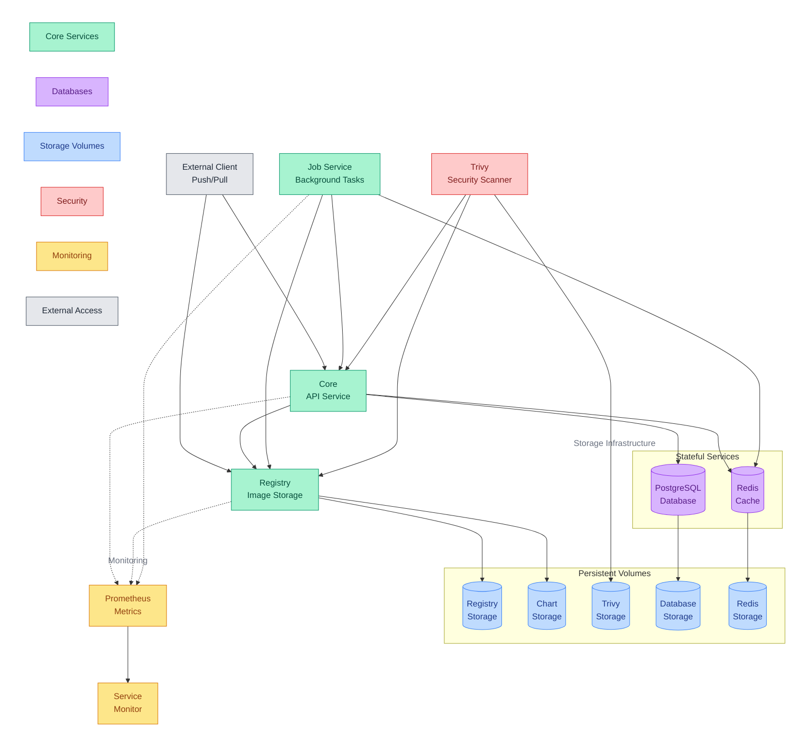

# Harbor Subsystem

Private container registry platform with built-in security scanning, RBAC, and artifact management capabilities.

## Quick Links

## Overview

The harbor subsystem consists of three main capability groups:

1. Registry Services
   - Container image storage
   - Artifact management
   - Chart repository
   - Image scanning

2. Supporting Infrastructure
   - Job processing
   - Data persistence
   - Caching layer
   - Security database

3. Operational Features
   - Metrics collection
   - Access control
   - TLS termination
   - Resource management

### Component Architecture

The following diagram illustrates how Harbor's components work together to provide container registry services, showing the relationships between core services, storage, and monitoring.

<!-- markdownlint-disable-next-line MD036 -->
*Line styles: Solid (→) = Direct interaction/data flow, Dotted with arrow (-.→) = Metrics collection*

### Component Details

| Component | Type | Primary Role | Key Features | Integration Points |
|-----------|------|--------------|--------------|-------------------|
| Registry | Core | Image Storage | • Container image management • Helm chart repository • Artifact versioning • Storage optimization | • Direct storage volume access • Core API integration • Metrics collection • Chart storage management |
| Core API | Core | Service Control | • Authentication management • Authorization control • API request handling • Resource coordination | • PostgreSQL data persistence • Redis cache integration • Registry coordination • Security service integration |
| Job Service | Core | Task Management | • Background task execution • Replication management • Scan job coordination • Queue processing | • Redis queue integration • Registry interaction • Core API communication • Job logging |
| Trivy | Core | Security Scanner | • Vulnerability scanning • Security database • Image analysis • Report generation | • Registry image access • Core API integration • Vulnerability database • Scan result storage |
| PostgreSQL | Storage | Data Persistence | • Metadata storage • User data management • Configuration storage • Relationship tracking | • Core service integration • Persistent volume storage • Data backup support |
| Redis | Storage | Cache Management | • Request caching • Job queue handling • Session management • Task coordination | • Job service integration • Core API caching • Queue persistence |

## Prerequisites

1. Persistent Storage

   | PVC Name | Purpose | Access Mode |
   |----------|---------|-------------|
   | harbor-registry | Container images and charts | RWX |
   | harbor-jobservice | Job logs and data | RWX |
   | harbor-database | PostgreSQL data | RWX |
   | harbor-redis | Redis data | RWX |
   | harbor-trivy | Vulnerability database | RWX |

2. Required Secrets

   | Secret Name | Purpose | Required Keys |
   |-------------|---------|---------------|
   | harbor | Admin credentials | adminPassword, secretKey |

3. Required Variables

   | Variable | Purpose | Used By |
   |----------|---------|---------|
   | domain_name | External access URL (harbor.${domain_name}) | All services |
