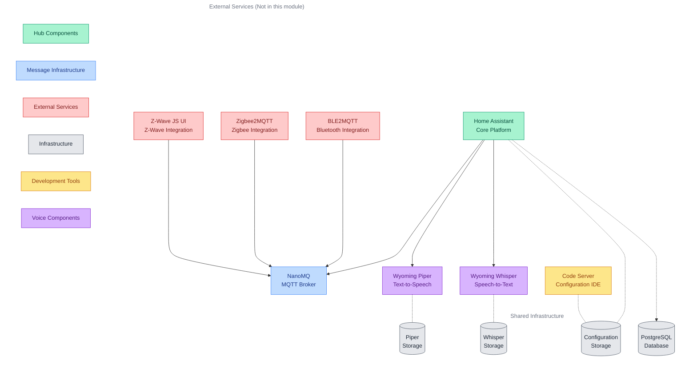

# Home Automation Subsystem

Home automation platform centered around Home Assistant, enabling integration with various IoT protocols and devices through a secure MQTT messaging infrastructure, with voice control capabilities through local speech-to-text and text-to-speech processing.

## Quick Links

   

## Overview

The home-automation subsystem consists of three main capability groups:

1. Automation Platform
   - Home automation control and monitoring
   - Device state management
   - Automation rules and scripts
   - Web-based configuration interface

2. Message Infrastructure
   - MQTT broker for device communication
   - Multi-protocol support (MQTT, WebSocket, HTTP)
   - Secure authentication and access control
   - IoT protocol integration support

3. Voice Capabilities
   - Local speech-to-text processing
   - Local text-to-speech synthesis
   - Voice command recognition
   - Voice response generation

### Component Architecture

The following diagram illustrates how the home automation subsystem components work together, including external services that integrate through the MQTT broker. While the external services are not part of this subsystem, they are shown to demonstrate the complete integration architecture.

*Line styles: Solid (→) = MQTT messaging, Dotted with dots (-.-) = Storage access, Dotted with arrow (-.→) = Database connections*

### Component Details

| Component | Type | Primary Role | Key Features | Integration Points |
|-----------|------|--------------|--------------|-------------------|
| Home Assistant | Core | Automation Platform | • Comprehensive device state management and tracking • Advanced automation engine with scripting • Modern web interface for configuration • Persistent state in PostgreSQL database | • Bi-directional MQTT communication for devices • State persistence through PostgreSQL • Configuration management via Code Server • Voice processing via Wyoming components |
| Code Server | Core | Configuration IDE | • Real-time YAML configuration editing • Integrated syntax highlighting and validation • Built-in version control capabilities • Immediate config validation feedback | • Direct mount of Home Assistant configuration • Secure internal-only access • Efficient resource utilization |
| NanoMQ | Infrastructure | Message Broker | • Full MQTT v3.1.1/v5.0 protocol support • Integrated WebSocket connectivity • RESTful HTTP API interface • Granular access control system | • Secure message routing between components • Multi-protocol device communication • Role-based authentication and ACL |
| Wyoming Piper | Voice | Text-to-Speech | • Local text-to-speech processing • Multiple voice options • Natural-sounding speech synthesis • Low-latency response generation | • Direct integration with Home Assistant • Voice response for automations • Persistent model storage |
| Wyoming Whisper | Voice | Speech-to-Text | • Local speech recognition • Accurate transcription capabilities • Medium-sized language model • Privacy-focused voice processing | • Direct integration with Home Assistant • Voice command recognition • Persistent model storage |
| Z-Wave JS UI | External | Device Integration | • Complete Z-Wave device management • Real-time state publication • Reliable command handling • Network monitoring | • Secure MQTT communication as "zwavejs" • Bi-directional state and command flow • Integrated network management |
| Zigbee2MQTT | External | Device Integration | • Comprehensive Zigbee network management • Automatic device discovery and pairing • Sophisticated state control • Device-specific configurations | • Secure MQTT communication as "zigbee2mqtt" • Real-time device state updates • Coordinated network control |
| BLE2MQTT | External | Device Integration | • Active Bluetooth device scanning • Efficient state reporting system • Reliable device control interface • Connection management | • Secure MQTT communication as "ble2mqtt" • Optimized state updates • Managed device connections |

## Prerequisites

1. Persistent Storage

   | PVC Name | Purpose | Access Mode |
   |----------|---------|-------------|
   | home-assistant-data | Configuration and code-server data | RWX |
   | wyoming-piper-data | Text-to-speech model storage | RWO |
   | wyoming-whisper-data | Speech-to-text model storage | RWO |

2. Required Secrets

   | Secret Name | Purpose | Required Keys |
   |-------------|---------|---------------|
   | home-automation-secrets | Service configuration | homeassistant_secrets.yaml, nanomq_admin_password, nanomq_pwd.conf |

3. Required ConfigMaps

   | ConfigMap Name | Purpose | Required Keys |
   |----------------|---------|---------------|
   | nanomq-config | MQTT broker config | nanomq.conf, nanomq_acl.conf |

4. MQTT Authentication

   | Username | Purpose | Access |
   |----------|---------|---------|
   | homeassistant | Core platform | Allow |
   | zwavejs | Z-Wave integration | Allow |
   | zigbee2mqtt | Zigbee integration | Allow |
   | ble2mqtt | Bluetooth integration | Allow |
