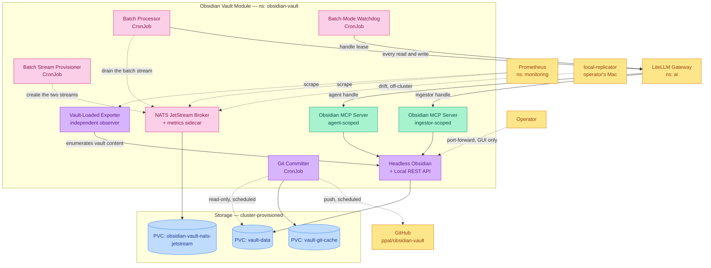

# Obsidian Vault Subsystem

A git-backed markdown knowledge vault that AI clients write to and the operator reads, together with the durable work queue that feeds it and the health signal that says whether the vault is actually open.

## Quick Links

 

## Overview

Every workload in this module serves one shared namespace and one invariant: exactly one process ever writes the vault's files, and everything else is a client of that one door. The module groups into four capabilities.

1. Knowledge Vault Engine
   - Headless Obsidian with the Local REST API plugin baked in and auto-trusted, backed by an externally-provisioned ReadWriteMany claim
   - The only workload mounting vault content read-write, and the only process that ever mutates a markdown file
   - `Recreate` rollout and a descheduler eviction exemption, so two instances never hold the vault at once
   - No ingress: the GUI is reached solely by `kubectl port-forward` against the already-running process

2. The Write Door
   - Two separately-scoped MCP server instances of the same image are the only network path to the vault's content — one confined to the agent capture zones, one carrying the wider scope promotion and bulk ingest require
   - Reachable only from the LiteLLM gateway in the `ai` namespace, which is where per-client key scoping is enforced
   - Authenticated with a per-instance JWT, unlike the `auth_type: none` posture of the gateway's other MCP servers, because an unauthenticated caller reaching one would have the vault's write-anywhere bearer token spent on its behalf

3. Work Queue Substrate
   - A NATS JetStream broker giving the write path a durable, ordered, acknowledged transport, reachable off-cluster over TLS for producers that do not run in this cluster
   - One account per message shape — patch-carrying, pointer-carrying, and content-carrying with a destination the processor fixes — each restricted by subject permission to the one stream it may publish to
   - `batch-processor` drains the batch stream in strict FIFO through the same gated MCP path as ordinary ingest; bulk work is a feed into the one write path, never a lane around it
   - A watchdog re-enables the agent-facing gateway handle when the run holding it down stops renewing its lease

4. Durability and Observation
   - A scheduled committer takes the vault's history to a GitHub remote, mounting vault content read-only and writing only to its own git-dir claim
   - An independent exporter asserts that the vault actually opened, deliberately wired to nothing that restarts anything

## Service Architecture

<!-- markdownlint-disable-next-line MD036 -->
*Line styles: Solid (→) = Direct interaction, Dotted (-.→) = Scheduled or optional connection*

### Service Details

| Service | Primary Role | Key Features | Integration Points |
| ------- | ------------ | ------------ | ------------------ |
| Obsidian | Knowledge Vault Engine | • Headless Obsidian with the Local REST API plugin baked in and auto-trusted • The only workload mounting vault content read-write, and the only process that ever mutates a markdown file • Non-root, read-only root filesystem, `Recreate` rollout so two instances never hold the vault at once • ClusterIP only, no ingress; readiness is the REST API answering, which proves the vault is open, trusted, and the plugin loaded • GUI reachable on demand by `kubectl port-forward` against the same running process | • Reached only by the two MCP servers and the vault-loaded exporter, enforced by `obsidian-rest-api-ingress` • Mounts the externally-provisioned `vault-data` PVC, holding only the vault's markdown content — Obsidian's own app state (vault registration, plugin-trust flag) lives on an ephemeral emptyDir, not this claim • Bearer token for its REST API is pinned from the secret store so the MCP servers can be wired declaratively |
| mcp-obsidian-agent | Knowledge Vault MCP Server (agent scope) | • `cyanheads/obsidian-mcp-server` fronting the headless Obsidian REST API • Writes confined to the agent capture zones (`00-inbox/`, `40-journal/`, `_ops/agent/`) plus the root `log.md`; reads span the whole vault • Path matching is prefix-based with implicit recursion and applies across every tool, note deletion included • Command-palette tools disabled at the server, not merely withheld at the gateway | • Registered on the LiteLLM gateway in `ai` as `obsidian_agent_mcp`; only the LiteLLM pod may reach it • Calls the in-cluster `obsidian` Service over HTTPS with the Local REST API bearer token • The write door for OpenClaw, n8n, Claude Code, and the drift-reconciliation channel |
| mcp-obsidian-ingestor | Knowledge Vault MCP Server (ingestor scope) | • Second instance of the same image, carrying the wider write scope promotion, lint, and bulk ingest require • Curated areas, the raw layer, the archive, and the `_ops` records are writable here and nowhere else • The schema file, the hand-curated index, templates, and `.obsidian/` stay outside every write scope • A separate instance rather than a second gateway handle onto the agent instance — a shared instance would leak this scope to the narrower handle | • Registered on the LiteLLM gateway as `obsidian_ingestor_mcp`; only the LiteLLM pod may reach it • Calls the same in-cluster `obsidian` Service • Reserved for the lint pass and `batch-processor`, never agent-facing keys |
| git-committer | Vault Git Committer | • Scheduled `CronJob`, not a long-lived Deployment — takes a commit and exits, so it holds a mount on `vault-data` only while a commit is actually being taken rather than adding a third permanent attachment • Mounts `vault-data` read-only and writes only to its own git-dir PVC, never vault content • Pushes the derived history to a GitHub remote over SSH, with host-key verification pinned rather than disabled • `concurrencyPolicy: Forbid`, so an in-flight `git push` is never killed mid-run by the next scheduled tick | • Reads the `vault-data` PVC read-only; Obsidian is the only other mounter, and its mount is read-write • Own `vault-git-cache` PVC for git's own metadata, kept off the vault volume entirely • SSH deploy key (`git-committer-secrets`) authorized as a write key on the GitHub remote |
| vault-loaded-exporter | Vault-Loaded Health Signal | • Independent observer of whether the vault is actually open: an authenticated call enumerating vault content, asserting the list non-empty, exposing `obsidian_vault_files_total` and `obsidian_vault_enumeration_success_timestamp_seconds` • Deliberately **not** a probe — the editor has been observed `1/1 Ready` with its REST API serving while unable to open the vault at all, and that failure is one a restart does not fix, so this signal is wired to nothing that restarts anything • Both gauges are absent until the first successful enumeration and never move on a failed one, so a stuck exporter reads as a frozen count beside an ageing timestamp rather than as a plausible zero • Polls on a background loop and serves `/metrics` from cache, so a wedged vault cannot turn into a scrape timeout • Mounts no PVC — the only I/O is HTTP, so it is not a further mounter of `vault-data` | • Calls the same in-cluster `obsidian` Service over HTTPS with the same Local REST API bearer token the MCP servers hold; that listener has one token and no path-scoped permissions, so no narrower credential exists • Admitted to the REST API by `obsidian-rest-api-ingress` as a peer in its own right, and scraped through `vault-observer-ingress` • Scraped by Prometheus through its own `ServiceMonitor` at the exporter's own 60s poll cadence; no alert rules accompany it |
| obsidian-vault-nats | Work Queue Substrate | • Single-replica NATS JetStream broker, file storage on its own PVC, chosen over RabbitMQ on operational weight — this repo runs no StatefulSet anywhere • **Ships zero streams by design**: each stream is created with the processor that consumes it, so no stream ever stands reachable with no consumer and no credential control behind it • One account per **message shape** — patch-carrying (batch), pointer-carrying (promotion), content-carrying with a processor-fixed destination (drift) — each importing exactly one subject as a private service export, each user restricted to publishing on its own stream's subjects and to a reply inbox of its own • No producer is granted the JetStream API subject space — an acknowledged publish never touches it, and granting it would let a producer widen or purge its own stream • Passwords are bcrypt hashes in the environment; only hashes ever reach the broker, and the config that carries the grants stays a reviewable ConfigMap • TLS on the client port, mandatory: static-account auth sends the password on CONNECT and the LoadBalancer puts that CONNECT on the network | • Reachable off-cluster at `obsidian-vault-nats.${domain_name}` over a MetalLB LoadBalancer — an `Ingress` is HTTP-only and cannot carry the NATS protocol • In-cluster clients use the same hostname, because the certificate is issued for it alone • Scraped through a `prometheus-nats-exporter` sidecar; NATS's own monitoring port serves JSON and 404s on `/metrics` • Mounts the externally-provisioned `obsidian-vault-nats-jetstream` PVC |
| batch-processor | Bulk Work Consumer | • Drains the `batch` JetStream stream in strict FIFO, applying each chunk of a git patch through the same gated MCP path as ordinary interactive ingest • A `CronJob`, not a Deployment: one invocation is one run that disables the agent-facing gateway handle, drains until the stream is empty and re-enables it, so a controller that restarted it would hold that handle down permanently • Ships the two streams it consumes, created by a companion `CronJob` holding the same credential — NATS cannot declare a stream in server configuration, and no producer is permitted to • The dead-letter path is a **separate** stream on a disjoint top-level subject; inside the batch stream's own subject list, a dead-lettered chunk would be re-consumed by the consumer that just gave up on it, forever and silently • `batch` is a work queue with `discard: new`, so an applied chunk leaves the stream and a full one refuses publishes rather than deleting the oldest unapplied chunk • A watchdog `CronJob` re-enables the agent handle when the run holding it down stops renewing its lease; a handle disabled with no lease is an operator's own hold and is left alone | • Consumes the batch stream over the broker's LoadBalancer hostname, with the one credential permitted to consume • Every vault read and write goes through the LiteLLM gateway in `ai` to `obsidian_ingestor_mcp`; it mounts no PVC and never reaches Obsidian directly • Turns the agent-facing gateway handle off and on through LiteLLM's key API, and never calls through that handle • Stream depth, ack, redelivery and dead-letter depth arrive through obsidian-vault-nats's exporter sidecar, keyed by stream and consumer name — no scrape wiring of its own |

## Prerequisites

This module needs a LiteLLM gateway reachable at `litellm.ai.svc.cluster.local:4000` with the two vault MCP servers registered on it and virtual keys scoped to them. That gateway is `apps/subsystems/ai`, and the coupling is bidirectional but not circular: the gateway calls into this module's MCP servers, and this module's `batch-processor` and watchdog call the gateway. Declare the hard edge where the module is consumed (`Kustomization.spec.dependsOn`), never inside the module — see [DESIGN.md](../../../DESIGN.md#dependencies).

1. Persistent Storage

   All three claims are provisioned externally by the cluster, not defined by this module, which references each by name only.

   | PVC Name | Purpose | Access Mode |
   | -------- | ------- | ----------- |
   | vault-data | Authoritative knowledge-vault content — the markdown files themselves, not Obsidian's own app state | RWX |
   | vault-git-cache | The git committer's own repository metadata (its `--git-dir`) — never vault content, and never mounted by any other workload | RWO |
   | obsidian-vault-nats-jetstream | JetStream's message store — the durable half of the work queue; an unacknowledged message not on this volume was never enqueued | RWO |

   `vault-data` is RWX because it has read-only consumers beyond Obsidian itself — the git committer today, a lint pass later — which must mount it without being co-scheduled onto the Obsidian pod's node. `vault-git-cache` is RWO: `concurrencyPolicy: Forbid` means at most one git-committer pod ever holds it. `obsidian-vault-nats-jetstream` is RWO for the same class of reason — the broker is one replica on `strategy: Recreate`, so two servers never hold one message store.

2. Required Secrets

   | Secret Name | Purpose | Required Keys |
   | ----------- | ------- | -------------- |
   | obsidian-secrets | Pins the Local REST API plugin's bearer token, so it is a known value rather than one generated inside the running container | OBSIDIAN_API_KEY |
   | mcp-obsidian-agent-secrets | The same REST API bearer token the agent-scoped MCP server spends on callers' behalf, plus the signing secret it verifies inbound JWTs against | OBSIDIAN_API_KEY, MCP_AUTH_SECRET_KEY |
   | mcp-obsidian-ingestor-secrets | The same, for the ingestor-scoped MCP server; its signing secret is deliberately distinct from the agent instance's | OBSIDIAN_API_KEY, MCP_AUTH_SECRET_KEY |
   | vault-loaded-exporter-secrets | The same Local REST API bearer token the two MCP servers hold, from the same secret-store key. Not narrowed for a read-only observer because the REST layer has no path-scoped permissions to narrow with — one token is all that exists | OBSIDIAN_API_KEY |
   | git-committer-secrets | The git committer's SSH private key. Its public half must be registered as a deploy key **with write access** on the GitHub remote — out of band, not by this module. Host keys are not a secret and are not here: the committer fetches GitHub's from `api.github.com/meta` at the start of every run | ssh-privatekey |
   | obsidian-vault-nats-server-credentials | The NATS broker's account passwords, as bcrypt hashes and nothing else. The broker verifies against a hash and stores no plaintext, so this Secret is not credential material; the plaintext each hash was derived from is a separate secret-store key held by the one client that presents it | obsidian_vault_nats_sysadmin_password_hash, obsidian_vault_nats_queue_admin_password_hash, obsidian_vault_nats_batch_processor_password_hash, obsidian_vault_nats_batch_producer_password_hash, obsidian_vault_nats_promotion_producer_password_hash, obsidian_vault_nats_drift_producer_password_hash |
   | obsidian-vault-nats-tls-cert | The broker's client-port certificate. Issued by cert-manager from `Certificate/obsidian-vault-nats-tls`, not sourced from the secret store; the `Certificate` carries `kustomize.toolkit.fluxcd.io/prune: disabled` so a module reshuffle does not force a re-issue against Let's Encrypt's rate limits | tls.crt, tls.key |
   | batch-processor-secrets | Everything one batch run presents: the broker credential permitted to consume, a LiteLLM virtual key scoped to the ingestor MCP server, the gateway's own admin key, and the agent handle a run blocks | BATCH_PROCESSOR_NATS_PASSWORD, BATCH_MCP_API_KEY, BATCH_GATEWAY_ADMIN_KEY, BATCH_AGENT_HANDLE_KEY |
   | batch-mode-watchdog-secrets | The two gateway keys and nothing else. Separate from the Secret above on purpose: the watchdog runs when `batch-processor` cannot, so it must not depend on the broker credential or the vault write key | BATCH_GATEWAY_ADMIN_KEY, BATCH_AGENT_HANDLE_KEY |

   The secret-store keys those `ExternalSecret`s read:

   | Secret Store Key | Purpose |
   | ---------------- | ------- |
   | obsidian_rest_api_key | Bearer token for the Local REST API plugin inside headless Obsidian. Pinned into the Obsidian pod and held by both MCP servers and the exporter; a caller holding it can write anywhere in the vault, since the REST layer has no path-scoped permissions of its own |
   | obsidian_agent_mcp_auth_secret | Shared secret (minimum 32 characters) the agent-scoped MCP server verifies inbound JWTs against |
   | obsidian_ingestor_mcp_auth_secret | The same for the ingestor-scoped MCP server. Deliberately a different value, so an agent token cannot be replayed against the wider-scoped instance |
   | obsidian_git_committer_ssh_private_key | The git committer's SSH private key. Its public half is a write-enabled deploy key on the GitHub remote, so it is scoped to that one repository by construction |
   | obsidian_vault_nats_sysadmin_password_hash | bcrypt hash of the NATS `SYS` account password. Operator-only; never issued to a producer |
   | obsidian_vault_nats_queue_admin_password_hash | bcrypt hash of the `BRAIN_QUEUE` account password. This is the identity that creates and manages streams, and it is deliberately never a producer's credential — a producer holding it could widen or purge the stream it publishes to |
   | obsidian_vault_nats_batch_producer_password_hash | bcrypt hash of the batch producer's password. Its plaintext is a separate key, delivered to the one producer that holds it |
   | obsidian_vault_nats_promotion_producer_password_hash | bcrypt hash of the promotion producer's password. Configured before any producer connects, deliberately: the authority test that matters is a legitimately held credential refused at a subject outside its grant, which needs a second real credential to exist |
   | obsidian_vault_nats_drift_producer_password_hash | bcrypt hash of the drift producer's password, held off-cluster by `local-replicator`. Same reasoning as promotion above |
   | obsidian_vault_nats_batch_processor_password_hash | bcrypt hash of the batch consumer's password. The only credential inside the account that holds the streams besides `queue-admin`, and the only one permitted to consume |
   | obsidian_vault_nats_batch_processor_password | The plaintext the hash above was derived from, presented by `batch-processor` and its stream provisioner. The only NATS plaintext this module reads; every other NATS key here is a hash |
   | apikey_litellm_batch_processor | `batch-processor`'s virtual key for the LiteLLM gateway. It must be scoped to `obsidian_ingestor_mcp` and nothing else — that scoping lives in LiteLLM's own store, not in this repo, so an over-scoped key is not something reviewing this module catches |
   | litellm_master_key | The LiteLLM gateway's own admin key, used by `batch-processor` and the watchdog to disable and re-enable the agent handle through the gateway's key API. The same key `apps/subsystems/ai` reads for the gateway itself |
   | litellm_obsidian_agent_handle_key | The agent-facing gateway handle — the LiteLLM key every interactive writer holds, which a batch run blocks for its duration and the watchdog re-enables. Which key that is, is a gateway-side fact this repository cannot see |

3. Required Variables

   | Variable | Purpose | Used By |
   | -------- | ------- | ------- |
   | secret_store | Name of the `ClusterSecretStore` every `ExternalSecret` here reads from | all components |
   | domain_name | The broker's external hostname (`obsidian-vault-nats.${domain_name}`), which is also the address in-cluster clients dial | obsidian-vault-nats, batch-processor |
   | cert_issuer | ClusterIssuer the broker's client-port certificate is requested from | obsidian-vault-nats |
   | git_committer_remote_origin_url | SSH URL of the GitHub remote the committer pushes derived history to. No default — a missing value fails the run at startup rather than silently defaulting to something wrong | git-committer |

## Notes

- **Network policy: one control, four defences, and one deliberate absence.** `obsidian-rest-api-ingress` is the *sole* control on Obsidian's Local REST API, which offers no path-scoped permissions of its own and additionally registers a second, unscoped MCP endpoint at `/mcp/` that upstream provides no way to disable. Its failure is an open door onto the whole vault, not a hardening regression. Every other policy here is defence in depth: `vault-writers-ingress` (LiteLLM to the two MCP servers), `vault-observer-ingress` (Prometheus to the exporter), and the broker's own rules. The absence is egress: this module isolates ingress only, as a decision rather than an inheritance — every workload here has a legitimate outbound path, and one of them (a packet to this cluster's own LoadBalancer VIP) cannot be expressed at all, because kube-proxy DNATs it to a backend pod IP before NetworkPolicy evaluates it. Enforcement depends on the cluster's CNI implementing NetworkPolicy; `kind` does not, so CI asserts the policies' shape and never that they bite.

- **`homelab-ops.internal/vault-access` is a policy selector and nothing else, and that separation is the point.** Two values: `writer` on the two MCP servers, `observer` on the vault-loaded exporter. It exists so that no policy in this module has to select on `app.kubernetes.io/component: mcp-server`, which answers a different question — "is this pod an MCP server" — whose population is not the same set, since the exporter is not one. One label answering both questions is the overload `ppat/homelab-ops-kubernetes-clusters#841` was opened to undo. The two MCP servers keep `component: mcp-server` because it is true and because it is how the whole fleet is enumerated across namespaces; the exporter does not carry it. Both labels live on the pod template, never on the immutable `spec.selector`. **A pod that loses its `vault-access` label keeps running and fails closed and silently** — no allow rule selects it, the namespace default-deny does, and its traffic simply stops.

- **The vault-loaded exporter reaches Obsidian's REST API as a peer in its own right.** It is an independent observer of whether headless Obsidian can actually open the vault, and the signal it carries must be able to contradict the Obsidian pod's own account of itself — the failure it exists to catch left that pod `1/1 Ready` with its REST API serving. A claim of that shape cannot be the pod's own probe, so it has to be a separate workload, and a separate workload reaching the REST API needs an exception on the sole control. Two things follow that are easy to get wrong later. It must not be given a readiness or liveness path onto the vault signal, and nothing may act on that signal by restarting anything — a restart does not fix the failure, so a probe would produce a crashloop instead of a signal. And it holds the same write-anywhere REST API bearer token the MCP servers do, because that listener has exactly one token; a read-only observer with a narrower credential is not available to be built. See `ppat/obsidian-tools` ADR-0037.

- **Nothing prevents reaching the broker's client port, and that is the design.** The broker is deliberately exposed off-cluster over a MetalLB LoadBalancer for `local-replicator`'s benefit, so a NetworkPolicy in front of it could not be the thing keeping anyone out: the credential presented on CONNECT and its subject grant are. `obsidian-vault-nats-ingress` therefore admits every source on 4222 rather than naming peers — a peer list would admit nothing the catch-all does not, and it might not even match its own intended callers, since in-cluster clients dial the *external* hostname (a public issuer cannot sign for `.cluster.local`) and whether the broker then observes a client pod's IP or a node's is unverified. The register of who those callers are lives in the policy's own comment, where being wrong costs nothing. The monitoring port 8222 is admitted by nothing: the exporter sidecar reaches it over loopback and the kubelet's probes are node-local, so under this namespace's default-deny it is closed to the cluster.

- **The JWT trust with LiteLLM spans a module boundary.** `apps/subsystems/ai` holds the tokens (`obsidian_agent_mcp_jwt`, `obsidian_ingestor_mcp_jwt`); this module holds the keys they are verified against (`obsidian_agent_mcp_auth_secret`, `obsidian_ingestor_mcp_auth_secret`). The coupling is essential rather than incidental — the gateway must hold a token the server verifies — but it now has two release cadences, so rotating a signing secret is a two-module, two-release operation and doing it in the wrong order returns `401` on every vault tool call.

- **Single-writer invariant.** Exactly one process ever writes the vault's files — headless Obsidian. Every writer in the system (OpenClaw over WhatsApp, scheduled n8n jobs, Claude Code, `batch-processor`, and later a lint pass and a drift-reconciliation channel) is a client of that one door, never a second filesystem writer. Two things in the manifests enforce it structurally rather than by convention: the Obsidian Deployment uses `Recreate` (a rolling update would run two Obsidian processes against the same volume mid-rollout), and it is the only workload that mounts `vault-data` read-write. The one read-only mount that exists today is the git committer's, with a lint pass to follow.

- **git-committer is a CronJob, not a Deployment** — deliberately, not by default. A long-lived committer would leave two questions open that a Deployment cannot answer for itself: what rollout strategy it should use, and whether it needs the descheduler `prefer-no-eviction` annotation the Obsidian Deployment carries. Both presuppose a pod that outlives a single unit of work; a CronJob has neither a rollout nor anything to evict between runs, so it removes those questions rather than answering them. It also *narrows* the multi-attach exposure rather than adding to it: `clusters#799` observed `AttachVolume.Attach` succeed for a second Obsidian pod two seconds after that pod was already marked for deletion during a pod-template flap, meaning the single-writer invariant currently holds by timing more than by enforcement. A CronJob holds a mount on `vault-data` only while a commit is actually being taken. See `ppat/homelab-ops-kubernetes-apps#3443` and `ppat/obsidian-tools#3`.

- **git-committer's `concurrencyPolicy` diverges from this repo's only other CronJob of its kind.** `apps/subsystems/downloaders/recyclarr/cronjob.yaml` uses `Replace`, which is correct for an idempotent Recyclarr sync but wrong here: `Replace` kills the currently-running Job outright to start the next tick's, and the running Job could be mid `git push`. git-committer uses `Forbid`, which skips a tick that would overlap a still-running one rather than killing it.

- **Two MCP instances, not two gateway handles.** A LiteLLM virtual key decides *who* may call; an MCP server instance's `OBSIDIAN_WRITE_PATHS` decides *where* a write may land. These are separate axes, and this module runs two instances of the same image rather than pointing two gateway handles at one. An instance does not know which handle called it, so two handles onto a shared instance would each see that instance's entire write scope — whoever held the narrow handle would get the wide one's reach for free. Separate instances make the wider scope physically unreachable through the narrower handle, independent of gateway configuration. The two also hold separate JWT signing secrets, so a leaked agent token cannot be replayed against the ingestor.

- **MCP auth here diverges from the gateway's other servers.** Every other MCP server behind LiteLLM is registered with `auth_type: none` and relies on the ingress NetworkPolicy alone. Both servers here run `MCP_AUTH_MODE=jwt` and are registered with `auth_type: bearer_token`. The difference is what sits behind them: the listener binds `0.0.0.0`, and an unauthenticated caller reaching it would have the vault's REST API bearer token spent on its behalf. Per-tool scope checks are switched off on both, which upstream documents as the supported posture when the caller cannot inject per-request claims — LiteLLM sends one static token per server, so a scope claim in it could not distinguish one client from another anyway. That distinction is made by per-client virtual-key tool filtering at the gateway; authorisation at the server is `OBSIDIAN_WRITE_PATHS`, which no token can widen. Signature, audience, issuer and expiry validation are unaffected.

- **Per-client vault access scope.** Virtual keys are managed out-of-band at runtime in LiteLLM's own store and appear in no repository, so no code review can catch an over-scoped key. This table is the durable record of the intended scoping, and folder-level path scoping at the server is the backstop that makes an out-of-band key tolerable — a key broader than intended still cannot write outside the paths its instance permits. Destructive and command-execution tools (note deletion, command-palette execution) are absent from every agent-facing key entirely, not merely scoped away from curated folders; the command-palette pair is additionally disabled at both servers.

  | Client | Handle | Tools |
  | ------ | ------ | ----- |
  | n8n | agent | Read/search, narrow frontmatter status updates, and appends to `log.md` only |
  | OpenClaw | agent | Read/search, create-in-inbox, append, patch, frontmatter, tags |
  | Claude Code | agent | As OpenClaw, plus section and structural edits |
  | Open WebUI | agent | Read/search only — human-facing chat, and the human is not a writer |
  | Lint pass | ingestor | Read/search, patch, frontmatter, append, move/promote |
  | Batch processor | ingestor | The same as the lint pass |

  Write paths follow the instance, not the key: the agent handle can only ever land a write in `00-inbox/`, `40-journal/`, `_ops/agent/`, or `log.md`; the ingestor handle additionally reaches `05-raw/`, `10-areas/`, `20-projects/`, `90-archive/`, and the rest of `_ops/`. Matching is prefix-based with implicit recursion rather than glob, so `00-inbox/` covers everything beneath it, and a bare filename such as `log.md` is a valid degenerate prefix matching only itself. Batch runs disable the agent handle and leave the ingestor handle live.

- **The Obsidian GUI is deliberately reachable, and deliberately ungated.** Configuring Obsidian itself — property types, default location for new notes, attachment folder, daily-note format, template folder — requires its GUI, and the only alternative is hand-crafting undocumented application config. So the GUI stays available: a VNC server ships in the image but is never started, and is attached on demand to the display the already-running Obsidian process owns, reached by `kubectl port-forward`. There is no ingress and no second GUI-bearing deployment, because two Obsidian processes against one volume would break the single-writer invariant. A human writing at that GUI carries none of the MCP path's controls — no validation, no provenance stamping, and no record that a write happened until a later maintenance pass notices it. Tolerable for occasional configuration and repair, corrosive as a habit.

- **The broker ships zero streams, and that is the unit of work, not an omission.** A stream is an attribute of the processor that consumes it and ships with it. What the design refuses is a stream reachable with no consumer and no credential control behind it — a durable place for messages to accumulate that nothing is entitled to drain and nothing scopes who may fill. Accounts and credentials without streams are not that state: they grant nothing and hold nothing. The ordering also matters in the other direction — all three producer credentials are configured before any of them connects, because the acceptance test that distinguishes real subject permissions from a NetworkPolicy is a *legitimately held* credential refused at a foreign subject, and that needs a second real credential to exist.

- **The batch set's streams are created by a client, on a schedule, holding the consumer's own credential.** NATS has no way to declare a stream in server configuration, so something must call the JetStream API — and the design withholds that API from every producer. The provisioner therefore uses `batch-processor`'s credential, whose grant names the two streams and the one consumer literally: it can create them and read them, and it cannot touch any other stream. It deliberately does **not** carry the stream-update subject, which has a consequence to know before editing a stream definition: creating an existing stream with an identical configuration succeeds, but with a changed one it fails, so retention or subject-list changes on a live stream are an operator action with `queue-admin`. Granting update here would hand the component with the widest write scope in the system the power to widen its own stream's subject list. Running on a schedule rather than once is what makes a first deploy and a lost JetStream volume both converge without an operator.

- **The dead-letter path is a second stream, and the disjointness is the whole mechanism.** JetStream has no first-class dead-letter exchange, so the path is built rather than configured: the processor republishes a chunk's own bytes with the reason in the headers, then terminates the original. If the dead-letter subject fell inside the batch stream's own subject list, every dead-lettered chunk would be immediately re-consumed by the consumer that had just given up on it, with its delivery count reset — an infinite loop with no error anywhere. Both sides check it: `process-batch` refuses to start when the two prefixes overlap, and the chainsaw suite asserts the two stream definitions' subject lists against each other. The two streams' limits are deliberately opposite — `batch` discards *new* so a full queue refuses publishes rather than deleting unapplied work, `batch-dead-letter` discards *old* so dead-lettering can never itself fail, which would leave a chunk terminated with no copy of it anywhere.

- **The two NATS permission layers are not redundant; they fail differently and only one fails audibly.** Each message shape gets its own account importing exactly one private service export, *and* its user carries an explicit `publish` allow-list. Drop the second and isolation still holds — but the refusal becomes a silent drop: the client sees a no-responders error, nothing reaches its error callback, and the server logs nothing, which is indistinguishable from a missing stream or a crashed JetStream. With the per-user allow-list the server logs `Publish Violation` naming account, user, connection id and subject. That is what makes the refusal observable and attributable, so the permission layer is load-bearing for verification rather than defence in depth. Neither layer grants any producer access to the JetStream API subject space: an acknowledged publish never touches it, and granting it would hand every producer stream creation, update, deletion and purge across the account.

- **The broker's `subscribe` grants are a client-library requirement, not authority, and the two traps around them both read as tightening.** A JetStream publish is a request: the client opens one reply inbox per connection and the acknowledgement comes back on it, so a credential permitted to subscribe nowhere cannot receive its own acknowledgement — the publish then fails with a *subscription* violation and a client-side timeout, never a publish violation, which reads as "broker unreachable" to whoever debugs it. Each credential therefore carries `subscribe: { allow: [ "_INBOX_<ROLE>.*.*" ] }`, granting a reply inbox of its own and no read of any stream. `<ROLE>` must match the `inbox_prefix` the producer's client is configured with — the two live in different repositories, and drift between them fails closed and loudly. `.*.*` rather than `.>` because a reply inbox is exactly `<prefix>.<connection-id>.*`; a tail wildcard would additionally let a holder open a catch-all across every connection sharing its prefix. The traps, both measured: **omitting** the subscribe block leaves subscribe entirely unrestricted (a credential with no block was observed subscribing to `batch.>` and receiving another producer's patch bytes live, and to `>`, `$JS.API.>` and `$SYS.>`), and `subscribe: { allow: [ ] }` reads as "subscribe to nothing" while meaning no restriction at all. The spelling for no subscribe is `deny: [ ">" ]`.

- **NATS's monitoring port is not a Prometheus endpoint, which is why a sidecar exists.** `/varz`, `/jsz` and `/connz` serve JSON and `/metrics` answers 404, so a `ServiceMonitor` pointed straight at the broker would produce a permanently failing scrape and no series at all. A `prometheus-nats-exporter` sidecar run with `-jsz all` translates it, and that flag is what emits the per-stream and per-consumer series the queue's acceptance criterion names — depth, acknowledgement, redelivery and backlog, labelled by `stream_name` and `consumer_name`. With zero streams the endpoint answers 200 and carries only server-level `gnatsd_varz_*` series. One further consequence worth knowing before changing anything here: the probe is `httpGet /healthz` on the monitoring port rather than a `tcpSocket` on the client port (which is what `home-automation/nanomq` does), because this client port requires TLS and a bare TCP connect-and-close logs `TLS handshake error: EOF` on every probe forever.

- **The broker's config ConfigMap must keep `kustomize.toolkit.fluxcd.io/substitute: disabled`.** Flux's post-build substitution expands bare `$NAME` as well as `${NAME}`, and the NATS config passes its bcrypt hashes in as bare `$NAME` environment references that only `nats-server` may resolve. Without the annotation every one of them substitutes to an empty string and the broker comes up with blank passwords — a total loss of authentication with no error anywhere. The chainsaw suite asserts the annotation for that reason. The same ConfigMap is generated with `disableNameSuffixHash: true`, which is also not cosmetic: Flux prune is disabled cluster-wide, so a content-hashed name would strand an orphan on every edit, and a label-selected assertion is satisfied by *any* matching ConfigMap — a stranded correct orphan would then mask a widened current one. Rolling the pod on a config change is handled by the `configmap.reloader.stakater.com/reload` annotation instead.

- **The Obsidian image is pinned by digest, not exercised end to end by CI.** The Obsidian Deployment points at a published, digest-pinned `docker.io/ppatlabs/obsidian` reference rather than a bare tag, because the upstream image is rebuilt and its tags reused — a bare tag would silently change what runs, and this container is the single writer to the authoritative vault. The chainsaw suite asserts the Deployment reaches Ready, which does exercise the boot chain's outcome (Xvfb, Electron, a DevTools attach that disables Restricted Mode, then the plugin binding its listener); what it cannot exercise is anything that depends on NetworkPolicy enforcement. See #3440.
