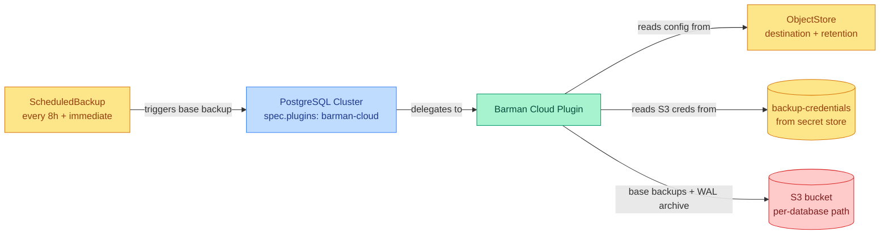

# db-backups

Adds continuous, S3-backed backup and WAL archiving to a CloudNativePG PostgreSQL `Cluster`. Applied as a Kustomize component on top of a module that defines a `Cluster`, it turns on the CloudNativePG Barman Cloud plugin, points it at an object store, and schedules recurring base backups — without the consuming module needing to know anything about backups.

## Overview

This component provides:

1. Object store backup target
   - Declarative `ObjectStore` (Barman Cloud plugin) describing the S3 destination
   - Per-database backup path isolation
   - WAL and data compression
   - Backup retention policy

2. Backup scheduling
   - Recurring base backups via `ScheduledBackup`
   - Immediate first backup on creation
   - Backups owned by (and garbage-collected with) the cluster

3. Credential management
   - S3 credentials sourced from the cluster secret store via `ExternalSecret`
   - Automatic reload on credential rotation

## How It Works

This component does three things to the `Cluster` it is layered onto: it patches the cluster to enable the Barman Cloud WAL-archiver plugin, creates the `ObjectStore` that plugin writes to, and creates a `ScheduledBackup` that drives recurring base backups. WAL is streamed continuously; base backups run on a schedule. Both land in the same per-database S3 path.

## Resources

| Resource | Kind | Purpose |
| -------- | ---- | ------- |
| `${db_name}-backup-store` | `ObjectStore` (barmancloud.cnpg.io) | Declares the S3 destination, credentials, compression, and retention policy the plugin uses |
| `${db_name}-${db_suffix_current}-backups` | `ScheduledBackup` (postgresql.cnpg.io) | Runs base backups on a schedule (every 8h) via the plugin, taking one immediately on creation |
| `${db_name}-backup-credentials` | `ExternalSecret` (external-secrets.io) | Materializes the S3 access key / secret key from the cluster secret store, labelled for plugin reload |
| (patch) | `Cluster` (postgresql.cnpg.io) | Adds the `barman-cloud.cloudnative-pg.io` plugin as WAL archiver, referencing the object store |

## Prerequisites

1. Required Variables

   | Variable | Purpose | Example |
   | -------- | ------- | ------- |
   | db_name | Base name of the database; keys the S3 path, object store, and credentials | home-automation-db |
   | db_namespace | Namespace the cluster and backup resources live in | home-automation |
   | db_suffix_current | Current cluster generation suffix; forms the archived `serverName` | v20251018 |
   | dns_zone | Used to build the S3 endpoint URL | example.com |
   | secret_store | `ClusterSecretStore` name providing S3 credentials | bitwarden-secret-manager-store |

2. Required Secret Store Keys

   | Key | Purpose |
   | --- | ------- |
   | cluster_nas_minio_cloudnativepg_accesskeyid | S3 access key id for the backup bucket |
   | cluster_nas_minio_cloudnativepg_secretkey | S3 secret access key for the backup bucket |

3. Required Infrastructure

   | Component | Purpose | Provided By |
   | --------- | ------- | ----------- |
   | CloudNativePG operator + Barman Cloud plugin | Runs the cluster and executes plugin backups | database-core |
   | External Secrets | Resolves S3 credentials from the secret store | security-core |
   | S3-compatible object storage | Stores base backups and WAL | external (e.g. NAS/MinIO) |

## Notes

- Backups are written to `s3://nas-cloudnativepg-backups/${db_name}/`, scoped per database, under `serverName` `${db_suffix_current}` — so each cluster generation archives to its own server path within the shared bucket.
- The `ScheduledBackup` name is suffixed with `${db_suffix_current}` on purpose: in CloudNativePG a `ScheduledBackup`'s `.spec.cluster` is immutable after creation, so rotating a cluster to a new generation must create a new `ScheduledBackup` (and prune the old) rather than mutate the existing one.
- Pair with [db-restore](../db-restore) to bootstrap a new cluster generation from these backups.
