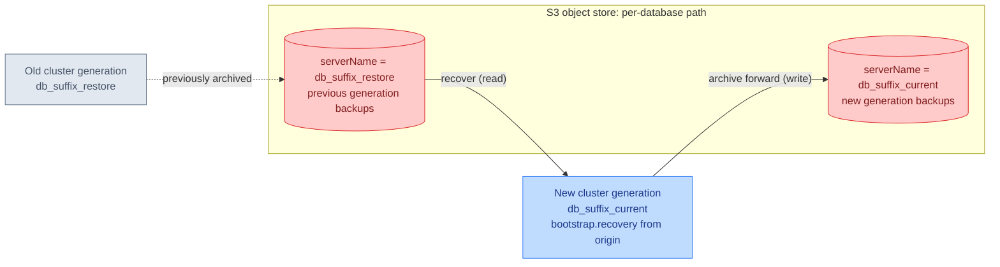

# db-restore

Bootstraps a CloudNativePG PostgreSQL `Cluster` by recovering from an existing object-store backup instead of initializing an empty database. Applied as a Kustomize component alongside [db-backups](../db-backups), it rewrites the cluster's bootstrap so a new cluster generation is seeded from a previous generation's backups.

## Overview

This component provides:

1. Recovery bootstrap
   - Replaces `initdb` (empty init) with `recovery` from an external source
   - Recovers into the configured database and owner

2. Backup source wiring
   - Points recovery at the Barman Cloud object store via the plugin
   - Selects the source generation by `serverName`

## How It Works

Normally a cluster bootstraps with `initdb`, creating an empty database. This component's patch removes `initdb` and instead declares a `recovery` bootstrap sourced from an `externalClusters` entry that references the Barman Cloud object store (created by [db-backups](../db-backups)) at a chosen `serverName`.

A "restore" in practice is a **generation rotation within the same namespace**: bump `db_suffix_current` to a new generation and set `db_suffix_restore` to the generation you want to recover from. The new cluster restores from the old generation's backups, while the db-backups component (applied together) simultaneously archives the new generation forward under its own `serverName`.

## Resources

| Resource | Kind | Purpose |
| -------- | ---- | ------- |
| (patch) | `Cluster` (postgresql.cnpg.io) | Removes `bootstrap.initdb`; adds `bootstrap.recovery` and an `externalClusters` entry referencing the backup object store at `serverName` `${db_suffix_restore}` |

## Prerequisites

1. Required Variables

   | Variable | Purpose | Example |
   | -------- | ------- | ------- |
   | db_name | Base name of the database; keys the backup object store name | home-automation-db |
   | db_bootstrap_database | Database to recover into | home-assistant |
   | db_bootstrap_owner | Owner role for the recovered database | home-assistant |
   | db_suffix_restore | Source generation `serverName` to recover from | 2025.07.03 |

2. Required Companions

   | Component | Purpose | Provided By |
   | --------- | ------- | ----------- |
   | db-backups | Supplies the `${db_name}-backup-store` `ObjectStore` and S3 credentials the recovery reads from | [db-backups](../db-backups) |
   | CloudNativePG operator + Barman Cloud plugin | Executes plugin-based recovery | database-core |

## Notes

- This component must be applied together with [db-backups](../db-backups); it references the `ObjectStore` (`${db_name}-backup-store`) that db-backups creates and does not define its own backup target.
- Recovery is a bootstrap-time action: it only affects how a *newly created* cluster generation is seeded. Rotating `db_suffix_current` triggers a new cluster; existing clusters are not re-bootstrapped.
- The recovery `serverName` (`${db_suffix_restore}`) is independent of the forward-archiving `serverName` (`${db_suffix_current}` from db-backups), so the new generation reads from the old path and writes to its own.
