# harbor-dockerio-mirror

Gives Harbor's `docker.io` proxy-cache project its own front door so Docker Hub pulls can be mirrored through it transparently. Applied as a Kustomize component on top of the [harbor](../../apps/subsystems/harbor) module, it adds a dedicated `Ingress` and a pair of Traefik `Middleware`s that make Harbor's project-in-path registry API reachable from a plain `registry-mirrors` entry, without the harbor module itself needing to know about it.

## Overview

This component provides:

1. A dedicated mirror hostname
   - `Ingress` routing `dockerio-harbor.${domain_name}` directly to the `harbor-core` Service
   - DNS record via the same `external-dns` annotation convention Harbor's own `Ingress` uses

2. Path rewriting for Docker's registry-mirror protocol
   - Inserts the `docker.io` proxy-cache project segment Harbor's registry API requires
   - Leaves Docker's version-check ping (`GET /v2/`) unrewritten so the mirror still answers it correctly

3. Host header correction
   - Overrides the outgoing `Host` header to Harbor's own hostname before the request reaches `harbor-core`, matching what Harbor's token-auth challenge and `externalURL` expect

## How It Works

```mermaid
flowchart LR
    %% Color scheme
    classDef client fill:#e2e8f0,stroke:#64748b,color:#475569
    classDef added fill:#bfdbfe,stroke:#3b82f6,color:#1e3a8a
    classDef target fill:#fecaca,stroke:#dc2626,color:#7f1d1d

    client[Docker client<br/>registry-mirrors]:::client
    ingress[Ingress: dockerio-harbor<br/>dockerio-harbor.domain_name]:::added
    rewrite["Middleware: dockerio-rewrite<br/>/v2/... → /v2/docker.io/..."]:::added
    host[Middleware: dockerio-host<br/>Host → harbor.domain_name]:::added
    core[(harbor-core Service)]:::target

    client -- "GET /v2/library/alpine/manifests/3.14" --> ingress
    ingress --> rewrite
    rewrite --> host
    host -- "GET /v2/docker.io/library/alpine/manifests/3.14<br/>Host: harbor.domain_name" --> core
```

Docker Engine's `registry-mirrors` setting can only ever point at a plain origin — it has no equivalent of containerd's `override_path`, so it can never itself produce the `/v2/<project>/...` path shape Harbor's registry API requires for a proxy-cache project (tracked upstream at goharbor/harbor#21339, closed `icebox`). This component makes up the difference on Harbor's behalf: a request lands on the mirror's own hostname, the `dockerio-rewrite` `Middleware` inserts the `docker.io` project segment into the path, the `dockerio-host` `Middleware` corrects the `Host` header to Harbor's real hostname, and only then does the request reach `harbor-core` — which sees an ordinary, correctly-shaped proxy-cache request.

## Resources

| Resource | Kind | Purpose |
| -------- | ---- | ------- |
| `dockerio-rewrite` | `Middleware` (traefik.io) | Rewrites `/v2/<repo>/...` to `/v2/docker.io/<repo>/...`, inserting the proxy-cache project segment. Deliberately excludes the bare `/v2/` version-check ping from the rewrite (see Notes) |
| `dockerio-host` | `Middleware` (traefik.io) | Overrides the outgoing `Host` header to `harbor.${domain_name}` before the request reaches `harbor-core` |
| `dockerio-harbor` | `Ingress` (networking.k8s.io) | Routes `dockerio-harbor.${domain_name}` to the `harbor-core` Service on port 80, wiring in both `Middleware`s via the `traefik.ingress.kubernetes.io/router.middlewares` annotation |

## Prerequisites

1. Required Variables

   | Variable | Purpose | Example |
   | -------- | ------- | ------- |
   | domain_name | Builds the mirror's hostname (`dockerio-harbor.${domain_name}`) and the Host-header override target (`harbor.${domain_name}`) — the same variable the harbor module's own `HelmRelease` already requires | cluster.example.com |

2. Required Companions

   | Component | Purpose | Provided By |
   | --------- | ------- | ----------- |
   | harbor (module) | Supplies the `harbor` namespace and `harbor-core` Service this component's `Ingress` targets, and the `externalURL`/token-auth behavior the Host-header override matches | [harbor](../../apps/subsystems/harbor) |

3. Required Infrastructure

   | Component | Purpose | Provided By |
   | --------- | ------- | ----------- |
   | Traefik (with CRDs) | Runs the `IngressController` that serves the `Ingress` and the `Middleware` CRD both rewrites depend on | networking-core |
   | external-dns | Watches `Ingress` resources and creates the DNS record for the mirror hostname | networking-core |

## Notes

- **The bare `/v2/` ping is deliberately excluded from the rewrite.** `^/v2/(.+)$` requires at least one character after `/v2/`, so the exact path `/v2/` — Docker's version-check probe, and the path the token-auth challenge round-trips through — passes through unprefixed. Rewriting it too sends `GET /v2/docker.io/`, which is not a Harbor endpoint: Harbor answers `401` with an *empty* `Www-Authenticate` header, Docker's probe gets no realm to authenticate against, and the mirror looks dead even though Harbor is healthy. Measured against a real Harbor; see ppat/homelab-ops-kubernetes-experiments#226.
- This component is specific to the harbor module — unlike [db-backups](../db-backups) or [sso](../sso), it is not reusable across arbitrary modules, since it hardcodes the `harbor` namespace and targets the `harbor-core` Service by name.
- Docker Engine's `registry-mirrors` only ever applies to Docker Hub; pulls from `ghcr.io`, `quay.io`, `registry.k8s.io`, etc. are unaffected by this component and always go direct to their own registries.
- Upstreamed from a cluster-local prototype (ppat/homelab-ops-kubernetes-clusters#840) once the mirror was measured working end-to-end through a live Harbor.
