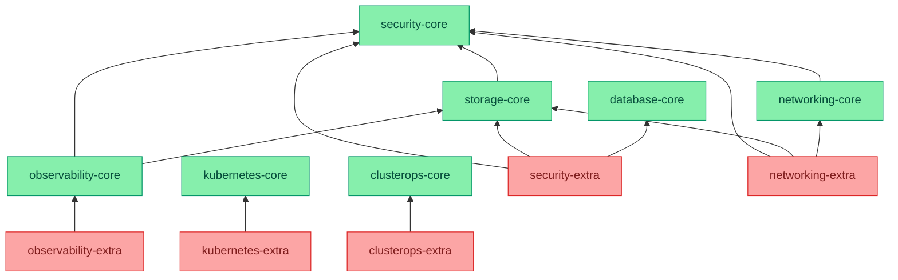

# Infrastructure Modules

This directory contains infrastructure modules that provide foundational capabilities for the Kubernetes platform. These modules establish the core services, security, networking, and operational features that both the cluster itself and applications require.

## Functional Areas & Capabilities

| Category | Functional Areas | Module Capabilities |
|----------|-----------------|-------------------|
| Security | Certificates Secrets SSO & Auth | [security-core](./subsystems/security-core): • Provides cert-manager operator that automatically obtains and renews TLS certificates from configured issuers (e.g., Let's Encrypt) • Enables applications to fetch secrets from Bitwarden Secrets Manager through external-secrets operator with automated synchronization • Uses trust-manager to copy certificates between namespaces based on bundle definitions, eliminating manual certificate distribution  [security-extra](./subsystems/security-extra): • Deploys Authentik identity provider for SSO across all cluster services with policy-based access control • Implements forward authentication for securing service ingress endpoints with rich identity headers |
| Storage | Block Storage Object Storage Network Storage | [storage-core](./subsystems/storage-core): • Deploys Longhorn to provide distributed block storage across cluster nodes with built-in replication and backup • Runs MinIO operator to provide S3-compatible object storage with bucket lifecycle management • Installs CSI driver for dynamic provisioning of volumes from existing NFS shares with custom mount options |
| Networking | Load Balancing DNS Management Ingress Control VPN & Network Management | [networking-core](./subsystems/networking-core): • Deploys MetalLB to provide Layer 2 load balancing for Kubernetes services with automatic IP allocation • Runs external-dns to automatically manage DNS records in configured providers (PiHole/UniFi) • Configures Traefik for ingress control with automatic TLS and custom middleware chains  [networking-extra](./subsystems/networking-extra): • Installs Pi-hole for DNS filtering and ad blocking with custom blocklists • Deploys Tailscale operator for secure VPN access with MagicDNS support • Runs UniFi controller for comprehensive network device management • Provides RADIUS authentication for mapping wireless clients to VLANs based on MAC addresses |
| Observability | Metrics Collection Log Aggregation Visualization Event Management | [observability-core](./subsystems/observability-core): • Deploys Prometheus stack for metrics collection with ServiceMonitor/PodMonitor support • Runs Loki for log aggregation with automated retention and S3 storage • Provides Grafana for unified visualization with auto-discovered dashboards  [observability-extra](./subsystems/observability-extra): • Exports Kubernetes events to Loki with custom stream labels • Collects SNMP metrics from network devices with custom MIBs • Detects node problems with custom problem definitions |
| Database | PostgreSQL Operations HA Management Backup & Recovery | [database-core](./subsystems/database-core): • Installs CloudNativePG operator for automated PostgreSQL cluster management • Enables other modules to create HA PostgreSQL clusters with automated failover • Configures S3 backup storage with customizable retention policies • Provides monitoring integration with pre-configured Grafana dashboards |
| Kubernetes | DNS Resolution API Access Hardware Management Resource Optimization | [kubernetes-core](./subsystems/kubernetes-core): • Configures CoreDNS for cluster-wide service discovery with custom zone support • Provides secure external access to Kubernetes API with load balancing  [kubernetes-extra](./subsystems/kubernetes-extra): • Discovers and labels node hardware capabilities through node-feature-discovery • Runs Vertical Pod Autoscaler in recommendation mode for resource optimization • Manages device plugins for hardware access with shared device support • Balances workloads through descheduler with configurable policies |
| ClusterOps | GitOps Deployment System Upgrades Configuration Management Resource Tuning | [clusterops-core](./subsystems/clusterops-core): • Manages Flux CD for GitOps-based deployment with OOM protection • Runs system-upgrade-controller for automated component upgrades  [clusterops-extra](./subsystems/clusterops-extra): • Provides Goldilocks for resource optimization visualization • Deploys reloader for automatic pod restarts on config changes • Runs Terraform controller for infrastructure management with Flux integration |

## Module Relationships

The following diagram shows the dependencies between infrastructure modules, illustrating how core services provide foundations for extended capabilities:

## Configuration

For detailed information about configuration methods used across all modules, including Kustomize patches, FluxCD post-build variables, and component overlays, refer to the [Configuration Methods](../projectBrief.md#configuration-methods) section in the project brief.
