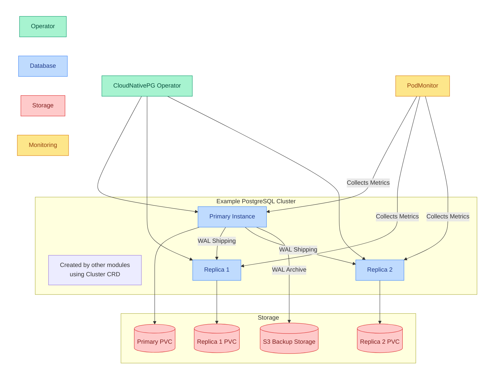

# Database Core

This module provides PostgreSQL database management capabilities for the cluster by installing and configuring the CloudNativePG operator. The operator enables other modules to create and manage their own PostgreSQL clusters with high availability, backup/recovery, and monitoring integration.

Note: This module only installs the operator - actual PostgreSQL clusters are created by other modules that need databases.

## Quick Links

- [CloudNativePG Documentation](https://cloudnative-pg.io/documentation/)
- [PostgreSQL Documentation](https://www.postgresql.org/docs/)

## Overview

The database-core module provides:

1. Database Management Capabilities
   - CloudNativePG operator deployment
   - Custom Resource Definitions for PostgreSQL
   - Operator monitoring integration
   - Operator high availability configuration

2. Data Protection Framework
   - S3 backup configuration
   - WAL archiving setup
   - Backup retention configuration
   - Recovery mechanisms

3. Monitoring Integration
   - Operator metrics collection
   - Default Grafana dashboards
   - Performance monitoring
   - Health checks

### Component Architecture

### Component Details

| Component | Primary Role | Integration Points |
|-----------|-------------|-------------------|
| CloudNativePG Operator | Database management | • Provides CRDs for PostgreSQL management • Enables high availability and failover • Configures backup and recovery • Integrates with monitoring stack • Collects operator/cluster metrics via PodMonitor • Provides default Grafana dashboards |

## Prerequisites

None for this subsystem (which provides the cloudnativepg operator). But creating Postgres instances using the `Cluster` CRD provided by this subsystem will have its own pre-requisites (according to how the `Cluster` is defined).

## Dependencies

### Required By

- Application modules requiring PostgreSQL databases
- [security-extra](../security-extra) (for authentication and authorization)

### Depends On

None
