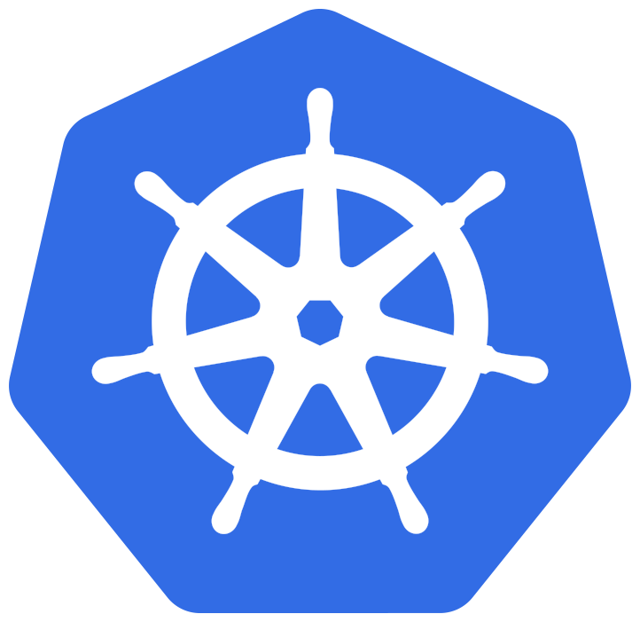

# Kubernetes Core

This module provides essential Kubernetes infrastructure services that enable cluster functionality:

- DNS resolution for service discovery and custom domain handling
- External access to the Kubernetes API server for tools and users outside the cluster

## Quick Links

   

## Overview

The kubernetes-core module provides two main capabilities:

1. DNS Services
   - Cluster-wide DNS resolution for service discovery
   - Custom zone configuration for local network domains
   - DNS forwarding to external DNS servers
   - DNS caching and performance metrics
   - Load balancing for DNS queries

2. API Access
   - Secure external access to the Kubernetes API server
   - TLS termination at ingress boundary
   - Load balancing for API requests
   - Integration with external DNS for API endpoint discovery

3. Node Labeling Based on Discovered Capabilities/Features
   - Automated USB device detection with specific class support
     - Storage devices (08)
     - Display devices (03)
     - Communication devices (02)
     - Video devices (0e)
     - Vendor-specific devices (ff)
   - Device labeling with class, vendor, and device information
   - Node feature rule generation

4. Resource Optimization
   - Vertical Pod Autoscaler in recommendation mode
   - Resource usage analysis and suggestions
   - Memory and CPU optimization
   - No automatic updates (manual application required)

### Component Details

| Component | Primary Role | Integration Points |
|-----------|-------------|-------------------|
| CoreDNS | Cluster DNS services | • Handles DNS resolution for all cluster services • Forwards custom zone queries to external DNS (${externaldns_ip_address}) • Caches DNS responses for 30 seconds • Provides metrics for DNS query performance • Load balances DNS responses for high availability |
| API Server Access | External API access | • Exposes Kubernetes API securely to external users • Handles TLS termination at ingress boundary • Routes API traffic to internal port 6443 • Skips TLS verification for internal traffic • Integrates with external DNS for endpoint discovery |
| Node Feature Discovery | Hardware detection | • Detects specific USB device classes (02, 03, 08, 0e, ef, fe, ff) • Labels nodes with hardware capabilities • Provides device information (class, vendor, device) • Enables Prometheus metrics • Runs on all nodes including control plane |
| Vertical Pod Autoscaler | Resource optimization | • Analyzes workload resource usage • Provides optimization recommendations • Integrates with metrics server • Exposes metrics via PodMonitor • Operates in recommendation-only mode |

## Prerequisites

1. Required Variables

   | Variable | Purpose | Example | Used By |
   |----------|---------|---------|---------|
   | domain_name | Base domain for API endpoint | example.com | API ingress hostname |
   | dns_zone | Base DNS zone for local services | homelab.local | CoreDNS zone configuration |
   | externaldns_ip_address | External DNS server for forwarding | 192.168.1.53 | CoreDNS forwarder configuration |

## Dependencies

### Required By

- [kubernetes-extra](../kubernetes-extra) - For extended Kubernetes functionality
- External tools and users requiring API access (kubectl, Lens, etc)
- Application modules requiring DNS resolution for service discovery
- Hardware access (USB devices)
- Resource scaling recommendations

Note: While this module provides external API access via ingress, components running inside the cluster access the Kubernetes API directly as expected through the internal service endpoint.
