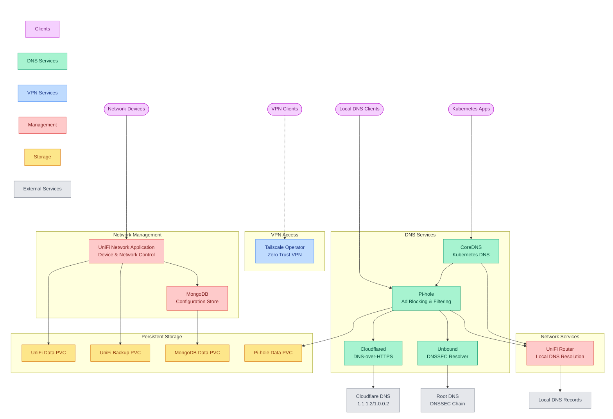

# Networking Extra

This module provides advanced networking capabilities through DNS filtering, VPN connectivity, and network infrastructure management.

## Quick Links

<a href="https://developers.cloudflare.com/cloudflare-one/connections/connect-apps/install-and-setup/tunnel-guide/" target="_blank"></a> <a href="https://pi-hole.net/" target="_blank"></a> <a href="https://tailscale.com/" target="_blank"></a> <a href="https://nlnetlabs.nl/documentation/unbound/" target="_blank"></a> <a href="https://ui.com/" target="_blank"></a>

## Overview

The networking-extra module provides three main capabilities:

1. DNS Management
   - Secure DNS resolution chain:
     - Pi-hole for ad blocking and filtering
     - Cloudflared for DNS-over-HTTPS (1.1.1.2/1.0.0.2)
     - Unbound for local DNSSEC validation
   - Security features:
     - DNSSEC validation
     - Query logging and monitoring
     - Privacy-focused configuration
     - Cache optimization
   - Performance tuning:
     - Aggressive NSEC caching
     - QNAME minimization
     - Prefetching support

2. VPN Connectivity
   - Tailscale integration:
     - Operator-based deployment
     - Custom hostname support
     - API server proxy capability
     - Zero-trust network access
   - Security features:
     - MagicDNS support
     - WireGuard encryption
     - Identity-based access

3. Network Management
   - UniFi Network Application:
     - Device discovery and adoption
     - Network monitoring
     - Configuration management
     - Firmware updates
   - Service ports:
     - L2 discovery (UDP 1900)
     - Device adoption (TCP 8080)
     - STUN (UDP 3478)
     - DNS (TCP/UDP 53)
     - NTP (UDP 123)
     - Remote syslog (UDP 5514)
     - Speed test (TCP 6789)
     - Management UI (TCP 8443)

### Component Architecture



### Component Details

| Component | Primary Role | Integration Points |
|-----------|-------------|-------------------|
| Pi-hole | DNS filtering | • Blocks ads and malware<br>• Integrates with cloudflared for DoH<br>• Provides query statistics<br>• Uses persistent storage for config |
| Cloudflared | DNS-over-HTTPS | • Connects to Cloudflare DNS<br>• Uses malware-blocking resolvers<br>• Exposes metrics endpoint<br>• Supports connection pooling |
| Unbound | DNS resolution | • Performs DNSSEC validation<br>• Implements privacy features<br>• Optimizes caching<br>• Supports prefetching |
| Tailscale | VPN access | • Manages network access<br>• Supports custom hostnames<br>• Enables API server proxy<br>• Zero-trust architecture |
| UniFi | Network management | • Controls network devices<br>• Manages configurations<br>• Handles firmware updates<br>• Collects device statistics |

## Prerequisites

1. Required Components

   | Component | Purpose | Configuration |
   |-----------|---------|---------------|
   | MongoDB | UniFi database | From database-core |
   | Storage | Persistent data | From storage-core |
   | Certificates | TLS termination | From security-core |

2. Required Variables

   | Variable | Purpose | Example |
   |----------|---------|---------|
   | domain_name | DNS zone | example.com |
   | dns_zone | Internal zone | homelab.local |
   | dns_fallback | Backup DNS | 1.1.1.1 |
   | pihole_external_ip_address | Pi-hole IP | 192.168.1.53 |

3. Required Secrets

   | Secret Name | Purpose | Required Keys |
   |-------------|---------|---------------|
   | pihole-secrets | Pi-hole admin | pihole_password |
   | unifi-secrets | UniFi database | unifi_db_user, unifi_db_password |
   | tailscale-auth | VPN access | authkey |

## Dependencies

### Required By

- Application modules requiring:
  - DNS filtering and security
  - VPN access
  - Network management

### Depends On

- [networking-core](../networking-core) - For basic networking
- [security-core](../security-core) - For certificates
- [storage-core](../storage-core) - For persistence

## Usage

### DNS Configuration

```yaml
# Example: Configure DNS-over-HTTPS
apiVersion: v1
kind: ConfigMap
metadata:
  name: cloudflared-config
  namespace: pihole
data:
  config.yml: |
    proxy-dns: true
    proxy-dns-port: 53
    proxy-dns-upstream:
      - https://1.1.1.2/dns-query
      - https://1.0.0.2/dns-query
```

### VPN Access

```yaml
# Example: Configure Tailscale subnet router
apiVersion: tailscale.com/v1alpha1
kind: Tailscale
metadata:
  name: subnet-router
spec:
  hostname: "k8s-subnet-router"
  authKey:
    secretRef:
      name: tailscale-auth
      key: authkey
  routes:
    - "10.0.0.0/8"
```

### Network Management

```yaml
# Example: Configure UniFi device adoption
apiVersion: v1
kind: Service
metadata:
  name: unifi-controller
  annotations:
    metallb.universe.tf/allow-shared-ip: "true"
spec:
  type: LoadBalancer
  ports:
  - name: device-comm
    port: 8080
    protocol: TCP
  - name: discovery
    port: 10001
    protocol: UDP
```
