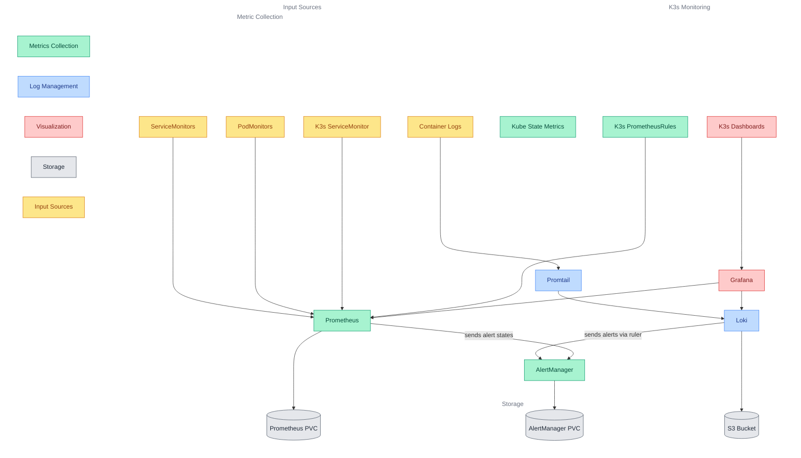

# Observability Core

This module provides comprehensive monitoring, logging, and visualization capabilities for the cluster. It enables metrics collection, log aggregation, and observability dashboards with specific support for K3s architecture.

## Quick Links

 <a href="https://grafana.com/" target="_blank"></a> <a href="https://grafana.com/oss/loki/" target="_blank"></a> <a href="https://prometheus.io/" target="_blank"></a>

## Overview

The observability-core module provides three main capabilities:

1. Metrics Collection
   - Prometheus-based metrics collection
   - K3s-specific component monitoring
   - AlertManager for alert routing
   - Kube State Metrics integration

2. Log Management
   - Centralized log aggregation with Loki
   - Log collection and shipping with Promtail
   - S3-compatible storage backend
   - Stream-specific retention policies

3. Observability Platform
   - Unified metrics and logs visualization
   - Automated dashboard discovery
   - Alert management and notification
   - User authentication and authorization

Note: The default Kubernetes component monitoring from kube-prometheus-stack is intentionally disabled because K3s uses a different architecture:

- K3s components are packaged as a single binary rather than separate services
- Standard Kubernetes ServiceMonitors and PrometheusRules don't match K3s's service discovery patterns
- Custom monitoring configuration is required to properly scrape metrics from K3s's unified architecture
- Our implementation provides monitoring rules and dashboards specifically designed for K3s's component structure

### Component Architecture



### Component Details

| Component | Primary Role | Integration Points |
|-----------|-------------|-------------------|
| Prometheus | Metrics collection and storage | • Collects metrics via ServiceMonitors and PodMonitors<br>• Stores metrics in persistent storage with configurable retention<br>• Evaluates alerting rules and sends alerts to AlertManager<br>• Provides query interface for metrics access |
| AlertManager | Alert routing and management | • Receives alerts from Prometheus rule evaluations<br>• Receives alerts from Loki rule evaluations<br>• Routes and groups alerts based on defined rules<br>• Manages notification delivery to configured channels |
| Promtail | Log collection agent | • Discovers and tails container log files on nodes<br>• Attaches labels to log streams based on Kubernetes metadata<br>• Ships logs to Loki for storage<br>• Supports various log formats and compression |
| Loki | Log aggregation and storage | • Receives logs from Promtail agents<br>• Stores logs in S3-compatible storage<br>• Evaluates log-based alerting rules<br>• Provides LogQL query interface |
| K3s Monitoring | K3s-specific monitoring | • Collects metrics from K3s unified binary<br>• Provides custom alerting rules for K3s components<br>• Includes specialized dashboards for K3s architecture<br>• Replaces standard Kubernetes monitoring |
| Grafana | Observability platform | • Provides unified visualization of metrics and logs<br>• Auto-discovers and provisions dashboards from ConfigMaps<br>• Manages alert rules and notifications<br>• Supports SSO integration and user management |

## Prerequisites

1. Required Secrets

   | Secret Name | Purpose | Required Keys |
   |-------------|---------|---------------|
   | grafana-admin-credentials | Grafana admin access | username, password |
   | loki-s3-credentials | S3 storage access | loki_s3_endpoint, loki_s3_accesskeyid, loki_s3_secretaccesskey |

2. Required Variables

   | Variable | Purpose | Required By |
   |----------|---------|-------------|
   | domain_name | Domain for component ingress | All components |
   | prometheus_retention_period | Metric retention time | Prometheus |
   | prometheus_retention_size | Metric storage limit | Prometheus |
   | prometheus_storage_size | PVC size for metrics | Prometheus |
   | prometheus_storage_class | Storage class for metrics | Prometheus |
   | alertmanager_retention_period | Alert retention time | AlertManager |
   | alertmanager_storage_class | Storage class for alerts | AlertManager |
   | alertmanager_storage_size | PVC size for alerts | AlertManager |
   | loki_deployment_mode | Deployment mode (simple-scalable/single-binary) | Loki |
   | loki_retention_size | Default log retention period | Loki |
   | loki_results_cache_memory | Results cache size | Loki |
   | loki_chunks_cache_memory | Chunks cache size | Loki |

3. Stream-Specific Log Retention
   - Configure retention per log stream using ConfigMap:

     ```yaml
     apiVersion: v1
     kind: ConfigMap
     metadata:
       name: loki-extra-config
     data:
       loki-retention.yaml: |
         loki:
           limits_config:
             retention_stream:
             - selector: '{namespace="media"}'
               priority: 1
               period: 24h
             - selector: '{service_name="coredns"}'
               priority: 1
               period: 24h
     ```

## Dependencies

### Required By

- Application modules requiring monitoring

### Depends On

- [security-core](../security-core) (for TLS certificates)
- [storage-core](../storage-core) (for persistent storage)
- [networking-core](../networking-core) (for ingress)
