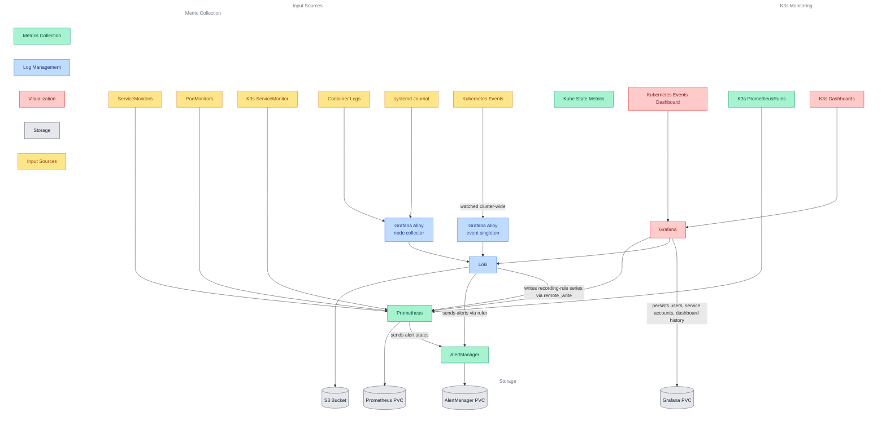

# Observability Core

This module provides comprehensive monitoring, logging, and visualization capabilities for the cluster. It enables metrics collection, log aggregation, and observability dashboards with specific support for K3s architecture. Goldilocks extends cluster operational capabilities with resource optimization recommendations.

## Quick Links

 <a href="https://grafana.com/" target="_blank"></a> <a href="https://grafana.com/oss/loki/" target="_blank"></a> <a href="https://prometheus.io/" target="_blank"></a> <a href="https://github.com/FairwindsOps/goldilocks" target="_blank"></a>

## Overview

The observability-core module provides these capabilities:

1. Metrics Collection
   - Prometheus-based metrics collection
   - K3s-specific component monitoring
   - AlertManager for alert routing
   - Kube State Metrics integration
   - Accepts remote-write from Loki's ruler, turning LogQL recording rules into first-class Prometheus series

2. Log Management
   - Centralized log aggregation with Loki
   - Log collection and shipping with Grafana Alloy
   - Journal and container log collection from every node
   - Cluster-wide Kubernetes Event export into the same log store
   - S3-compatible storage backend
   - Stream-specific retention policies

3. Observability Platform
   - Unified metrics and logs visualization
   - Automated dashboard discovery
   - Kubernetes Event history over ranges the Event API's TTL cannot cover
   - Alert management and notification
   - User authentication and authorization

4. Resource Optimization Visualization
   - VPA recommendations dashboard
   - Per-namespace resource analysis
   - Resource usage visualization
   - Secure dashboard access via ingress
   - Control plane node scheduling
   - Defined resource limits:
     - Controller: 25m-500m CPU, 50Mi-200Mi memory
     - Dashboard: 25m-500m CPU, 50Mi-200Mi memory

Note: The default Kubernetes component monitoring from kube-prometheus-stack is intentionally disabled because K3s uses a different architecture:

- K3s components are packaged as a single binary rather than separate services
- Standard Kubernetes ServiceMonitors and PrometheusRules don't match K3s's service discovery patterns
- Custom monitoring configuration is required to properly scrape metrics from K3s's unified architecture
- Our implementation provides monitoring rules and dashboards specifically designed for K3s's component structure

### Component Architecture


```mermaid
flowchart TB
    %% Color scheme with good contrast
    classDef metrics fill:#a7f3d0,stroke:#059669,color:#064e3b
    classDef logs fill:#bfdbfe,stroke:#3b82f6,color:#1e3a8a
    classDef viz fill:#fecaca,stroke:#dc2626,color:#7f1d1d
    classDef store fill:#e5e7eb,stroke:#4b5563,color:#1f2937
    classDef input fill:#fde68a,stroke:#d97706,color:#92400e
    classDef legend fill:none,stroke:none,color:#6b7280

    %% Input Sources
    subgraph inputs[Input Sources]
        container_logs[Container Logs]:::input
        journal_logs[systemd Journal]:::input
        k8s_events[Kubernetes Events]:::input
        subgraph metric_collection[Metric Collection]
            servicemonitors[ServiceMonitors]:::input
            podmonitors[PodMonitors]:::input
            k3s_servicemonitor[K3s ServiceMonitor]:::input
        end
    end

    %% K3s Monitoring
    subgraph k3s[K3s Monitoring]
        k3s_rules[K3s PrometheusRules]:::metrics
        k3s_dashboards[K3s Dashboards]:::viz
    end

    %% Metrics Components
    prometheus[Prometheus]:::metrics
    alertmanager[AlertManager]:::metrics
    kube_state[Kube State Metrics]:::metrics

    %% Logging Components
    loki[Loki]:::logs
    alloy[Grafana Alloy<br>node collector]:::logs
    alloy_events[Grafana Alloy<br>event singleton]:::logs

    %% Visualization
    grafana[Grafana]:::viz
    events_dashboard[Kubernetes Events Dashboard]:::viz

    %% Storage
    subgraph storage[Storage]
        prometheus_pvc[(Prometheus PVC)]:::store
        alertmanager_pvc[(AlertManager PVC)]:::store
        grafana_pvc[(Grafana PVC)]:::store
        s3_bucket[(S3 Bucket)]:::store
    end

    %% Data Flow Relationships
    container_logs & journal_logs --> alloy
    k8s_events -- "watched cluster-wide" --> alloy_events
    alloy & alloy_events --> loki
    loki --> s3_bucket
    loki -- "sends alerts via ruler" --> alertmanager
    loki -- "writes recording-rule series via remote_write" --> prometheus

    servicemonitors & podmonitors & k3s_servicemonitor --> prometheus
    k3s_rules --> prometheus

    prometheus --> prometheus_pvc
    prometheus -- "sends alert states" --> alertmanager
    alertmanager --> alertmanager_pvc

    grafana --> prometheus
    grafana --> loki
    grafana -- "persists users, service accounts, dashboard history" --> grafana_pvc
    k3s_dashboards --> grafana
    events_dashboard --> grafana

    %% Simple legend
    subgraph Legend[" "]
        direction LR
        metrics[Metrics Collection]:::metrics
        logs[Log Management]:::logs
        viz[Visualization]:::viz
        store[Storage]:::store
        input[Input Sources]:::input
    end

    class Legend legend
    class storage legend
    class k3s legend
    class inputs legend
    class metric_collection legend
```

### Component Details

| Component | Primary Role | Integration Points |
| ----------- | ------------- | ------------------- |
| Prometheus | Metrics collection and storage | • Collects metrics via ServiceMonitors and PodMonitors<br>• Stores metrics in persistent storage with configurable retention<br>• Evaluates alerting rules and sends alerts to AlertManager<br>• Provides query interface for metrics access<br>• Accepts remote-write from Loki's ruler |
| AlertManager | Alert routing and management | • Receives alerts from Prometheus rule evaluations<br>• Receives alerts from Loki rule evaluations<br>• Routes and groups alerts based on defined rules<br>• Manages notification delivery to configured channels |
| Grafana Alloy (node collector) | Node-local log collection agent | • Discovers and tails container log files on every node<br>• Attaches labels to log streams based on Kubernetes metadata<br>• Reads the systemd journal from both `/run/log/journal` and `/var/log/journal`<br>• Ships logs to Loki for storage<br>• Accepts additional collection jobs injected by the consuming cluster<br>• Exposes its own metrics via ServiceMonitor and alerts via PrometheusRule |
| Grafana Alloy (event singleton) | Cluster-wide Kubernetes Event export | • Watches Events in every namespace from a single replica<br>• Derives a `severity` label from each event's type<br>• Ships events to Loki under the `kubernetes-events` job<br>• Runs with its own ServiceAccount, granted core-group `events` only<br>• Needs no host access, so it mounts no node paths<br>• Exposes its own metrics via ServiceMonitor<br>• Ships the Kubernetes Events dashboard that reads what it exports |
| Loki | Log aggregation and storage | • Receives logs from the Grafana Alloy agents<br>• Stores logs in S3-compatible storage<br>• Evaluates log-based alerting rules<br>• Evaluates LogQL recording rules and remote-writes the results to Prometheus<br>• Provides LogQL query interface |
| K3s Monitoring | K3s-specific monitoring | • Collects metrics from K3s unified binary<br>• Provides custom alerting rules for K3s components<br>• Includes specialized dashboards for K3s architecture<br>• Replaces standard Kubernetes monitoring |
| Grafana | Observability platform | • Provides unified visualization of metrics and logs<br>• Auto-discovers and provisions dashboards from ConfigMaps<br>• Manages alert rules and notifications<br>• Supports SSO integration and user management |
| Goldilocks | Resource optimization visualization | • Integrates with external VPA installation<br>• Exposes dashboard at goldilocks.${domain_name}<br>• Uses websecure entrypoint with TLS<br>• Provides resource usage insights<br>• Runs with specific resource limits |

## Prerequisites

1. Persistent Storage

   | PVC Name | Purpose | Access Mode |
   | -------- | ------- | ----------- |
   | grafana-data | Grafana's own state: service accounts and their tokens, users, and dashboard version history | RWO |

2. Required Secrets

   | Secret Name               | Purpose              | Required Keys                                                  |
   |---------------------------|----------------------|----------------------------------------------------------------|
   | grafana-admin-credentials | Grafana admin access | username, password                                             |
   | loki-s3-credentials       | S3 storage access    | loki_s3_endpoint, loki_s3_accesskeyid, loki_s3_secretaccesskey |

3. Required Variables

   | Variable | Purpose | Required By |
   | ---------- | --------- | ------------- |
   | domain_name | Domain for component ingress | All components |
   | prometheus_retention_period | Metric retention time | Prometheus |
   | prometheus_retention_size | Metric storage limit | Prometheus |
   | prometheus_storage_size | PVC size for metrics | Prometheus |
   | prometheus_storage_class | Storage class for metrics | Prometheus |
   | alertmanager_retention_period | Alert retention time | AlertManager |
   | alertmanager_storage_class | Storage class for alerts | AlertManager |
   | alertmanager_storage_size | PVC size for alerts | AlertManager |
   | loki_retention_size | Default log retention period | Loki |
   | loki_results_cache_memory | Results cache size | Loki |
   | loki_chunks_cache_memory | Chunks cache size | Loki |
   | loki_s3_endpoint_key | Bitwarden key naming the S3 endpoint for Loki storage | Loki |
   | loki_s3_accesskeyid_key | Bitwarden key naming the S3 access key id for Loki storage | Loki |
   | loki_s3_secretkey_key | Bitwarden key naming the S3 secret access key for Loki storage | Loki |
   | systemd_journal_gid | GID of the `systemd-journal` group on the cluster's nodes, added to the collector's supplementary groups | Grafana Alloy |

4. Stream-Specific Log Retention
   - Configure retention per log stream using ConfigMap:

     ```yaml
     apiVersion: v1
     kind: ConfigMap
     metadata:
       name: loki-extra-config
     data:
       loki-retention.yaml: |
         loki:
           limits_config:
             retention_stream:
             - selector: '{namespace="media"}'
               priority: 1
               period: 24h
             - selector: '{service_name="coredns"}'
               priority: 1
               period: 24h
     ```

5. Extending Grafana Alloy from a cluster

   Alloy is configured in directory mode: `alloy run /etc/alloy/.` loads **every** `*.alloy` file in that
   directory into a single component graph, and references resolve across files.

   There are two Alloy workloads and therefore two such directories, and they are separate component graphs
   in separate processes:

   | ConfigMap | Generated from | Mounted by | Extensible by a cluster |
   | ------------------- | ---------------------- | ------------------------------ | ----------------------- |
   | `alloy-config` | `alloy/conf.d/` | the node-collector DaemonSet | yes, see below |
   | `alloy-events-config` | `alloy/events.d/` | the Kubernetes Event singleton | not a documented seam |

   A cluster adds its own node-local collection jobs by patching extra keys into `alloy-config` from its Flux
   `Kustomization`:

   ```yaml
   patches:
   - patch: |-
       apiVersion: v1
       kind: ConfigMap
       metadata:
         name: alloy-config
         namespace: logging
       data:
         cluster-pihole-logs.alloy: |
           # cluster-owned components go here
     target:
       kind: ConfigMap
       name: alloy-config
       namespace: logging
   ```

   Repointing the write destination uses environment variables rather than that seam. Both instances read
   them, set via `alloy.extraEnv` on the HelmRelease:

   | Variable | Unset | Set |
   | -------- | ----- | --- |
   | `LOKI_WRITE_URL` | the in-cluster Loki service | that URL, for both the node collector and the event singleton |
   | `K8S_CLUSTER_LABEL` | no label is added at all | a `k8s_cluster` external label on every stream |

   Loki discards a label whose value is empty *before* computing the stream hash, so leaving
   `K8S_CLUSTER_LABEL` unset leaves existing stream identities untouched.

   The contract for those fragments:

   - `loki.write.default` is the stable anchor to forward into. It lives in its own `write.alloy` precisely so
     that it stays available even if `logs.alloy` or `journal.alloy` are dropped (a Talos cluster has no
     systemd journal and can drop the latter outright). The event singleton declares a component of the same
     name in its own graph; the two never see each other, so a fragment in `alloy-config` reaches the node
     collector's `loki.write` and only that one.
   - Component names must be unique across every file in the directory, because they all share one namespace.
     Cluster-injected components must therefore use a `cluster_` prefix.
   - Do not declare `logging`, `tracing` or `livedebugging` blocks. These are singletons; this module leaves
     them out so that a cluster may add one, and two files declaring the same one fails the whole load.
   - A cluster mounting `/var/lib/kubelet/pods` (to reach another pod's CSI-mounted volume) **must** set
     `mountPropagation: HostToContainer` on that mount. Without it the collector only ever sees the CSI mounts
     that existed at the moment its own bind mount was created, and silently misses everything mounted after -
     with no error and no unhealthy component.

## Dependencies

### Required By

- Application modules requiring monitoring

### Depends On

- [security-core](../security-core) (for TLS certificates)
- [storage-core](../storage-core) (for persistent storage)
- [kubernetes-core](../kubernetes-core) (VPA for resource recommendations)
- [networking-core](../networking-core) (for ingress)
- Metrics Server [k3s builtin components] (for resource recommendations)
- [clusterops-core](../clusterops-core) (Reloader, soft: applies rotated credentials)

## Notes

- **The pushed label set is a contract, not a free choice.** Alloy pushes `app`, `component`, `container`,
  `filename`, `host`, `instance`, `job`, `namespace`, `node_name`, `pod`, `service_name`, `severity`, `stream`,
  `syslog_identifier` and `systemd_unit`. Changing any of them gives the existing Loki series a new identity
  rather than extending it, and breaks the dashboards and `retention_stream` selectors that key off them -
  which is also why no `collector`-style marker label is pushed. The one addition a consumer may make is
  `k8s_cluster` via `K8S_CLUSTER_LABEL` (above), opt-in because setting it re-mints that consumer's own
  stream identities. `ci/test/infra-observability` asserts the set
  for exact equality against a fixture pod, so a leaked extra label fails as loudly as a missing one. The three
  journal-only labels (`severity`, `syslog_identifier`, `systemd_unit`) are out of scope there because kind
  nodes have no systemd journal to read.
- **Kubernetes Event export runs as a second, single-replica Alloy instead of inside the DaemonSet.**
  `loki.source.kubernetes_events` watches the cluster, not the node, so the same component in the DaemonSet's
  config would ship one copy of every event per node. It cannot dedupe its way out of that: the component's
  `clustering` block is a no-op unless global clustering is enabled, and enabling that would make
  `discovery.kubernetes` shard pod targets across nodes and silently gut pod-log coverage. Two consequences
  are the point of the split rather than side effects - exactly one copy of each event without touching the
  pod-log pipeline, and cluster-wide Event read living on an identity that runs once instead of on the
  identity that runs on every node. The node collector's ClusterRole is still `get`/`list`/`watch` on `pods`
  and nothing else; `ci/test/infra-observability/scripts/check-alloy-collector.sh` asserts that it *cannot*
  list events and that the singleton's ServiceAccount can read events and nothing else.
- **Event streams carry no new labels, and `reason` is deliberately not one of them.** An event arrives under
  `job="kubernetes-events"` with `namespace` and a `severity` derived from the event's type (`Warning` maps to
  `warning`, everything else to `info`) - all three already in the pushed set above. Every other field of the
  Event, `reason` included, stays in the logfmt line body and is reached with a line filter. Promoting
  `reason` would multiply the stream count by a dimension the Kubernetes API places no bound on - any
  controller may invent a new reason - which is a poor trade for a pipeline that ships a trickle. Note that
  `namespace` is the *involved object's* namespace, so events about cluster-scoped objects (Nodes,
  PersistentVolumes) carry no `namespace` label at all and are excluded by a `{namespace=~".+"}` selector.
  Alloy does send the label - as the empty string - and Loki discards empty-valued labels on ingest, before
  the stream hash is computed, so no such series is ever stored (`syntax.ParseLabels`; grafana/loki#7355,
  every release since 2.7.0).
- **The Kubernetes Events dashboard ships with the exporter, not with the other dashboards.**
  `alloy/dashboards/kubernetes-events.json` is filed under the component that produces the data because its
  panels are a contract with `events.d/events.alloy`: the `kubernetes-events` job name, the `severity` mapping
  and the logfmt field names are read straight out of that file, so changing one without the other empties the
  dashboard rather than erroring. Kubernetes event data has several properties that make an obvious panel
  return a plausible wrong number instead of an error - the reason a stuck object shows three different totals
  depending on how it is counted, and why the panels rank on none of the two a reader reaches for first. Those
  are set out in [the dashboard's own notes](./alloy/dashboards/MAINTAINER.md), with
  [a reader's guide](./alloy/dashboards/README.md) alongside it.
- **An event carries its own timestamp, which bounds how much a restart can recover - and, at that same
  boundary, can drop events outright rather than merely replay them.** Entries are stamped with the event's
  `LastTimestamp`, not the ingest time, and Loki accepts an out-of-order entry only while it is within
  `ingester.max_chunk_age / 2` of the newest entry in that stream - 60 minutes at this module's settings. The
  singleton keeps its read watermark in a positions file on an `emptyDir`, and the `Recreate` update strategy
  leaves that watermark empty at every start, so each restart or reschedule makes the informer's initial List
  re-deliver whatever the API server still holds, bounded by the Kubernetes Event TTL of about an hour. Most
  of that lands inside the 60-minute window and is accepted as a duplicate, but the oldest of it can already
  sit outside that window: Loki rejects those entries outright (`too_far_behind`, `TooFarBehind` in Loki's
  `pkg/validation/validate.go`) within seconds of the pod starting, instead of storing them late, and there
  is no retry - they are lost rather than delayed, a handful of the oldest, and therefore least valuable,
  events the API server was holding. The loss is structurally confined to that cold-start List: once the
  informer is established it delivers events as they occur, so entries are stamped near-present and nothing
  approaches the 60-minute boundary again until the next restart. A `PersistentVolumeClaim` for the positions
  file would fix it - a preserved watermark means a warm restart only forwards events newer than the last one
  sent, which are always inside the window - but it would put a cluster-specific storage class inside a
  module that has none today, requiring per-cluster injection. Raising `ingester.max_chunk_age` instead
  widens the window cluster-wide at the cost of chunks staying in ingester memory longer, for a pipeline that
  ships a trickle. Both cost more than the handful of low-value events lost per restart, so this is accepted
  rather than fixed. `loki_discarded_samples_total{reason="too_far_behind"}` is the signal to watch for this
  loss specifically; the label also carries `greater_than_max_sample_age`, a different, unrelated limit
  (`reject_old_samples_max_age`, left at Loki's default of a week) that this pipeline's ~1h-old events would
  never trip.
- **Alloy has a memory limit but deliberately no CPU limit.** The limit is sized on measured usage with
  headroom, because `loki.write` has no write-ahead log: an OOMKill discards the in-memory queue and the
  replacement pod re-reads from its last persisted offset. A CPU limit is omitted because throttling a log
  shipper does not kill it, it makes it lag silently - and every alert in `prometheusrule-alloy.yaml` keys off
  entries stopping rather than slowing.
- **A healthy Alloy pod is weak evidence.** Several ways of misconfiguring this collector produce a Ready pod
  that exits 0, logs nothing, and collects nothing or drops a label: a symlinked config path loads zero
  components; a missing `K8S_NODE_NAME` drops the `host` label; a missing journal GID leaves the journal reader
  reporting "journal tailer is running" with zero entries. What the module can pin, it pins in
  `ci/test/infra-observability/validate-alloy.yaml` and `scripts/check-alloy-collector.sh`, which assert the
  rendered DaemonSet and the collector's live component graph rather than its health.
- **A broken event watch is invisible to metrics - this is a known, accepted gap.** `loki.source.kubernetes_events`
  does not implement Alloy's `HealthComponent` interface and nothing on its path calls `UpdateHealth`, so it
  reports `state: healthy` unconditionally. Denied the RBAC it needs, it blocks in `WaitForCacheSync` until a
  10-minute timeout and logs `event watcher exited with error` while still reporting healthy (checked against
  alloy v1.18.1). `AlloyComponentsUnhealthy` therefore cannot detect it, and neither can any other rule: the
  only positive signal is entries arriving, and a quiet cluster legitimately emits no events for far longer
  than any sane `for:` window, so "no events shipped" is not alertable either. Nothing is deployed to close
  this - consistent with alerting being deliberately unwired here. What does close it is CI:
  `ci/test/infra-observability` queries Loki end-to-end for a fixture's events
  (`scripts/check-event-stream-contract.sh`), which is the only assertion in the suite that can tell a working
  event watch from a broken one. To check a live cluster by hand, query the pipeline's output - `{job="kubernetes-events"}`
  in Loki, or the singleton's `loki_write_sent_entries_total{job="alloy-events"}` - never its component health.
- **The node collector's positions are stored on the node.** Its storage path is a `hostPath` at
  `/var/lib/alloy`, created and chowned by a root init container because kubelet does not apply `fsGroup` to
  hostPath volumes. Without it, every pod restart would re-read pod logs from offset 0 and replay the journal
  back to `max_age`. The event singleton is the opposite case: an `emptyDir` gets `fsGroup` applied, so it
  needs no init container and keeps the stricter security posture (see the event-timestamp note above for
  what it gives up in exchange).
- **Alloy's ConfigMap changes do not restart the DaemonSet.** The chart can only emit a `checksum/config`
  annotation for a ConfigMap it creates itself, and this module generates its own. Propagation is handled by
  the `config-reloader` sidecar, which reloads the running collector in place; an invalid config is rejected
  and the last valid one keeps running.
- **Prometheus's remote-write receiver takes no authentication of its own.** Anything in the cluster that can
  reach the Prometheus Service can write arbitrary series to it. Today the only writer is Loki's ruler; locking
  it down further (NetworkPolicy, a write-token proxy, mTLS) is a deliberate, deferred decision, not an
  oversight.
- **Any module can ship its own Loki recording (or alerting) rules - the same self-service pattern as Grafana
  dashboards, just for LogQL instead of dashboard JSON.** Add a `ConfigMap` in the module's own namespace
  labelled `loki_rule: "1"`, with one data key per rule file, each a standard Loki rule-group YAML document
  (`groups: [{name, rules: [{record or alert, expr, ...}]}]`). Loki's sidecar picks it up within a minute; see
  `kube-prometheus-stack/configmap-loki-rule-demo.yaml` for a live example. Give rule files cluster-unique
  names (two modules both choosing `rules.yaml` is worth avoiding even though `enableUniqueFilenames`
  disambiguates on disk), and note that recording rules also need Prometheus's remote-write receiver enabled
  (`enableRemoteWriteReceiver`, already on) - alerting rules don't, since they route to AlertManager directly.
- **The sidecar's cluster-wide reach is ConfigMap read only - Secret read is explicitly stripped.**
  `searchNamespace: ALL` requires the Loki ServiceAccount to read ConfigMaps in every namespace; the chart's
  own ClusterRole template also grants Secret read by default, unconditional on any Helm value. A
  `postRenderers` patch on `helm-release-loki.yaml` rewrites the rendered ClusterRole down to ConfigMaps only,
  verified in CI via the ServiceAccount's actual effective permissions
  (`ci/test/infra-observability/scripts/check-loki-rbac.sh`), not the ClusterRole's YAML.

- **That grant also requires ConfigMaps to hold no credentials, which is why the S3 credentials are not
  in one.** The chart renders `loki.storage.s3.*` into `ConfigMap/loki`, so both the access key ID and
  the secret access key are instead `${...}` references Loki expands from its own environment at load
  time. Rotation is applied by Reloader rather than by a config-checksum roll, since the values are not
  part of the HelmRelease's values.
