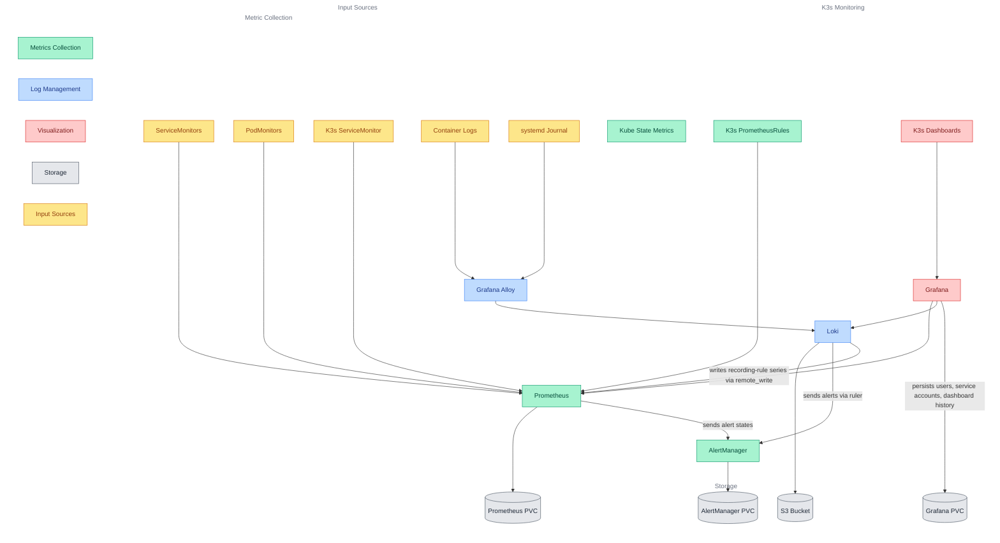

# Observability Core

This module provides comprehensive monitoring, logging, and visualization capabilities for the cluster. It enables metrics collection, log aggregation, and observability dashboards with specific support for K3s architecture. Goldilocks extends cluster operational capabilities with resource optimization recommendations.

## Quick Links

 <a href="https://grafana.com/" target="_blank"></a> <a href="https://grafana.com/oss/loki/" target="_blank"></a> <a href="https://prometheus.io/" target="_blank"></a> <a href="https://github.com/FairwindsOps/goldilocks" target="_blank"></a>

## Overview

The observability-core module provides these capabilities:

1. Metrics Collection
   - Prometheus-based metrics collection
   - K3s-specific component monitoring
   - AlertManager for alert routing
   - Kube State Metrics integration
   - Accepts remote-write from Loki's ruler, turning LogQL recording rules into first-class Prometheus series

2. Log Management
   - Centralized log aggregation with Loki
   - Log collection and shipping with Grafana Alloy
   - Journal and container log collection from every node
   - S3-compatible storage backend
   - Stream-specific retention policies

3. Observability Platform
   - Unified metrics and logs visualization
   - Automated dashboard discovery
   - Alert management and notification
   - User authentication and authorization

4. Resource Optimization Visualization
   - VPA recommendations dashboard
   - Per-namespace resource analysis
   - Resource usage visualization
   - Secure dashboard access via ingress
   - Control plane node scheduling
   - Defined resource limits:
     - Controller: 25m-500m CPU, 50Mi-200Mi memory
     - Dashboard: 25m-500m CPU, 50Mi-200Mi memory

Note: The default Kubernetes component monitoring from kube-prometheus-stack is intentionally disabled because K3s uses a different architecture:

- K3s components are packaged as a single binary rather than separate services
- Standard Kubernetes ServiceMonitors and PrometheusRules don't match K3s's service discovery patterns
- Custom monitoring configuration is required to properly scrape metrics from K3s's unified architecture
- Our implementation provides monitoring rules and dashboards specifically designed for K3s's component structure

### Component Architecture


```mermaid
flowchart TB
    %% Color scheme with good contrast
    classDef metrics fill:#a7f3d0,stroke:#059669,color:#064e3b
    classDef logs fill:#bfdbfe,stroke:#3b82f6,color:#1e3a8a
    classDef viz fill:#fecaca,stroke:#dc2626,color:#7f1d1d
    classDef store fill:#e5e7eb,stroke:#4b5563,color:#1f2937
    classDef input fill:#fde68a,stroke:#d97706,color:#92400e
    classDef legend fill:none,stroke:none,color:#6b7280

    %% Input Sources
    subgraph inputs[Input Sources]
        container_logs[Container Logs]:::input
        journal_logs[systemd Journal]:::input
        subgraph metric_collection[Metric Collection]
            servicemonitors[ServiceMonitors]:::input
            podmonitors[PodMonitors]:::input
            k3s_servicemonitor[K3s ServiceMonitor]:::input
        end
    end

    %% K3s Monitoring
    subgraph k3s[K3s Monitoring]
        k3s_rules[K3s PrometheusRules]:::metrics
        k3s_dashboards[K3s Dashboards]:::viz
    end

    %% Metrics Components
    prometheus[Prometheus]:::metrics
    alertmanager[AlertManager]:::metrics
    kube_state[Kube State Metrics]:::metrics

    %% Logging Components
    loki[Loki]:::logs
    alloy[Grafana Alloy]:::logs

    %% Visualization
    grafana[Grafana]:::viz

    %% Storage
    subgraph storage[Storage]
        prometheus_pvc[(Prometheus PVC)]:::store
        alertmanager_pvc[(AlertManager PVC)]:::store
        grafana_pvc[(Grafana PVC)]:::store
        s3_bucket[(S3 Bucket)]:::store
    end

    %% Data Flow Relationships
    container_logs & journal_logs --> alloy
    alloy --> loki
    loki --> s3_bucket
    loki -- "sends alerts via ruler" --> alertmanager
    loki -- "writes recording-rule series via remote_write" --> prometheus

    servicemonitors & podmonitors & k3s_servicemonitor --> prometheus
    k3s_rules --> prometheus

    prometheus --> prometheus_pvc
    prometheus -- "sends alert states" --> alertmanager
    alertmanager --> alertmanager_pvc

    grafana --> prometheus
    grafana --> loki
    grafana -- "persists users, service accounts, dashboard history" --> grafana_pvc
    k3s_dashboards --> grafana

    %% Simple legend
    subgraph Legend[" "]
        direction LR
        metrics[Metrics Collection]:::metrics
        logs[Log Management]:::logs
        viz[Visualization]:::viz
        store[Storage]:::store
        input[Input Sources]:::input
    end

    class Legend legend
    class storage legend
    class k3s legend
    class inputs legend
    class metric_collection legend
```

### Component Details

| Component | Primary Role | Integration Points |
| ----------- | ------------- | ------------------- |
| Prometheus | Metrics collection and storage | • Collects metrics via ServiceMonitors and PodMonitors<br>• Stores metrics in persistent storage with configurable retention<br>• Evaluates alerting rules and sends alerts to AlertManager<br>• Provides query interface for metrics access<br>• Accepts remote-write from Loki's ruler |
| AlertManager | Alert routing and management | • Receives alerts from Prometheus rule evaluations<br>• Receives alerts from Loki rule evaluations<br>• Routes and groups alerts based on defined rules<br>• Manages notification delivery to configured channels |
| Grafana Alloy | Log collection agent | • Discovers and tails container log files on every node<br>• Attaches labels to log streams based on Kubernetes metadata<br>• Reads the systemd journal from both `/run/log/journal` and `/var/log/journal`<br>• Ships logs to Loki for storage<br>• Accepts additional collection jobs injected by the consuming cluster<br>• Exposes its own metrics via ServiceMonitor and alerts via PrometheusRule |
| Loki | Log aggregation and storage | • Receives logs from the Grafana Alloy agents<br>• Stores logs in S3-compatible storage<br>• Evaluates log-based alerting rules<br>• Evaluates LogQL recording rules and remote-writes the results to Prometheus<br>• Provides LogQL query interface |
| K3s Monitoring | K3s-specific monitoring | • Collects metrics from K3s unified binary<br>• Provides custom alerting rules for K3s components<br>• Includes specialized dashboards for K3s architecture<br>• Replaces standard Kubernetes monitoring |
| Grafana | Observability platform | • Provides unified visualization of metrics and logs<br>• Auto-discovers and provisions dashboards from ConfigMaps<br>• Manages alert rules and notifications<br>• Supports SSO integration and user management |
| Goldilocks | Resource optimization visualization | • Integrates with external VPA installation<br>• Exposes dashboard at goldilocks.${domain_name}<br>• Uses websecure entrypoint with TLS<br>• Provides resource usage insights<br>• Runs with specific resource limits |

## Prerequisites

1. Persistent Storage

   | PVC Name | Purpose | Access Mode |
   | -------- | ------- | ----------- |
   | grafana-data | Grafana's own state: service accounts and their tokens, users, and dashboard version history | RWO |

2. Required Secrets

   | Secret Name               | Purpose              | Required Keys                                                  |
   |---------------------------|----------------------|----------------------------------------------------------------|
   | grafana-admin-credentials | Grafana admin access | username, password                                             |
   | loki-s3-credentials       | S3 storage access    | loki_s3_endpoint, loki_s3_accesskeyid, loki_s3_secretaccesskey |

3. Required Variables

   | Variable | Purpose | Required By |
   | ---------- | --------- | ------------- |
   | domain_name | Domain for component ingress | All components |
   | prometheus_retention_period | Metric retention time | Prometheus |
   | prometheus_retention_size | Metric storage limit | Prometheus |
   | prometheus_storage_size | PVC size for metrics | Prometheus |
   | prometheus_storage_class | Storage class for metrics | Prometheus |
   | alertmanager_retention_period | Alert retention time | AlertManager |
   | alertmanager_storage_class | Storage class for alerts | AlertManager |
   | alertmanager_storage_size | PVC size for alerts | AlertManager |
   | loki_retention_size | Default log retention period | Loki |
   | loki_results_cache_memory | Results cache size | Loki |
   | loki_chunks_cache_memory | Chunks cache size | Loki |
   | loki_s3_endpoint_key | Bitwarden key naming the S3 endpoint for Loki storage | Loki |
   | loki_s3_accesskeyid_key | Bitwarden key naming the S3 access key id for Loki storage | Loki |
   | loki_s3_secretkey_key | Bitwarden key naming the S3 secret access key for Loki storage | Loki |
   | systemd_journal_gid | GID of the `systemd-journal` group on the cluster's nodes, added to the collector's supplementary groups | Grafana Alloy |

4. Stream-Specific Log Retention
   - Configure retention per log stream using ConfigMap:

     ```yaml
     apiVersion: v1
     kind: ConfigMap
     metadata:
       name: loki-extra-config
     data:
       loki-retention.yaml: |
         loki:
           limits_config:
             retention_stream:
             - selector: '{namespace="media"}'
               priority: 1
               period: 24h
             - selector: '{service_name="coredns"}'
               priority: 1
               period: 24h
     ```

5. Extending Grafana Alloy from a cluster

   Alloy is configured in directory mode: `alloy run /etc/alloy/.` loads **every** `*.alloy` file in that
   directory into a single component graph, and references resolve across files. The directory is the
   `alloy-config` ConfigMap, generated by this module from `alloy/conf.d/`. A cluster adds its own collection
   jobs by patching extra keys into that same ConfigMap from its Flux `Kustomization`:

   ```yaml
   patches:
   - patch: |-
       apiVersion: v1
       kind: ConfigMap
       metadata:
         name: alloy-config
         namespace: logging
       data:
         cluster-pihole-logs.alloy: |
           # cluster-owned components go here
     target:
       kind: ConfigMap
       name: alloy-config
       namespace: logging
   ```

   The contract for those fragments:

   - `loki.write.default` is the stable anchor to forward into. It lives in its own `write.alloy` precisely so
     that it stays available even if `logs.alloy` or `journal.alloy` are dropped (a Talos cluster has no
     systemd journal and can drop the latter outright).
   - Component names must be unique across every file in the directory, because they all share one namespace.
     Cluster-injected components must therefore use a `cluster_` prefix.
   - Do not declare `logging`, `tracing` or `livedebugging` blocks. These are singletons; this module leaves
     them out so that a cluster may add one, and two files declaring the same one fails the whole load.
   - A cluster mounting `/var/lib/kubelet/pods` (to reach another pod's CSI-mounted volume) **must** set
     `mountPropagation: HostToContainer` on that mount. Without it the collector only ever sees the CSI mounts
     that existed at the moment its own bind mount was created, and silently misses everything mounted after -
     with no error and no unhealthy component.

## Dependencies

### Required By

- Application modules requiring monitoring

### Depends On

- [security-core](../security-core) (for TLS certificates)
- [storage-core](../storage-core) (for persistent storage)
- [kubernetes-core](../kubernetes-core) (VPA for resource recommendations)
- [networking-core](../networking-core) (for ingress)
- Metrics Server [k3s builtin components] (for resource recommendations)

## Notes

- **The pushed label set is a contract, not a free choice.** Alloy pushes `app`, `component`, `container`,
  `filename`, `host`, `instance`, `job`, `namespace`, `node_name`, `pod`, `service_name`, `severity`, `stream`,
  `syslog_identifier` and `systemd_unit`. Changing any of them gives the existing Loki series a new identity
  rather than extending it, and breaks the dashboards and `retention_stream` selectors that key off them -
  which is also why no `collector`-style marker label is pushed. `ci/test/infra-observability` asserts the set
  for exact equality against a fixture pod, so a leaked extra label fails as loudly as a missing one. The three
  journal-only labels (`severity`, `syslog_identifier`, `systemd_unit`) are out of scope there because kind
  nodes have no systemd journal to read.
- **Alloy has a memory limit but deliberately no CPU limit.** The limit is sized on measured usage with
  headroom, because `loki.write` has no write-ahead log: an OOMKill discards the in-memory queue and the
  replacement pod re-reads from its last persisted offset. A CPU limit is omitted because throttling a log
  shipper does not kill it, it makes it lag silently - and every alert in `prometheusrule-alloy.yaml` keys off
  entries stopping rather than slowing.
- **A healthy Alloy pod is weak evidence.** Several ways of misconfiguring this collector produce a Ready pod
  that exits 0, logs nothing, and collects nothing or drops a label: a symlinked config path loads zero
  components; a missing `K8S_NODE_NAME` drops the `host` label; a missing journal GID leaves the journal reader
  reporting "journal tailer is running" with zero entries. What the module can pin, it pins in
  `ci/test/infra-observability/validate-alloy.yaml` and `scripts/check-alloy-collector.sh`, which assert the
  rendered DaemonSet and the collector's live component graph rather than its health.
- **Positions are stored on the node.** Alloy's storage path is a `hostPath` at `/var/lib/alloy`, created and
  chowned by a root init container because kubelet does not apply `fsGroup` to hostPath volumes. Without it,
  every pod restart would re-read pod logs from offset 0 and replay the journal back to `max_age`.
- **Alloy's ConfigMap changes do not restart the DaemonSet.** The chart can only emit a `checksum/config`
  annotation for a ConfigMap it creates itself, and this module generates its own. Propagation is handled by
  the `config-reloader` sidecar, which reloads the running collector in place; an invalid config is rejected
  and the last valid one keeps running.
- **Prometheus's remote-write receiver takes no authentication of its own.** Anything in the cluster that can
  reach the Prometheus Service can write arbitrary series to it. Today the only writer is Loki's ruler; locking
  it down further (NetworkPolicy, a write-token proxy, mTLS) is a deliberate, deferred decision, not an
  oversight.
- **Any module can ship its own Loki recording (or alerting) rules - the same self-service pattern as Grafana
  dashboards, just for LogQL instead of dashboard JSON.** Add a `ConfigMap` in the module's own namespace
  labelled `loki_rule: "1"`, with one data key per rule file, each a standard Loki rule-group YAML document
  (`groups: [{name, rules: [{record or alert, expr, ...}]}]`). Loki's sidecar picks it up within a minute; see
  `kube-prometheus-stack/configmap-loki-rule-demo.yaml` for a live example. Give rule files cluster-unique
  names (two modules both choosing `rules.yaml` is worth avoiding even though `enableUniqueFilenames`
  disambiguates on disk), and note that recording rules also need Prometheus's remote-write receiver enabled
  (`enableRemoteWriteReceiver`, already on) - alerting rules don't, since they route to AlertManager directly.
- **The sidecar's cluster-wide reach is ConfigMap read only - Secret read is explicitly stripped.**
  `searchNamespace: ALL` requires the Loki ServiceAccount to read ConfigMaps in every namespace; the chart's
  own ClusterRole template also grants Secret read by default, unconditional on any Helm value. A
  `postRenderers` patch on `helm-release-loki.yaml` rewrites the rendered ClusterRole down to ConfigMaps only,
  verified in CI via the ServiceAccount's actual effective permissions
  (`ci/test/infra-observability/scripts/check-loki-rbac.sh`), not the ClusterRole's YAML.
