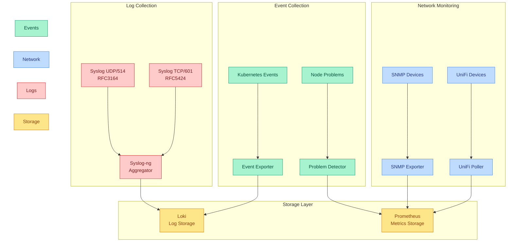

# Observability Extra

This module extends the core observability stack with specialized collectors and exporters for comprehensive system monitoring.

## Quick Links

    

## Overview

The observability-extra module provides five main capabilities:

1. Event Collection
   - Kubernetes event export to Loki:
     - 60-second event retention
     - Custom stream labels
     - Flexible routing rules
     - Structured logging
   - Node problem detection:
     - System log monitoring
     - Kernel problem detection
     - Custom problem definitions
     - Prometheus alerts

2. Network Monitoring
   - SNMP metrics collection:
     - Custom scrape configurations
     - Instance relabeling
     - Anti-affinity rules
     - Timeout handling
   - UniFi statistics:
     - Site metrics
     - Device status
     - Network utilization
     - Secure credential handling

3. Log Aggregation
   - Syslog collection:
     - RFC3164 support (UDP/514)
     - RFC5424 support (TCP/601)
     - UTF-8 sanitization
     - Flow control
   - Performance features:
     - Connection pooling
     - Batch processing
     - Worker scaling
     - Buffer tuning

### Component Architecture

### Component Details

| Component | Primary Role | Integration Points |
|-----------|-------------|-------------------|
| Event Exporter | Event collection | • Exports Kubernetes events • Routes to Loki • Custom stream labels • 60s event retention |
| Problem Detector | Node monitoring | • System log analysis • Kernel monitoring • PrometheusRules • ServiceMonitor enabled |
| SNMP Exporter | Network metrics | • Custom scrape configs • Instance relabeling • Anti-affinity rules • Timeout handling |
| Syslog-ng | Log aggregation | • Dual protocol support • Batch processing • Worker scaling • Flow control |
| UniFi Poller | Network stats | • Site monitoring • Device metrics • Secure credentials • Prometheus integration |

## Prerequisites

1. Required Components

   | Component | Purpose | Configuration |
   |-----------|---------|---------------|
   | Loki | Log storage | From observability-core |
   | Prometheus | Metrics storage | From observability-core |
   | UniFi Controller | Network stats | From networking-extra |

2. Required Variables

   | Variable | Purpose | Example |
   |----------|---------|---------|
   | domain_name | UniFi URL | example.com |

3. Required Secrets

   | Secret Name | Purpose | Required Keys |
   |-------------|---------|---------------|
   | unpoller-credentials | UniFi access | unpoller_username, unpoller_password |

## Dependencies

### Required By

- Application modules requiring:
  - Event monitoring
  - Network metrics
  - Log aggregation
  - Problem detection

### Depends On

- [observability-core](../observability-core) - For storage backends
- [networking-extra](../networking-extra) - For UniFi integration
