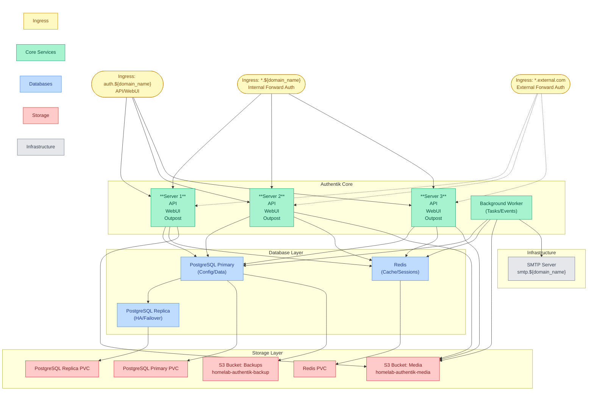

# Security Extra

This module provides advanced identity and access management through Authentik, enabling centralized authentication, authorization, and user management.

## Quick Links

- [Authentik Documentation](https://goauthentik.io/docs/)
- [Forward Auth Documentation](https://goauthentik.io/docs/providers/proxy/forward_auth)

## Overview

The security-extra module provides three main capabilities:

1. Identity Management
   - High-availability server deployment (3 replicas)
   - Background worker for async tasks
   - PostgreSQL cluster (2 instances)
   - Redis for caching and sessions
   - S3-based media storage
   - SMTP integration for notifications

2. Access Control
   - Forward authentication for Traefik
   - Rich identity headers
   - Wildcard domain support
   - TLS termination
   - Policy-based access control

3. Monitoring Integration
   - ServiceMonitor for servers
   - PodMonitor for database
   - Redis metrics collection
   - Prometheus rules
   - Health checks

### Component Architecture



### Component Details

| Component | Primary Role | Integration Points |
|-----------|-------------|-------------------|
| Server | Core identity management | • Runs 3 replicas for HA<br>• Handles API requests and flows<br>• Processes SSO operations<br>• Routes static assets<br>• Hosts embedded outpost |
| Background Worker | Async task processing | • Sends notifications<br>• Processes events<br>• Handles system tasks<br>• Manages email delivery |
| PostgreSQL | Data persistence | • Primary-replica setup<br>• Stores configuration<br>• Manages user data<br>• Custom storage class<br>• PodMonitor enabled |
| Redis | Session management | • Caches authentication data<br>• Manages user sessions<br>• Persistent storage<br>• Metrics collection |
| Embedded Outpost | Forward authentication | • Handles Traefik auth<br>• Provides identity headers<br>• Supports wildcard domains<br>• Real-time config updates |
| External Outpost | Remote authentication | • Optional deployment<br>• Supports airgapped setups<br>• Uses service account<br>• Websocket health checks |

## Prerequisites

1. Required Components

   | Component | Purpose | Configuration |
   |-----------|---------|---------------|
   | PostgreSQL | Data persistence | From database-core |
   | S3 Storage | Media storage | From storage-core |
   | Certificate Manager | JWT signing | From security-core |

2. Required Variables

   | Variable | Purpose | Example |
   |----------|---------|---------|
   | domain_name | Base domain | example.com |
   | dns_zone | Cookie domain | homelab.local |
   | cert_issuer | Certificate issuer | letsencrypt-prod |
   | POSTGRES_DB_SIZE | Database size | 10Gi |
   | REDIS_SIZE | Cache size | 1Gi |

3. Required Secrets

   | Secret Name | Purpose | Required Keys |
   |-------------|---------|---------------|
   | authentik-credentials | Core credentials | authentik_secret_key, authentik_redis_password |
   | authentik-db-app | Database access | username, password |
   | authentik-signing-cert | JWT signing | tls.key, tls.crt |

## Dependencies

### Required By

- Application modules requiring:
  - Authentication services
  - Authorization controls
  - Single sign-on
  - Forward auth protection

### Depends On

- [security-core](../security-core) - For certificates
- [storage-core](../storage-core) - For S3 storage
- [database-core](../database-core) - For PostgreSQL

## Usage

### Forward Authentication

Enable authentication for an ingress:

```yaml
apiVersion: networking.k8s.io/v1
kind: Ingress
metadata:
  annotations:
    traefik.ingress.kubernetes.io/router.middlewares: authentik-forward-auth@kubernetescrd
spec:
  rules:
  - host: app.example.com
```

### Identity Headers

Available headers from forward auth:

```yaml
- X-authentik-username  # User's login name
- X-authentik-groups    # Group memberships
- X-authentik-email     # Email address
- X-authentik-name      # Display name
- X-authentik-uid       # Unique identifier
- X-authentik-jwt      # JSON Web Token
```
