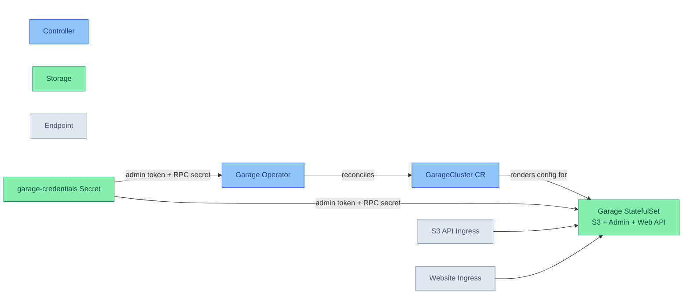

# Storage Object Core

Provides S3-compatible object storage for the cluster through a Kubernetes-native Garage cluster, managed declaratively by the Garage operator.

## Quick Links

## Overview

The storage-object-core module runs a self-hosted, S3-compatible object store, provisioned and reconciled entirely through Kubernetes custom resources rather than imperative Helm-chart bucket/user generation.

1. S3-Compatible Object Storage
   - S3 API and admin API served by an operator-managed Garage cluster
   - Configurable replication factor for data durability
   - Independently sized metadata and data volumes, since the two have very different access patterns
   - Bitwarden-sourced admin and RPC credentials delivered via `ExternalSecret`, not Helm-generated secrets
   - Metadata fsync behavior set explicitly rather than left to the upstream default

2. Public Bucket Hosting
   - Garage's website module (`[s3_web]`) serves the contents of an opted-in bucket unauthenticated, since Garage has no S3 bucket-policy support
   - Wildcard-capable ingress and TLS certificate for per-bucket subdomain hosting on a dedicated root domain

3. Declarative Lifecycle via Operator + CRDs
   - `GarageCluster`, `GarageBucket`, `GarageKey`, `GarageNode`, `GarageAdminToken`, and `GarageReferenceGrant` custom resources let any consuming module declare buckets and access keys as Kubernetes objects
   - Admission and conversion webhooks validate cluster/bucket/key changes before they reach Garage
   - Prometheus integration generated directly from the `GarageCluster` resource, no hand-authored `ServiceMonitor`

## Service Architecture

## Service Details

| Service | Primary Role | Key Features | Integration Points |
| --------- | -------------- | --------------- | --------------------- |
| Garage Operator | Reconciles `GarageCluster`/`GarageBucket`/`GarageKey`/`GarageNode` custom resources into a running Garage deployment | • Admission and conversion webhooks • Generates a `ServiceMonitor` from `GarageCluster.spec.monitoring` • Drives bucket/key/layout changes through Garage's admin API | • cert-manager (webhook TLS) • Kubernetes API |
| Garage (`garage` cluster) | Runs the S3-compatible storage node(s) as a `StatefulSet`, serving the S3 API, admin API, and website endpoint | • Configurable replication factor • Separate metadata and data volumes • Anonymous website hosting per opted-in bucket | • `garage-credentials` Secret (admin token + RPC secret) • S3 API ingress and website ingress |

## Prerequisites

1. Required Secrets

   | Secret Name        | Purpose                                                 | Required Keys           |
   |--------------------|---------------------------------------------------------|-------------------------|
   | garage-credentials | Garage admin API token and inter-node RPC shared secret | admin-token, rpc-secret |

2. Required Variables

   | Variable | Purpose | Used By |
   | ---------- | --------- | --------- |
   | secret_store | Bitwarden `ClusterSecretStore` name | garage-credentials ExternalSecret |
   | cert_issuer | cert-manager `ClusterIssuer` name | Website endpoint TLS certificate |
   | domain_name | Domain for the S3 API endpoint | Garage S3 API ingress |
   | garage_admin_token_key | Bitwarden key for the Garage admin API token | garage-credentials ExternalSecret |
   | garage_rpc_secret_key | Bitwarden key for the inter-node RPC shared secret | garage-credentials ExternalSecret |
   | garage_replication_factor | Data replication factor across storage nodes | GarageCluster |
   | garage_storage_replicas | Storage node (StatefulSet) replica count | GarageCluster |
   | garage_storage_class | Storage class for the metadata and data volumes | GarageCluster |
   | garage_metadata_size | Size of the metadata volume | GarageCluster |
   | garage_data_size | Size of the data volume | GarageCluster |
   | garage_web_root_domain | Root domain for anonymous per-bucket website hosting | GarageCluster webApi, website ingress and certificate |

## Dependencies

### Required By

- *(none yet — this is a newly-added module)*

### Depends On

- [security-core](../security-core)

## Notes

- **The operator is not where the data lives.** Garage's storage nodes run as an ordinary `StatefulSet` reconciled from the `GarageCluster` resource; the operator's role is to keep that reconciliation declarative. If the operator project were to be abandoned, the `StatefulSet`s keep serving Garage exactly as deployed and can be adopted and managed manually — the blast radius of losing the operator is "provisioning stops being declarative," not "storage stops working."
- **No buckets or keys ship with this module.** `GarageBucket` and `GarageKey` are cluster-wide custom resources; consuming app modules create their own against this cluster rather than this module pre-declaring any, keeping the module free of application-specific state.
- **Credentials are not Helm `lookup`-generated.** The upstream Garage Helm chart generates its admin/RPC secrets via a `lookup` function, which returns empty on helm-controller's dry-run and silently regenerates on every reconcile. This module sources both secrets from Bitwarden via `ExternalSecret` instead.
- **`metadataFsync` is set explicitly.** Garage defaults this to off, and upstream's own documentation reports LMDB corruption after an unclean shutdown with it off. It is set to `true` here as a deliberate durability-over-throughput choice, currently under active re-evaluation — treat it as a considered default, not a fixed conclusion.
- **Image signature verification is not enforced at admission.** The operator publishes cosign keyless-signed images with SLSA provenance and an SBOM, but this repo has no Kyverno `verifyImages` policy yet to check that signature — the chart and image are pinned by version/digest instead.
- **Runs alongside `storage-core`'s MinIO, not in place of it.** Both are deployed concurrently while Garage is evaluated as MinIO's eventual replacement; `storage-core` is untouched by this module.
