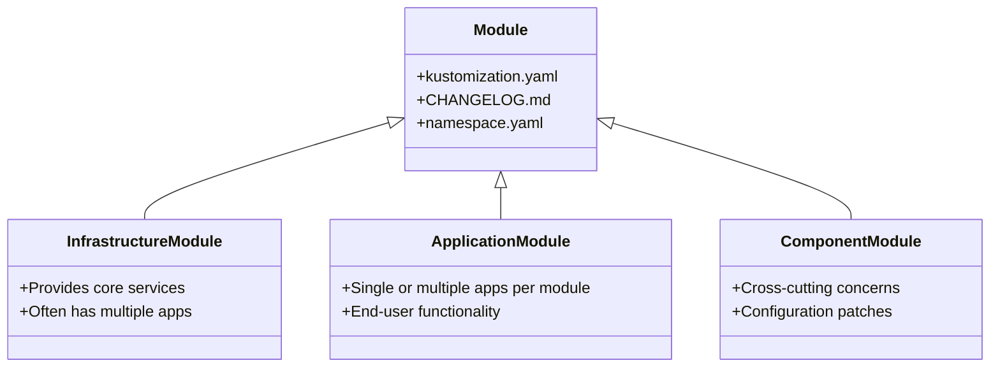
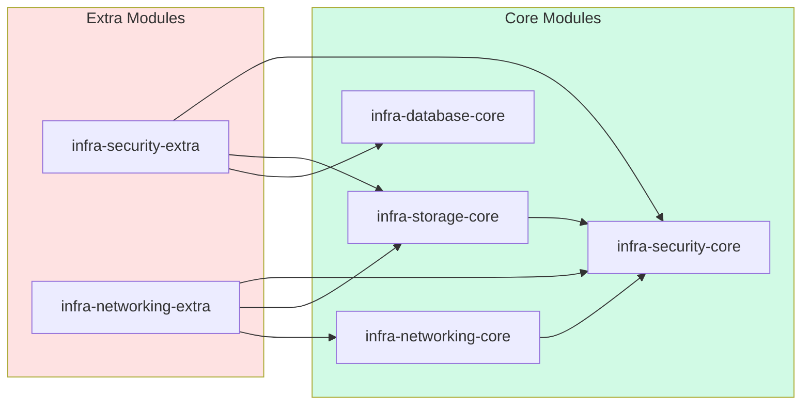
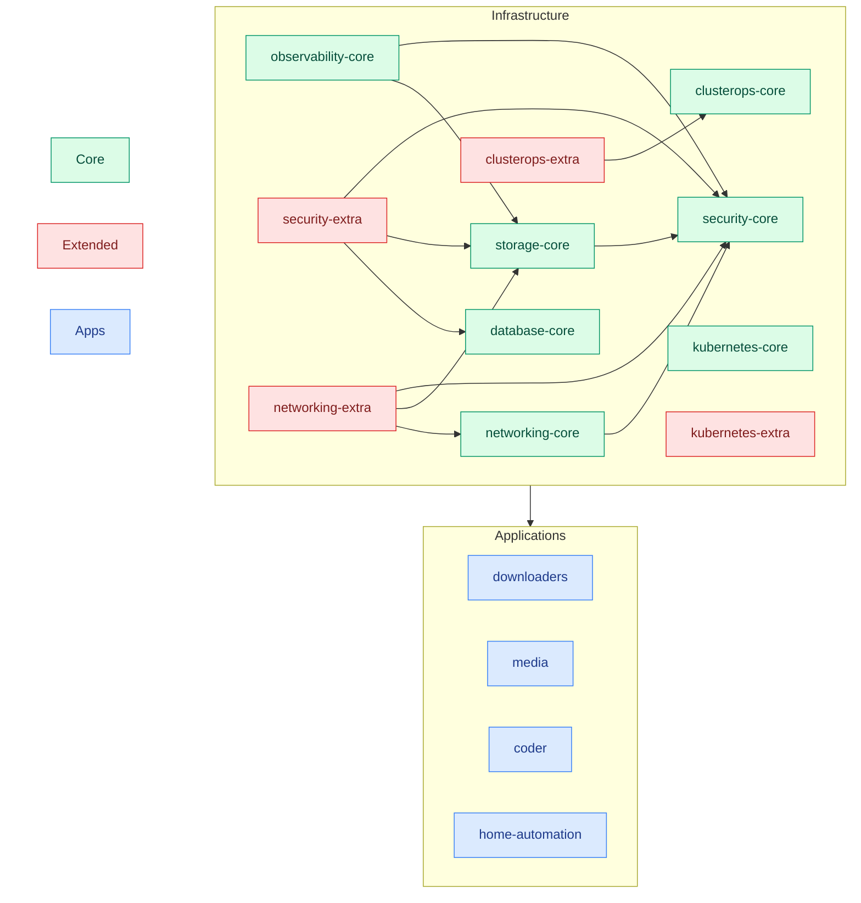
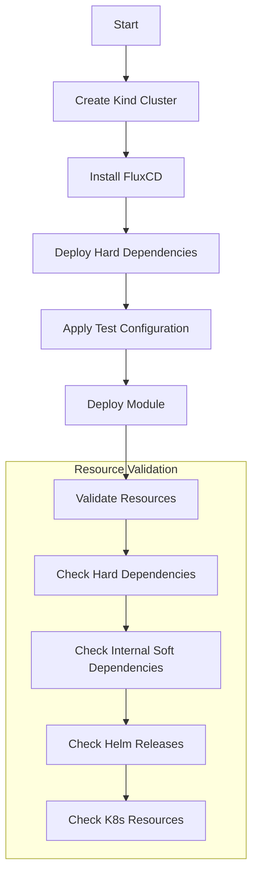
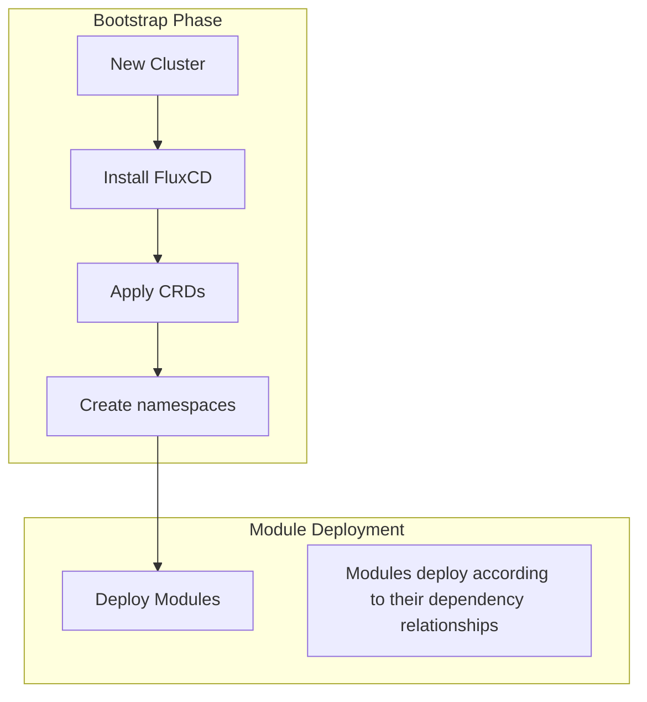
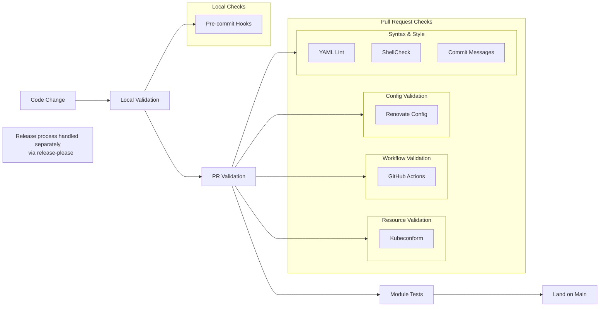

# Kubernetes Platform Modules

This repository contains modules for deploying applications and infrastructure on Kubernetes clusters using FluxCD. Each module is a self-contained unit that can be composed to build complete cluster configurations.

```mermaid
flowchart TB
    %% Color scheme with better contrast
    classDef infra fill:#dcfce7,stroke:#059669,color:#064e3b
    classDef apps fill:#dbeafe,stroke:#3b82f6,color:#1e3a8a
    classDef components fill:#fee2e2,stroke:#dc2626,color:#7f1d1d
    classDef clusterStyle fill:none,stroke:none,color:#334155
    classDef legend fill:none,stroke:none

    subgraph Cluster["Kubernetes Cluster"]
        subgraph Infrastructure["Infrastructure Modules"]
            ICap[Cluster Capabilities]:::infra
            IServ[Core Services]:::infra
            ISec[Security & Access]:::infra
            IStore[Storage & State]:::infra
            IMon[Monitoring & Observability]:::infra
        end

        subgraph Applications["Application Modules"]
            AFunc[End-user Functionality]:::apps
            AServ[Application Services]:::apps
        end

        subgraph Components["Component Modules"]
            CSSO[SSO Configuration]:::components
            CBack[DB Backups]:::components
            CCred[PVC Backups]:::components
        end

        %% Dependencies
        Infrastructure --> Applications
        Components -.-> Infrastructure
        Components -.-> Applications
    end

    %% Simple legend at bottom
    subgraph Legend[" "]
        direction LR
        leg_infra[Infrastructure Modules]:::infra
        leg_apps[Application Modules]:::apps
        leg_comp[Component Modules]:::components
    end

    class Cluster clusterStyle
    class Legend legend
```



## Module Types and Organization



### Infrastructure Modules

Infrastructure modules provide the foundational capabilities that both the cluster itself and its applications require. These modules:

- Supply core services (monitoring, storage, networking)
- Focus on platform capabilities and operational needs
- May provide end-user functionality, but it's not their primary purpose

### Application Modules

Application modules focus on delivering end-user functionality. They:

- Provide services directly consumed by end users
- Depend on capabilities provided by infrastructure modules
- Are typically more focused in scope than infrastructure modules

### Component Modules

Component modules provide cross-cutting configuration and capabilities:

- Apply consistent configuration across multiple modules
- Manage cross-cutting concerns like SSO or backup capabilities
- Can be applied to both infrastructure and application modules
- Structured as Kustomize components for flexible application

### Core vs Extra Pattern

Modules, particularly infrastructure modules, often follow a core/extra pattern to manage complex dependencies:

```
infrastructure/subsystems/
├── security-core/     # Core security services
├── security-extra/    # Additional security features
├── networking-core/   # Essential networking
└── networking-extra/  # Advanced networking features
```

This pattern:

- Breaks circular dependencies between modules
- Allows gradual deployment of complex systems
- Core modules contain essential services
- Extra modules contain additional features that depend on other modules

Example scenario:

```
Module X (apps a,b,c) and Module Y (apps p,q)
- If c depends on q, but p depends on a and b
- Solution: Split into X-core (a,b) and X-extra (c)
- Deployment order: X-core → Y → X-extra
```

## Dependencies

### Types of Dependencies

#### Hard Dependencies

- Required for system functionality
- Used when module needs resources from another module to function
- Examples:
  - storage capabilities from storage-core module
  - secret-store for  from security-core module
- Defined at point of use, not within modules themselves
  - Explicitly declared in FluxCD Kustomization's `spec.dependsOn`
- Used sparingly and only when necessary due to:
  - Added complexity in troubleshooting
  - Increased deployment time (blocks parallel reconciliation)
- Valuable for:
  - Ensuring systemic dependencies (e.g., external-secrets secrets stored from security-core module)
  - Eliminating preventable errors during first-time deployments
  - Maintaining upgrade safety between dependent modules

Examples:

```yaml
# At point of use in cluster configuration
apiVersion: kustomize.toolkit.fluxcd.io/v1
kind: Kustomization
metadata:
  name: infra-storage-core
spec:
  dependsOn:
  - name: infra-security-core
```

#### Soft Dependencies

- Required for end-user functionality
- Not explicitly declared
- Rely on Kubernetes's eventually consistent model
- Monitored via Prometheus service monitors and rules
- Examples:
  - Ingress controller availability
  - Load balancer readiness

### Dependency Management

1. Only hard dependencies are explicitly declared
2. Dependencies are verified during testing
3. Module versioning is independent of one another
4. Changes to a dependency don't automatically cascade as dependency relationship is codified at point of use in FluxCD kustomization that includes the module.
5. Core/Extra pattern used to break circular dependencies

### Dependency Flow Example



### Complete Module Dependency Graph

Having covered dependency types, management approaches, and seen a simplified example, here is the complete dependency graph showing all current infrastructure modules and their relationships. This represents the actual module hierarchy and interdependencies within the Kubernetes platform, illustrating how core services, extended components, and applications interconnect.



## Configuration

### Configuration Methods

#### 1. Kustomize Patches

- Preferred for module-specific parameterization
- Applied through Flux Kustomization
- Examples:

  ```yaml
  apiVersion: kustomize.toolkit.fluxcd.io/v1
  kind: Kustomization
  spec:
    patches:
    - target:
        kind: HelmRelease
        name: app-release
      patch: |-
        - op: replace
          path: /spec/values/replicaCount
          value: 3
  ```

#### 2. FluxCD Post-build Variables

- Primarily used for cluster-wide settings
- Additionally used in scenarios where Kustomize patching is too limited to handle a need type of parameterization
- Applied through Flux Kustomization
- Example:

  ```yaml
  apiVersion: kustomize.toolkit.fluxcd.io/v1
  kind: Kustomization
  spec:
    postBuild:
      substitute:
        domain_name: cluster.example.com
      substituteFrom:
      - kind: Secret
        name: cluster-secrets
  ```

#### 3. Component Overlays

- Applied through Kustomize components
- Used for cross-cutting concerns
- Example:

  ```yaml
  apiVersion: kustomize.toolkit.fluxcd.io/v1
  kind: Kustomization
  spec:
    components:
    - ../../../components/sso
    - ../../../components/db-backups
  ```

## Testing and Validation

### Module Testing Strategy

Each module is tested as a complete unit in CI, even when only one component changes. This ensures:

- All components within a module work together
- Dependencies are properly satisfied
- Configuration is valid

### Test Process



### Test Components

1. Environment Setup
   - Kind cluster creation
   - FluxCD installation
   - Test configuration and secrets

2. Dependency Deployment
   - Deploy hard dependencies first
   - Configure test mode settings
   - Apply necessary patches

3. Resource Validation

   ```yaml
   # Example validation checks
   - kubectl wait --for=condition=Ready pod -l app=dependency-app
   - kubectl wait --for=condition=Ready helmrelease/app-release
   - kubectl get deploy app-deployment -o jsonpath='{.status.readyReplicas}'
   ```

### Test Data

- Located in `ci/test-data/`
- Contains test configurations and secrets
- No production data or credentials
- Example:

  ```yaml
  apiVersion: v1
  kind: Secret
  metadata:
    name: test-credentials
  type: Opaque
  stringData:
    username: test-user
    password: example
  ```

### Resource Validation

- Uses `kubeconform` to validate all Kubernetes manifests
- Validates against:
  - Native Kubernetes resource specs
  - Custom Resource Definition (CRD) specs
- Runs on all pull requests

## Bootstrap and CRDs

### Bootstrap Process



### CRD Management

- Location: `bootstrap/crds/`
- Only engaged during:
  1. First-time cluster setup
  2. Disaster recovery scenarios
- Updates to CRDs handled by:
  - Helm charts in modules
- Primary purpose:
  - Enable custom resource creation prior to the module that normally installs the CRDs is deployed
  - Example:
    - Custom resource types like `ServiceMonitor` or `PrometheusRule` from prometheus operator are available for use in any modules that need them before the `observability-core` module that installs the prometheus operator is deployed.
    - Other examples include `Certificate`s from `cert-manager` or `ExternalSecret`s from `external-secrets` operator.

## Design Principles

### 1. Module Independence

- Self-contained functionality
- Clear boundaries
- Independent versioning
- Any dependencies between modules are specified at point of use than within the module
- Cluster or deployment environment specific details are specified external to the module.
  - This enables this aspects to vary from cluster to cluster or from production environment to testing environment.
  - Examples:
    - secret store to fetching secrets from
    - storage class used for PVCs

### 2. Configuration Flexibility

- Multiple configuration methods
- Environment-specific settings
- Component-based customization
- Patch-based modifications

### 3. Dependency Management

- Explicit hard dependencies
- Implicit soft dependencies
- Dependency cycle prevention
- Core/Extra pattern usage

### 4. Testing Integrity

- Module-level testing
- Complete dependency validation
- Resource state verification

### 5. Operational Clarity

- Clear module categorization
- Consistent naming patterns
- Change tracking
- Version update automation

## Development Workflow

### Quality Controls



### Version Management

```mermaid
flowchart LR
    subgraph updates [Version Updates]
        direction TB
        R[Renovate Bot] --> PR1[Version Upgrade PR]
        DEV[Developer] --> PR2[Feature PR]
    end

    subgraph validation [Validation]
        direction TB
        T1[Module Tests]
        T2[Pre-commit Checks]
        T3[CI Validation]
    end

    subgraph release [Release Process]
        direction TB
        RP[Release-please PR]
        RM[Land Release PR]
        CL[Changelog Update]
        TAG[Git Tag]
    end

    PR1 --> T3
    PR2 --> T2 --> T3 --> T1

    T1 --> |Tests Pass| PRTYPE{Feature or Version Upgrade?}
    PRTYPE --> |Version Upgrade| AM{Auto-merge?}
    PRTYPE --> |Feature| M[Merge]
    AM --> |Patch/Minor| M
    AM --> |Major| HR[Human Review] --> M

    M --> RP --> RM
    RM --> CL --> TAG

    style updates fill:#d1fae5
    style validation fill:#dbeafe
    style release fill:#fee2e2
```



#### Automated Updates

- Renovate bot manages version updates for applications
- Automated merging rules:
  - Patch versions: Auto-merge if tests pass
  - Minor versions: Auto-merge if tests pass (with exceptions for critical infrastructure)
  - Major versions: Require human approval

#### Release Process

Each module is versioned and released independently.

1. Changes land in main branch (via Renovate or manual PRs)
2. Release-please creates release PR with:
   - Version bump
   - Changelog updates
3. When release PR merges:
   - CHANGELOG.md is updated
   - Module gets versioned (git tag)

### Maintenance Practices

1. Module Archival
   - Unused modules moved to `.archive`
   - Preserves historical context
   - Maintains deployment history

2. Repository Organization
   - Helm repositories split by purpose (infra vs apps)
   - Clear module categorization
   - Consistent structure

3. Documentation
   - CHANGELOG.md per module

## End-to-End Infrastructure Automation: How Everything Comes Together

| Category | Tool/Mechanism | Purpose | Key Features & Data |
|---|---|---|---|
| **GitOps & Continuous Sync** | FluxCD GitOps | Cluster deployment & state reconciliation | - Continuously syncs desired state from Git<br>- Uses FluxCD Kustomization CRDs for automated module deployments<br>- Acts as the central control plane for GitOps workflows<br>- Propagates changes via FluxCD's continuous reconciliation |
| **Application Deployment** | HelmRelease via FluxCD | Deploy applications & version upgrades | - FluxCD HelmRelease defines how a helm deployment can be carried out<br>- Coordinates version upgrades<br> |
| **Configuration Management** | Kustomize Patches via FluxCD | Module-specific parameterization | - Applies inline patches for targeted configuration adjustments<br>- Modifies resource definitions<br> |
| **Configuration Management** | Kustomize Overlays via FluxCD | Environment-specific & cross-cutting customization | - Implements composable overlays for configurations that must be selectively applied<br>- Separates cross-cutting concerns (e.g., SSO, backups) from core module logic |
| **Dependency Orchestration** | Module Dependency Orchestration | Define module dependencies & deployment sequencing | - Declares explicit hard dependencies using FluxCD's `spec.dependsOn`<br>- Makes hard dependencies explicit<br>- Uses a Core/Extra pattern to prevent circular dependencies and enforce reliable deployment order |
| **Cluster Setup** | Manual Bootstrap | Initial cluster setup & CRD enablement | - Bootstraps new clusters by installing FluxCD, applying CRDs, and creating namespaces<br>- Ensures CRDs are established for custom resource creation prior to module deployment<br> |
| **CI/CD & Validation** | GitHub Actions | Automated testing, linting & validation | - Integrates GitHub Actions workflows for continuous integration and validation<br>- Executes quality checks (e.g., YAML Lint, ShellCheck)<br>- Uses kubeconform to validate Kubernetes manifests and pre-commit hooks for ensuring code quality |
| **Version Management** | Renovate Bot via Github Actions | Automated version upgrades | - Scans for dependency updates across and within modules<br>- Triggers automated PRs merges for patch/minor updates<br>- Requires human review for major version changes |
| **Release Coordination** | Release-Please | Automates release processes & changelog management | - Generates release PRs with version bumps<br>- Automatically updates changelog files<br>- Creates git tags as part of the release process<br> |
